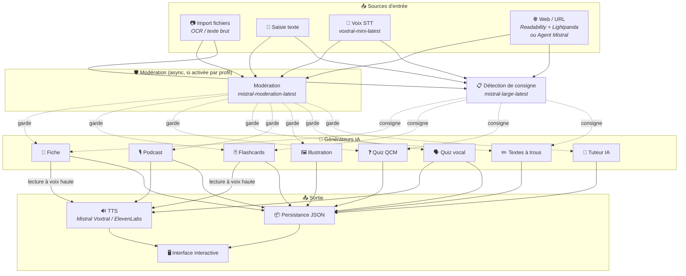
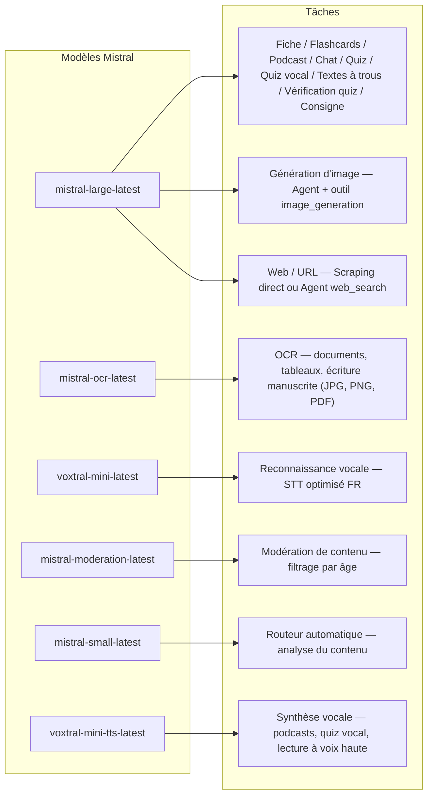
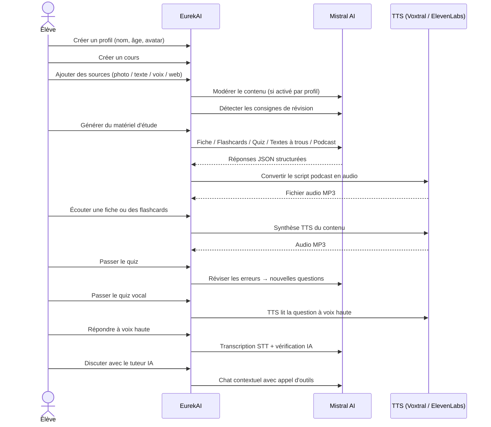

<p align="center">
  
</p>

<h1 align="center">EurekAI</h1>

<p align="center">
  <strong>Förvandla vilket innehåll som helst till en interaktiv lärandeupplevelse — drivs av <a href="https://mistral.ai">Mistral AI</a>.</strong>
</p>

<p align="center">
  <a href="README-en.md">🇬🇧 Engelska</a> · <a href="README-es.md">🇪🇸 Spanska</a> · <a href="README-pt.md">🇧🇷 Portugisiska</a> · <a href="README-de.md">🇩🇪 Tyska</a> · <a href="README-it.md">🇮🇹 Italienska</a> · <a href="README-nl.md">🇳🇱 Nederländska</a> · <a href="README-ar.md">🇸🇦 Arabiska</a><br>
  <a href="README-hi.md">🇮🇳 Hindi</a> · <a href="README-zh.md">🇨🇳 Kinesiska</a> · <a href="README-ja.md">🇯🇵 Japanska</a> · <a href="README-ko.md">🇰🇷 Koreanska</a> · <a href="README-pl.md">🇵🇱 Polska</a> · <a href="README-ro.md">🇷🇴 Rumänska</a> · <a href="README-sv.md">🇸🇪 Svenska</a>
</p>

<p align="center">
  <a href="https://www.youtube.com/watch?v=_b1TQz2leoI"></a>
</p>

<h4 align="center">📊 Kodkvalitet</h4>

<p align="center">
  <a href="https://sonarcloud.io/summary/new_code?id=jls42_EurekAI"></a>
  <a href="https://sonarcloud.io/summary/new_code?id=jls42_EurekAI"></a>
  <a href="https://sonarcloud.io/summary/new_code?id=jls42_EurekAI"></a>
  <a href="https://sonarcloud.io/summary/new_code?id=jls42_EurekAI"></a>
</p>
<p align="center">
  <a href="https://sonarcloud.io/summary/new_code?id=jls42_EurekAI"></a>
  <a href="https://sonarcloud.io/summary/new_code?id=jls42_EurekAI"></a>
  <a href="https://sonarcloud.io/summary/new_code?id=jls42_EurekAI"></a>
  <a href="https://sonarcloud.io/summary/new_code?id=jls42_EurekAI"></a>
</p>

---

## Historien — Varför EurekAI?

**EurekAI** föddes under [Mistral AI Worldwide Hackathon](https://luma.com/mistralhack-online) ([officiell webbplats](https://worldwide-hackathon.mistral.ai/)) (mars 2026). Jag behövde ett ämne — och idén kom från något mycket konkret: jag förbereder regelbundet prov med min dotter, och jag tänkte att det borde gå att göra det roligare och mer interaktivt med hjälp av AI.

Målet: ta emot **vilken indata som helst** — ett foto av lektionen, en kopierad text, en röstinspelning, en webbsökning — och förvandla det till **repetitionskort, flashcards, quiz, podcaster, lucktexter, illustrationer och mer**. Allt drivs av Mistral AIs franska modeller, vilket gör det till en lösning som naturligt passar fransktalande elever.

Den [ursprungliga prototypen](https://github.com/jls42/worldwide-hackathon.mistral.ai) byggdes på 48 timmar under hackathonet som ett proof-of-concept kring Mistral-tjänsterna — redan fungerande, men begränsad. Sedan dess har EurekAI blivit ett riktigt projekt: lucktexter, navigering i övningarna, webbscraping, konfigurerbar föräldramoderering, djupgående kodgranskning och mycket mer. All källkod är genererad av AI — främst [Claude Code](https://code.claude.com/), med några bidrag via [Codex](https://openai.com/codex/) och [Gemini CLI](https://geminicli.com/).

---

## Funktioner

| | Funktion | Beskrivning |
|---|---|---|
| 📷 | **Filimport** | Importera dina lektioner — foto, PDF (via Mistral OCR) eller textfil (TXT, MD) |
| 📝 | **Textinmatning** | Skriv eller klistra in valfri text direkt |
| 🎤 | **Röstinmatning** | Spela in dig själv — Voxtral STT transkriberar din röst |
| 🌐 | **Webb / URL** | Klistra in en URL (scraping direkt via Readability + Lightpanda) eller skriv en sökning (Agent Mistral web_search) |
| 📄 | **Repetitionskort** | Strukturerade anteckningar med nyckelpunkter, vokabulär, citat, anekdoter |
| 🃏 | **Flashcards** | Fråga/svar-kort med referenser till källor för aktiv inlärning (antal går att konfigurera) |
| ❓ | **Flervalsquiz** | Flervalsfrågor med adaptiv repetition av misstag (antal går att konfigurera) |
| ✏️ | **Lucktexter** | Övningar att fylla i med ledtrådar och tolerans vid validering |
| 🎙️ | **Podcast** | Mini-podcast med 2 röster i ljud — Mistral-röst som standard eller anpassade röster (föräldrar!) |
| 🖼️ | **Illustrationer** | Pedagogiska bilder genererade av en Agent Mistral |
| 🗣️ | **Röstquiz** | Frågor upplästa högt (anpassad röst möjlig), muntligt svar, AI-verifiering |
| 💬 | **AI-handledare** | Kontextuell chatt med dina kursdokument, med verktygsanrop |
| 🧠 | **Automatisk router** | En router baserad på `mistral-small-latest` analyserar innehållet och föreslår en kombination av generatorer bland de 7 tillgängliga typerna |
| 🔒 | **Föräldrakontroll** | Konfigurerbar moderering per profil (anpassningsbara kategorier), föräldra-PIN, chattbegränsningar |
| 🌍 | **Fler språk** | Gränssnitt tillgängligt på 9 språk; AI-generering styrbar på 15 språk via prompts |
| 🔊 | **Uppläsning** | Lyssna på kort och flashcards via Mistral Voxtral TTS eller ElevenLabs |

---

## Översikt av arkitekturen



---

## Översikt över modellernas användningsområden



---

## Användarflöde



---

## Djupdykning — Funktioner

### Multimodal inmatning

EurekAI accepterar 4 typer av källor, modererade beroende på profil (aktiverat som standard för barn och tonåringar):

- **Filimport** — JPG, PNG eller PDF-filer behandlas av `mistral-ocr-latest` (tryckt text, tabeller, handskrift), eller textfiler (TXT, MD) importeras direkt.
- **Fri text** — Skriv eller klistra in valfritt innehåll. Modererat innan lagring om moderering är aktiverat.
- **Röstinmatning** — Spela in ljud i webbläsaren. Transkriberas av `voxtral-mini-latest`. Parametern `language="fr"` optimerar igenkänningen.
- **Webb / URL** — Klistra in en eller flera URL:er för att scrapa innehållet direkt (Readability + Lightpanda för JS-sidor), eller skriv nyckelord för en webbsökning via Agent Mistral. Det enda fältet accepterar båda — URL:er och nyckelord separeras automatiskt, varje resultat skapar en separat källa.

### AI-innehållsgenerering

Sju typer av genererat undervisningsmaterial:

| Generator | Modell | Utdata |
|---|---|---|
| **Repetitionskort** | `mistral-large-latest` | Titel, sammanfattning, nyckelpunkter, vokabulär, citat, anekdot |
| **Flashcards** | `mistral-large-latest` | Fråga/svar-kort med referenser till källor (antal går att konfigurera) |
| **Flervalsquiz** | `mistral-large-latest` | Flervalsfrågor, förklaringar, adaptiv repetition (antal går att konfigurera) |
| **Lucktexter** | `mistral-large-latest` | Meningar att fylla i med ledtrådar, tolerans vid validering (Levenshtein) |
| **Podcast** | `mistral-large-latest` + Voxtral TTS | Manus för 2 röster → MP3-ljud |
| **Illustration** | Agent `mistral-large-latest` | Pedagogisk bild via verktyget `image_generation` |
| **Röstquiz** | `mistral-large-latest` + Voxtral TTS + STT | Frågor TTS → svar STT → AI-verifiering |

### AI-handledare via chatt

En konversationell handledare med full åtkomst till kursdokumenten:

- Använder `mistral-large-latest`
- **Verktygsanrop**: kan generera repetitionskort, flashcards, quiz eller lucktexter under konversationen
- Historik på 50 meddelanden per kurs
- Moderering av innehåll om det är aktiverat för profilen

### Automatisk router

Routern använder `mistral-small-latest` för att analysera innehållet i källorna och föreslå de mest relevanta generatorerna bland de 7 tillgängliga. Gränssnittet visar realtidsprogress: först en analysfas, sedan individuella generationer med möjlighet att avbryta.

### Adaptivt lärande

- **Quizstatistik**: spårning av försök och träffsäkerhet per fråga
- **Quizrepetition**: genererar 5–10 nya frågor som riktar in sig på svaga koncept
- **Upptäckt av instruktioner**: upptäcker revisionsinstruktioner ("Jag kan min lektion om jag kan...") och prioriterar dem i kompatibla textgeneratorer (repetitionskort, flashcards, quiz, lucktexter)

### Säkerhet & föräldrakontroll

- **4 åldersgrupper**: barn (≤10 år), tonåring (11–15), student (16–25), vuxen (26+)
- **Innehållsmoderering**: `mistral-moderation-latest` med 10 tillgängliga kategorier, 5 blockerade som standard för barn/tonåringar (`sexual`, `hate_and_discrimination`, `violence_and_threats`, `selfharm`, `jailbreaking`). Kategorier kan anpassas per profil i inställningarna.
- **Föräldra-PIN**: hash SHA-256, krävs för profiler under 15 år. För produktionsdistribution, använd en långsammare hash med salt (Argon2id, bcrypt).
- **Chattbegränsningar**: AI-chatt avstängd som standard för under 16 år, kan aktiveras av föräldrarna

### Multi-profilssystem

- Flera profiler med namn, ålder, avatar, språkpreferenser
- Projekt kopplade till profiler via `profileId`
- Kaskadborttagning: ta bort en profil tar bort alla dess projekt

### TTS flera leverantörer & anpassade röster

- **Mistral Voxtral TTS** (standard): `voxtral-mini-tts-latest`, ingen ytterligare nyckel krävs
- **ElevenLabs** (alternativ): `eleven_v3`, naturliga röster, kräver `ELEVENLABS_API_KEY`
- Leverantör går att konfigurera i applikationens inställningar
- **Anpassade röster**: föräldrar kan skapa egna röster via Mistral Voices API (från ett ljudprov) och tilldela dem rollerna värd/gäst — podcasts och röstquiz spelas då upp med förälderns röst, vilket gör upplevelsen ännu mer uppslukande för barnet
- Två konfigurerbara röstroller: **värd** (huvudberättare) och **gäst** (andra podcast-röst)
- Fullständig katalog över Mistral-röster finns i inställningarna, filtrerbar efter språk

### Internationalisering

- Gränssnitt tillgängligt på 9 språk: fr, en, es, pt, it, nl, de, hi, ar
- AI-prompter stödjer 15 språk (fr, en, es, de, it, pt, nl, ja, zh, ko, ar, hi, pl, ro, sv)
- Språk går att konfigurera per profil

---

## Teknisk stack

| Lager | Teknologi | Roll |
|---|---|---|
| **Runtime** | Node.js + TypeScript 6.x | Server och typsäkerhet |
| **Backend** | Express 5.x | REST-API |
| **Utvecklingsserver** | Vite 8.x (Rolldown) + tsx | HMR, Handlebars-partials, proxy |
| **Frontend** | HTML + TailwindCSS 4.x + Alpine.js 3.x | Reaktivt gränssnitt, TypeScript kompilerat av Vite |
| **Templating** | vite-plugin-handlebars | HTML-komposition via partials |
| **AI** | Mistral AI SDK 2.x | Chatt, OCR, STT, TTS, Agents, Moderering |
| **TTS (standard)** | Mistral Voxtral TTS | `voxtral-mini-tts-latest`, inbyggd talsyntes |
| **TTS (alternativ)** | ElevenLabs SDK 2.x | `eleven_v3`, naturliga röster |
| **Ikoner** | Lucide 1.x | SVG-ikonbibliotek |
| **Webbscraping** | Readability + linkedom | Extraktion av huvudinnehåll från webbsidor (Firefox Reader View-teknik) |
| **Headless browser** | Lightpanda | Ultraklätt headless-browser (Zig + V8) för JS/SPA-sidor — fallback scraping |
| **Markdown** | Marked | Markdown-rendering i chatten |
| **Filuppladdning** | Multer 2.x | Hantering av multipart-formulär |
| **Ljud** | ffmpeg-static | Sammanfogning av ljudsegment |
| **Tester** | Vitest | Enhetstester — täckning mätt av SonarCloud |
| **Persistens** | JSON-filer | Lagring utan externa beroenden |

---

## Modellreferens

| Modell | Användning | Varför |
|---|---|---|
| `mistral-large-latest` | Repetitionskort, Flashcards, Podcast, Quiz, Lucktexter, Chatt, Verifiering av röstquiz, Agent Image, Agent Web Search, Upptäckt av instruktioner | Bäst för flerspråkighet + följer instruktioner |
| `mistral-ocr-latest` | OCR för dokument | Tryckt text, tabeller, handskrift |
| `voxtral-mini-latest` | Röstigenkänning (STT) | Multilingual STT, optimerad med `language="fr"` |
| `voxtral-mini-tts-latest` | Talsyntes (TTS) | Podcasts, röstquiz, uppläsning |
| `mistral-moderation-latest` | Innehållsmoderering | 5 kategorier blockerade för barn/tonåringar (+ jailbreak-detektion) |
| `mistral-small-latest` | Automatisk router | Snabb innehållsanalys för routingbeslut |
| `eleven_v3` (ElevenLabs) | Talsyntes (alternativ TTS) | Naturliga röster, konfigurerbar alternativ leverantör |

---

## Snabbstart

```bash
# Cloner le dépôt
git clone https://github.com/jls42/EurekAI.git
cd EurekAI

# Installer les dépendances
npm install

# Configurer les clés API
cp .env.example .env
# Éditez .env avec vos clés :
#   MISTRAL_API_KEY=votre_clé_ici           (requis)
#   ELEVENLABS_API_KEY=votre_clé_ici        (optionnel, TTS alternatif)
#   SONAR_TOKEN=...                          (optionnel, CI SonarCloud uniquement)

# Lancer le développement
npm run dev
# → Backend :  http://localhost:3000 (API)
# → Frontend : http://localhost:5173 (serveur Vite avec HMR)
```

> **Notera** : Mistral Voxtral TTS är standardleverantören — ingen ytterligare nyckel krävs utöver `MISTRAL_API_KEY`. ElevenLabs är en alternativ TTS-leverantör som kan konfigureras i inställningarna.

---

## Projektsstruktur

```
server.ts                 — Point d'entrée Express, monte les routes + config
config.ts                 — Config runtime (modèles, voix, TTS provider), persistée dans output/config.json
store.ts                  — ProjectStore : CRUD projets/sources/générations, persistance JSON
profiles.ts               — ProfileStore : gestion des profils, hachage PIN
types.ts                  — Types TypeScript : Source, Generation (7 types), QuizStats, Profile
prompts.ts                — Tous les prompts IA centralisés (system + user templates, 15 langues)

generators/
  ocr.ts                  — OCR via Mistral (JPG, PNG, PDF)
  summary.ts              — Génération de fiche de révision (JSON structuré)
  flashcards.ts           — Flashcards Q/R (5-50, configurable)
  quiz.ts                 — Quiz QCM (5-50 questions, configurable) + révision adaptative
  fill-blank.ts           — Exercices à trous avec validation tolérante
  podcast.ts              — Script podcast 2 voix
  quiz-vocal.ts           — Quiz vocal : questions TTS + réponses STT + vérification IA
  image.ts                — Génération d'image via Agent Mistral (outil image_generation)
  chat.ts                 — Tuteur IA par chat avec appel d'outils
  router.ts               — Routeur automatique (contenu → générateurs recommandés)
  consigne.ts             — Détection de consignes de révision
  tts-provider.ts         — Dispatch TTS multi-provider (Mistral Voxtral / ElevenLabs)
  tts.ts                  — Génération audio podcast (concaténation de segments)
  stt.ts                  — Voxtral STT (audio → texte)
  websearch.ts            — Agent Mistral avec outil web_search (fallback)
  moderation.ts           — Modération de contenu (filtrage par âge)

routes/
  projects.ts             — CRUD projets
  profiles.ts             — CRUD profils avec gestion du PIN
  sources.ts              — Import fichiers (OCR + texte brut), texte libre, voix STT, scraping URL + recherche web, modération
  generate.ts             — Endpoints de génération (7 types + auto + route)
  generations.ts          — Tentatives de quiz/fill-blank, réponses vocales, lecture à voix haute
  chat.ts                 — Chat IA avec appel d'outils

helpers/
  index.ts                — getContent, stripJsonMarkdown, safeParseJson, unwrapJsonArray, extractAllText, timer
  audio.ts                — collectStream (ReadableStream → Buffer)
  fill-blank-validate.ts  — Validation tolérante des réponses (normalisation, Levenshtein)
  diversity.ts            — Diversité des générations (exclusion du contenu déjà produit, randomSeed)

src/                      — Frontend (Vite + Handlebars)
  index.html              — Point d'entrée HTML principal
  main.ts                 — Entrée frontend (init Alpine.js + icônes Lucide)
  app/                    — Modules applicatifs Alpine.js
    state.ts              — Gestion d'état réactif
    navigation.ts         — Routage des vues + gardes par âge
    profiles.ts           — Logique du sélecteur de profils
    projects.ts           — CRUD des cours
    sources.ts            — Gestionnaires d'upload de sources
    generate.ts           — Déclencheurs de génération (individuel, tout, auto 2 phases)
    generations.ts        — Affichage + actions sur les générations
    chat.ts               — Interface de chat
    config.ts             — Interface de configuration (modèles, voix, TTS provider)
    render.ts             — Helpers de rendu HTML
    i18n.ts               — Changement de langue
    ...
  components/
    quiz.ts               — Composant quiz interactif
    quiz-vocal.ts         — Composant quiz vocal
    fill-blank.ts         — Composant textes à trous
    flashcards.ts         — Composant flashcards avec retournement
    step-by-step.ts       — Mixin navigation pas-à-pas (quiz, fill-blank, flashcards)
  i18n/
    fr.ts, en.ts, es.ts, — Dictionnaires par langue (9 langues)
    pt.ts, it.ts, nl.ts,
    de.ts, hi.ts, ar.ts
    languages.ts          — Registre des langues UI disponibles
    index.ts              — Chargeur i18n
  partials/               — Partials HTML Handlebars (header, sidebar, dialogues, vues)
  styles/
    main.css              — Entrée TailwindCSS
    theme.css             — Variables de thème personnalisées

public/assets/            — Ressources statiques (logo, avatars)
output/                   — Données d'exécution (projets, config, fichiers audio)
```

---

## API-referens

### Konfiguration
| Metod | Endpoint | Beskrivning |
|---|---|---|
| `GET` | `/api/config` | Aktuell konfiguration |
| `PUT` | `/api/config` | Ändra konfiguration (modeller, röster, TTS-leverantör) |
| `GET` | `/api/config/status` | API-status (Mistral, ElevenLabs, TTS) |
| `POST` | `/api/config/reset` | Återställ till standardkonfiguration |
| `GET` | `/api/config/voices` | Lista Mistral TTS-röster (valfritt `?lang=fr`) |
| `GET` | `/api/moderation-categories` | Tillgängliga modereringskategorier + standarder per ålder |

### Profiler
| Metod | Endpoint | Beskrivning |
|---|---|---|
| `GET` | `/api/profiles` | Lista alla profiler |
| `POST` | `/api/profiles` | Skapa en profil |
| `PUT` | `/api/profiles/:id` | Ändra en profil (PIN krävs för < 15 år) |
| `DELETE` | `/api/profiles/:id` | Ta bort en profil + kaskad av projekt `{pin?}` → `{ok, deletedProjects}` |

### Projekt
| Metod | Endpoint | Beskrivning |
|---|---|---|
| `GET` | `/api/projects` | Lista projekt (`?profileId=` valfritt) |
| `POST` | `/api/projects` | Skapa ett projekt `{name, profileId}` |
| `GET` | `/api/projects/:pid` | Projektinformation |
| `PUT` | `/api/projects/:pid` | Byt namn `{name}` |
| `DELETE` | `/api/projects/:pid` | Ta bort projektet |

### Källor
| Metod | Endpoint | Beskrivning |
|---|---|---|
| `POST` | `/api/projects/:pid/sources/upload` | Importera filer multipart (OCR för JPG/PNG/PDF, direkt läsning för TXT/MD) |
| `POST` | `/api/projects/:pid/sources/text` | Fri text `{text}` |
| `POST` | `/api/projects/:pid/sources/voice` | Röst STT (ljud multipart) |
| `POST` | `/api/projects/:pid/sources/websearch` | Scraping av URL eller webbsökning `{query}` — returnerar en lista med källor |
| `DELETE` | `/api/projects/:pid/sources/:sid` | Ta bort en källa |
| `POST` | `/api/projects/:pid/moderate` | Moderera `{text}` |
| `POST` | `/api/projects/:pid/detect-consigne` | Upptäcka revisionsinstruktioner | ### Generering
| Méthode | Endpoint | Beskrivning |
|---|---|---|
| `POST` | `/api/projects/:pid/generate/summary` | Revisionskort |
| `POST` | `/api/projects/:pid/generate/flashcards` | Flashkort |
| `POST` | `/api/projects/:pid/generate/quiz` | Flervalsquiz |
| `POST` | `/api/projects/:pid/generate/fill-blank` | Texter med luckor |
| `POST` | `/api/projects/:pid/generate/podcast` | Podcast |
| `POST` | `/api/projects/:pid/generate/image` | Illustration |
| `POST` | `/api/projects/:pid/generate/quiz-vocal` | Röst-quiz |
| `POST` | `/api/projects/:pid/generate/quiz-review` | Adaptiv repetition `{generationId, weakQuestions}` |
| `POST` | `/api/projects/:pid/generate/route` | Routningsanalys (plan över generatorer att starta) |
| `POST` | `/api/projects/:pid/generate/auto` | Automatisk backend-generering (routning + 5 typer: sammanfattning, flashkort, quiz, fyll-i-blank, podcast) |

Alla genereringsrutter accepterar `{sourceIds?, lang?, ageGroup?, count?, useConsigne?}`. `quiz-review` kräver dessutom `{generationId, weakQuestions}`.

### CRUD Genereringar
| Méthode | Endpoint | Beskrivning |
|---|---|---|
| `POST` | `/api/projects/:pid/generations/:gid/quiz-attempt` | Skicka in quiz-svar `{answers}` |
| `POST` | `/api/projects/:pid/generations/:gid/fill-blank-attempt` | Skicka in svar för texter med luckor `{answers}` |
| `POST` | `/api/projects/:pid/generations/:gid/vocal-answer` | Verifiera ett muntligt svar (audio + questionIndex) |
| `POST` | `/api/projects/:pid/generations/:gid/read-aloud` | TTS-uppspelning högt (kort/flashkort) |
| `PUT` | `/api/projects/:pid/generations/:gid` | Byt namn på `{title}` |
| `DELETE` | `/api/projects/:pid/generations/:gid` | Radera genereringen |

### Chatt
| Méthode | Endpoint | Beskrivning |
|---|---|---|
| `GET` | `/api/projects/:pid/chat` | Hämta chattens historik |
| `POST` | `/api/projects/:pid/chat` | Skicka ett meddelande `{message, lang, ageGroup}` |
| `DELETE` | `/api/projects/:pid/chat` | Radera chattens historik |

---

## Arkitekturella beslut

| Beslut | Motivering |
|---|---|
| **Alpine.js istället för React/Vue** | Liten fotavtryck, lättviktig reaktivitet med TypeScript kompilerat av Vite. Perfekt för en hackathon där hastighet räknas. |
| **Persistens i JSON-filer** | Noll beroenden, omedelbar uppstart. Ingen databas att konfigurera — man sätter igång direkt. |
| **Vite + Handlebars** | Det bästa av två världar: snabb HMR för utveckling, HTML-partials för kodorganisation, Tailwind JIT. |
| **Centraliserade prompts** | Alla AI-prompter i `prompts.ts` — enkelt att iterera, testa och anpassa per språk/åldersgrupp. |
| **Multigenereringssystem** | Varje generering är ett självständigt objekt med eget ID — tillåter flera kort, quiz osv. per kurs. |
| **Prompter anpassade efter ålder** | 4 åldersgrupper med olika vokabulär, komplexitet och ton — samma innehåll lär ut olika beroende på eleven. |
| **Agent-baserade funktioner** | Bildgenerering och webbsökning använder temporära Mistral-agenter — tydlig livscykel med automatisk rengöring. |
| **Intelligent URL-scraping** | Ett enda fält accepterar blandade URL:er och nyckelord — URL:er skrapas via Readability (statiska sidor) med fallback till Lightpanda (JS/SPA-sidor), nyckelord triggar en Mistral-agent web_search. Varje resultat skapar en separat källa. |
| **TTS med flera leverantörer** | Mistral Voxtral TTS som standard (ingen extra nyckel), ElevenLabs som alternativ — konfigurerbart utan omstart. |

---

## Krediteringar & tack

- **[Mistral AI](https://mistral.ai)** — AI-modeller (Large, OCR, Voxtral STT, Voxtral TTS, Moderation, Small) + Worldwide Hackathon
- **[ElevenLabs](https://elevenlabs.io)** — Alternativ text-till-tal-motor (`eleven_v3`)
- **[Alpine.js](https://alpinejs.dev)** — Lättviktigt reaktivt ramverk
- **[TailwindCSS](https://tailwindcss.com)** — Utility-first CSS-ramverk
- **[Vite](https://vitejs.dev)** — Frontend-byggverktyg
- **[Lucide](https://lucide.dev)** — Ikonbibliotek
- **[Marked](https://marked.js.org)** — Markdown-parser
- **[Readability](https://github.com/mozilla/readability)** — Extrahering av webbinnehåll (teknik från Firefox Reader View)
- **[Lightpanda](https://lightpanda.io)** — Ultralätt headless-webbläsare för skrapning av JS/SPA-sidor

Initierad under Mistral AI Worldwide Hackathon (mars 2026), utvecklad helt av AI med [Claude Code](https://code.claude.com/), [Codex](https://openai.com/codex/) och [Gemini CLI](https://geminicli.com/).

---

## Författare

**Julien LS** — [contact@jls42.org](mailto:contact@jls42.org)

## Licens

[AGPL-3.0](LICENSE) — Copyright (C) 2026 Julien LS

**Detta dokument har översatts från fr-versionen till språket sv med hjälp av modellen gpt-5-mini. För mer information om översättningsprocessen, se https://gitlab.com/jls42/ai-powered-markdown-translator**

