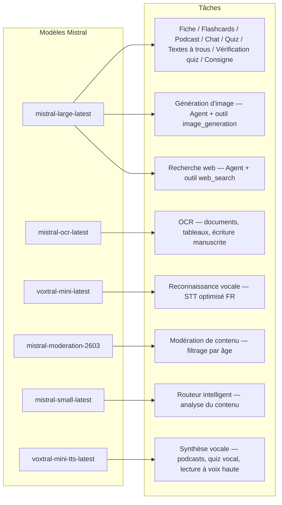
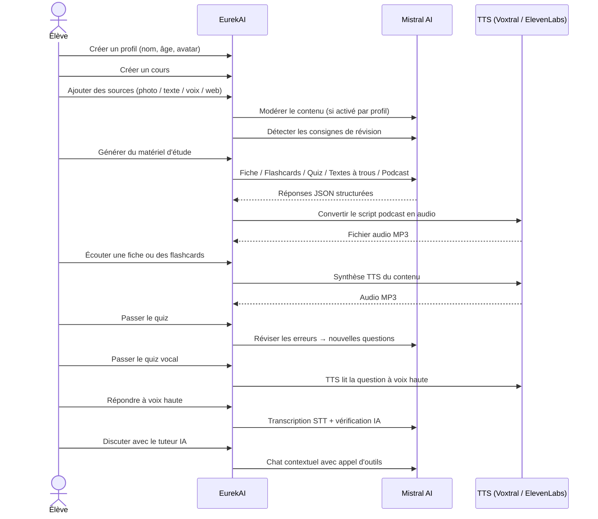

<p align="center">
  
</p>

<h1 align="center">EurekAI</h1>

<p align="center">
  <strong>Förvandla vilket innehåll som helst till en interaktiv inlärningsupplevelse — driven av AI.</strong>
</p>

<p align="center">
  <a href="https://mistral.ai"></a>
  <a href="https://www.typescriptlang.org"></a>
  <a href="https://mistral.ai"></a>
  <a href="https://elevenlabs.io"></a>
</p>

<p align="center">
  <a href="https://www.youtube.com/watch?v=_b1TQz2leoI">▶️ Se demo på YouTube</a> · <a href="README-en.md">🇬🇧 Läs på engelska</a>
</p>

<p align="center">
  <a href="https://sonarcloud.io/summary/new_code?id=jls42_EurekAI"></a>
  <a href="https://sonarcloud.io/summary/new_code?id=jls42_EurekAI"></a>
  <a href="https://sonarcloud.io/summary/new_code?id=jls42_EurekAI"></a>
  <a href="https://sonarcloud.io/summary/new_code?id=jls42_EurekAI"></a>
</p>
<p align="center">
  <a href="https://sonarcloud.io/summary/new_code?id=jls42_EurekAI"></a>
  <a href="https://sonarcloud.io/summary/new_code?id=jls42_EurekAI"></a>
  <a href="https://sonarcloud.io/summary/new_code?id=jls42_EurekAI"></a>
  <a href="https://sonarcloud.io/summary/new_code?id=jls42_EurekAI"></a>
</p>

---

## Historien — Varför EurekAI ?

**EurekAI** föddes under [Mistral AI Worldwide Hackathon](https://luma.com/mistralhack-online) ([officiell webbplats](https://worldwide-hackathon.mistral.ai/)) (mars 2026). Jag behövde ett ämne — och idén kom från något väldigt konkret: jag förbereder regelbundet prov med min dotter, och jag tänkte att det borde vara möjligt att göra det mer lekfullt och interaktivt med hjälp av AI.

Målet: ta emot **vilken ingång som helst** — ett foto av läroboken, en inklistrad text, en röstinspelning, en webbsökning — och omvandla den till **revisionsblad, flashcards, quiz, poddar, lucktexter, illustrationer och mer**. Allt drivs av de franska modellerna från Mistral AI, vilket gör det till en lösning som naturligt passar fransktalande elever.

Varje rad kod skrevs under hackathonet. Alla öppna API:er och open-source-bibliotek används i enlighet med hackathonets regler.

---

## Funktioner

| | Funktion | Beskrivning |
|---|---|---|
| 📷 | **OCR-uppladdning** | Ta ett foto av din lärobok eller dina anteckningar — Mistral OCR extraherar innehållet |
| 📝 | **Textinmatning** | Skriv eller klistra in valfri text direkt |
| 🎤 | **Röstinmatning** | Spela in dig — Voxtral STT transkriberar din röst |
| 🌐 | **Webbsökning** | Ställ en fråga — en Mistral-agent söker svar på webben |
| 📄 | **Revisionsblad** | Strukturerade anteckningar med nyckelpunkter, ordförråd, citat, anekdoter |
| 🃏 | **Flashcards** | 5–50 Q/A-kort med källhänvisningar för aktiv inlärning |
| ❓ | **Flervalsquiz** | 5–50 flervalsfrågor med adaptiv genomgång av fel |
| ✏️ | **Lucktexter** | Övningar att fylla i med ledtrådar och tolerant validering |
| 🎙️ | **Podd** | Mini-podd med två röster konverterad till ljud via Mistral Voxtral TTS |
| 🖼️ | **Illustrationer** | Pedagogiska bilder genererade av en Mistral-agent |
| 🗣️ | **Röstquiz** | Frågor upplästa högt, muntligt svar, AI kontrollerar svaret |
| 💬 | **AI-handledare** | Kontextuell chatt med dina kursdokument, med verktygsanrop |
| 🧠 | **Intelligent router** | AI analyserar ditt innehåll och rekommenderar de mest relevanta generatorerna bland de 7 tillgängliga |
| 🔒 | **Föräldrakontroll** | Åldersbaserad moderation, föräldra-PIN, chattbegränsningar |
| 🌍 | **Flera språk** | Gränssnitt och AI-innehåll fullt på franska och engelska |
| 🔊 | **Uppläsning** | Lyssna på revisionsblad och flashcards via Mistral Voxtral TTS eller ElevenLabs |

---

## Arkitekturöversikt


---

## Modellanvändningskarta



---

## Användarflöde



---

## Fördjupning — Funktioner

### Multimodal inmatning

EurekAI accepterar 4 typer källor, modererade beroende på profil (aktivt som standard för barn och tonåringar):

- **OCR-uppladdning** — JPG-, PNG- eller PDF-filer behandlas av `mistral-ocr-latest`. Hanterar tryckt text, tabeller och handskriven text.
- **Fri text** — Skriv eller klistra in valfritt innehåll. Modereras före lagring om moderering är aktiverad.
- **Röstinmatning** — Spela in ljud i webbläsaren. Transkriberas av `voxtral-mini-latest`. Parametern `language="fr"` optimerar igenkänningen.
- **Webbsökning** — Ange en fråga. En tillfällig Mistral-agent med verktyget `web_search` hämtar och sammanfattar resultaten.

### AI-genererat innehåll

Sju typer av genererat lärmaterial:

| Generator | Modell | Utdata |
|---|---|---|
| **Revisionsblad** | `mistral-large-latest` | Titel, sammanfattning, 10–25 nyckelpunkter, ordförråd, citat, anekdot |
| **Flashcards** | `mistral-large-latest` | 5–50 kort Q/A med källhänvisningar för aktiv inlärning |
| **Flervalsquiz** | `mistral-large-latest` | 5–50 frågor, 4 val vardera, förklaringar, adaptiv repetition |
| **Lucktexter** | `mistral-large-latest` | Fyll-i-satser med ledtrådar, tolerant validering (Levenshtein) |
| **Podd** | `mistral-large-latest` + Voxtral TTS | Manus 2 röster → MP3-ljud |
| **Illustration** | Agent `mistral-large-latest` | Pedagogisk bild via verktyget `image_generation` |
| **Röstquiz** | `mistral-large-latest` + Voxtral TTS + STT | Frågor TTS → svar STT → AI-verifiering |

### AI-handledare via chatt

En AI-handledare med full åtkomst till kursdokument:

- Använder `mistral-large-latest`
- **Verktygsanrop**: kan generera revisionsblad, flashcards, quiz eller lucktexter under konversationen
- Historik på 50 meddelanden per kurs
- Innehållsmoderering om det är aktiverat för profilen

### Automatisk intelligent router

Routern använder `mistral-small-latest` för att analysera innehållet i källorna och rekommendera vilka generatorer som är mest relevanta bland de 7 tillgängliga — så att eleverna inte behöver välja manuellt. Gränssnittet visar realtidsprogress: först en analysfas, sedan individuella generationer med möjlighet att avbryta.

### Adaptivt lärande

- Quizstatistik: spårning av försök och träffsäkerhet per fråga
- Quizrepetition: genererar 5–10 nya frågor som riktar in sig på svaga koncept
- Instruktionsdetektion: identifierar repetitionsinstruktioner ("Jag kan min lektion om jag kan...") och prioriterar dem i alla generatorer

### Säkerhet & föräldrakontroll

- 4 åldersgrupper: barn (≤10 år), tonåring (11–15), student (16–25), vuxen (26+)
- Innehållsmoderering: `mistral-moderation-2603` med 5 blockerade kategorier för barn/tonåringar (sexualitet, hat, våld, självskada, jailbreaking), inga restriktioner för student/vuxen
- Föräldra-PIN: SHA-256-hash, krävs för profiler under 15 år
- Chattbegränsningar: AI-chatt är inaktiverad som standard för under 16 år, kan aktiveras av föräldrar

### Multiprofilsystem

- Flera profiler med namn, ålder, avatar, språkpreferenser
- Projekt kopplade till profiler via `profileId`
- Kaskadradering: ta bort en profil tar bort alla dess projekt

### Flera TTS-leverantörer

- **Mistral Voxtral TTS** (standard): `voxtral-mini-tts-latest`, ingen ytterligare nyckel krävs
- **ElevenLabs** (alternativ): `eleven_v3`, naturliga röster, kräver `ELEVENLABS_API_KEY`
- Leverantör konfigurerbar i appens inställningar

### Internationalisering

- Hela gränssnittet tillgängligt på franska och engelska
- AI-prompter stödjer idag 2 språk (FR, EN) med arkitektur redo för 15 (es, de, it, pt, nl, ja, zh, ko, ar, hi, pl, ro, sv)
- Språk kan ställas in per profil

---

## Teknisk stack

| Lager | Teknik | Roll |
|---|---|---|
| **Runtime** | Node.js + TypeScript 5.7 | Server och typ-säkerhet |
| **Backend** | Express 4.21 | API REST |
| **Serveur de dev** | Vite 7.3 + tsx | HMR, Handlebars-partials, proxy |
| **Frontend** | HTML + TailwindCSS 4.2 + Alpine.js 3.15 | Reaktivt gränssnitt, TypeScript kompilerat av Vite |
| **Templating** | vite-plugin-handlebars | HTML-komposition med partials |
| **IA** | Mistral AI SDK 2.1 | Chat, OCR, STT, TTS, Agents, Moderering |
| **TTS (défaut)** | Mistral Voxtral TTS | `voxtral-mini-tts-latest`, inbyggd talgenerering |
| **TTS (alternatif)** | ElevenLabs SDK 2.36 | `eleven_v3`, naturliga röster |
| **Icônes** | Lucide 0.575 | SVG-ikonbibliotek |
| **Markdown** | Marked 17 | Markdownrendering i chatten |
| **Upload fichiers** | Multer 1.4 | Multipartformulärhantering |
| **Audio** | ffmpeg-static | Konkatenering av ljudsegment |
| **Tests** | Vitest 4 | Enhetstester — täckning mätt av SonarCloud |
| **Persistance** | Fichiers JSON | Filbaserad lagring utan beroenden |

---

## Modellreferens

| Modell | Användning | Varför |
|---|---|---|
| `mistral-large-latest` | Fiche, Flashcards, Podcast, Quiz, Textes à trous, Chat, Vérification quiz vocal, Agent Image, Agent Web Search, Détection consigne | Bäst för flerspråkighet + följer instruktioner |
| `mistral-ocr-latest` | OCR de documents | Tryckt text, tabeller, handskrift |
| `voxtral-mini-latest` | Reconnaissance vocale (STT) | Multilingual STT, optimerad med `language="fr"` |
| `voxtral-mini-tts-latest` | Synthèse vocale (TTS) | Poddar, röstquiz, uppläsning |
| `mistral-moderation-2603` | Modération de contenu | 5 kategorier blockerade för barn/tonåringar (+ jailbreaking) |
| `mistral-small-latest` | Routeur intelligent | Snabb innehållsanalys för routingbeslut |
| `eleven_v3` (ElevenLabs) | Synthèse vocale (TTS alternatif) | Naturliga röster, alternativ konfigurerbar |

---

## Kom igång snabbt

```bash
# Cloner le dépôt
git clone https://github.com/jls42/EurekAI.git
cd EurekAI

# Installer les dépendances
npm install

# Configurer les clés API
cp .env.example .env
# Éditez .env avec vos clés :
#   MISTRAL_API_KEY=votre_clé_ici           (requis)
#   ELEVENLABS_API_KEY=votre_clé_ici        (optionnel, TTS alternatif)

# Lancer le développement
npm run dev
# → Backend :  http://localhost:3000 (API)
# → Frontend : http://localhost:5173 (serveur Vite avec HMR)
```

> **Obs**: Mistral Voxtral TTS är standardleverantör — ingen ytterligare nyckel krävs utöver `MISTRAL_API_KEY`. ElevenLabs är en alternativ TTS-leverantör som kan konfigureras i inställningarna.

---

## Projektstruktur

```
server.ts                 — Point d'entrée Express, monte les routes + config
config.ts                 — Config runtime (modèles, voix, TTS provider), persistée dans output/config.json
store.ts                  — ProjectStore : CRUD projets/sources/générations, persistance JSON
profiles.ts               — ProfileStore : gestion des profils, hachage PIN
types.ts                  — Types TypeScript : Source, Generation (7 types), QuizStats, Profile
prompts.ts                — Tous les prompts IA centralisés (system + user templates, FR/EN)

generators/
  ocr.ts                  — Upload + OCR via Mistral (JPG, PNG, PDF)
  summary.ts              — Génération de fiche de révision (JSON structuré)
  flashcards.ts           — Flashcards Q/R (5-50, configurable)
  quiz.ts                 — Quiz QCM (5-50 questions, configurable) + révision adaptative
  fill-blank.ts           — Exercices à trous avec validation tolérante
  podcast.ts              — Script podcast 2 voix
  quiz-vocal.ts           — Quiz vocal : questions TTS + réponses STT + vérification IA
  image.ts                — Génération d'image via Agent Mistral (outil image_generation)
  chat.ts                 — Tuteur IA par chat avec appel d'outils
  router.ts               — Routeur automatique intelligent (contenu → générateurs recommandés)
  consigne.ts             — Détection de consignes de révision
  tts-provider.ts         — Dispatch TTS multi-provider (Mistral Voxtral / ElevenLabs)
  tts.ts                  — Génération audio podcast (concaténation de segments)
  stt.ts                  — Voxtral STT (audio → texte)
  websearch.ts            — Agent Mistral avec outil web_search
  moderation.ts           — Modération de contenu (filtrage par âge)

routes/
  projects.ts             — CRUD projets
  profiles.ts             — CRUD profils avec gestion du PIN
  sources.ts              — Upload OCR, texte libre, voix STT, recherche web, modération
  generate.ts             — Endpoints de génération (7 types + auto + route)
  generations.ts          — Tentatives de quiz/fill-blank, réponses vocales, lecture à voix haute
  chat.ts                 — Chat IA avec appel d'outils

helpers/
  index.ts                — safeParseJson, unwrapJsonArray, extractAllText, timer
  audio.ts                — collectStream (ReadableStream → Buffer)
  fill-blank-validate.ts  — Validation tolérante des réponses (normalisation, Levenshtein)

src/                      — Frontend (Vite + Handlebars)
  index.html              — Point d'entrée HTML principal
  main.ts                 — Entrée frontend (init Alpine.js + icônes Lucide)
  app/                    — Modules applicatifs Alpine.js
    state.ts              — Gestion d'état réactif
    navigation.ts         — Routage des vues + gardes par âge
    profiles.ts           — Logique du sélecteur de profils
    projects.ts           — CRUD des cours
    sources.ts            — Gestionnaires d'upload de sources
    generate.ts           — Déclencheurs de génération (individuel, tout, auto 2 phases)
    generations.ts        — Affichage + actions sur les générations
    chat.ts               — Interface de chat
    config.ts             — Interface de configuration (modèles, voix, TTS provider)
    render.ts             — Helpers de rendu HTML
    i18n.ts               — Changement de langue
    ...
  components/
    quiz.ts               — Composant quiz interactif
    quiz-vocal.ts         — Composant quiz vocal
    fill-blank.ts         — Composant textes à trous
    flashcards.ts         — Composant flashcards avec retournement
    step-by-step.ts       — Mixin navigation pas-à-pas (quiz, fill-blank, flashcards)
  i18n/
    fr.ts                 — Traductions françaises
    en.ts                 — Traductions anglaises
    index.ts              — Chargeur i18n
  partials/               — Partials HTML Handlebars (header, sidebar, dialogues, vues)
  styles/
    main.css              — Entrée TailwindCSS
    theme.css             — Variables de thème personnalisées

public/assets/            — Ressources statiques (logo, avatars)
output/                   — Données d'exécution (projets, config, fichiers audio)
```

---

## API-referens

### Konfiguration
| Metod | Endpoint | Beskrivning |
|---|---|---|
| `GET` | `/api/config` | Aktuell konfiguration |
| `PUT` | `/api/config` | Ändra konfigurationen (modeller, röster, TTS-leverantör) |
| `GET` | `/api/config/status` | API-status (Mistral, ElevenLabs, TTS) |
| `POST` | `/api/config/reset` | Återställ standardkonfiguration |
| `GET` | `/api/config/voices` | Lista Mistral TTS-röster (valfritt `?lang=fr`) |

### Profiler
| Metod | Endpoint | Beskrivning |
|---|---|---|
| `GET` | `/api/profiles` | Lista alla profiler |
| `POST` | `/api/profiles` | Skapa en profil |
| `PUT` | `/api/profiles/:id` | Ändra en profil (PIN krävs för < 15 år) |
| `DELETE` | `/api/profiles/:id` | Ta bort en profil + kaskad av projekt |

### Projekt
| Metod | Endpoint | Beskrivning |
|---|---|---|
| `GET` | `/api/projects` | Lista projekt |
| `POST` | `/api/projects` | Skapa ett projekt `{name, profileId}` |
| `GET` | `/api/projects/:pid` | Projektets detaljer |
| `PUT` | `/api/projects/:pid` | Byt namn `{name}` |
| `DELETE` | `/api/projects/:pid` | Ta bort projektet |

### Källor
| Metod | Endpoint | Beskrivning |
|---|---|---|
| `POST` | `/api/projects/:pid/sources/upload` | OCR-uppladdning (multipart-filer) |
| `POST` | `/api/projects/:pid/sources/text` | Fri text `{text}` |
| `POST` | `/api/projects/:pid/sources/voice` | Röst STT (multipart-audio) |
| `POST` | `/api/projects/:pid/sources/websearch` | Webbsökning `{query}` |
| `DELETE` | `/api/projects/:pid/sources/:sid` | Ta bort en källa |
| `POST` | `/api/projects/:pid/moderate` | Moderera `{text}` |
| `POST` | `/api/projects/:pid/detect-consigne` | Dektera repetitionsinstruktioner |

### Generering
| Metod | Endpoint | Beskrivning |
|---|---|---|
| `POST` | `/api/projects/:pid/generate/summary` | Revisionsblad |
| `POST` | `/api/projects/:pid/generate/flashcards` | Flashcards |
| `POST` | `/api/projects/:pid/generate/quiz` | Flervalsquiz |
| `POST` | `/api/projects/:pid/generate/fill-blank` | Lucktexter |
| `POST` | `/api/projects/:pid/generate/podcast` | Podd |
| `POST` | `/api/projects/:pid/generate/image` | Illustration |
| `POST` | `/api/projects/:pid/generate/quiz-vocal` | Röstquiz |
| `POST` | `/api/projects/:pid/generate/quiz-review` | Adaptiv repetition `{generationId, weakQuestions}` |
| `POST` | `/api/projects/:pid/generate/route` | Routinganalys (plan för vilka generatorer som ska köras) |
| `POST` | `/api/projects/:pid/generate/auto` | Automatisk backendgenerering (routing + 5 typer : summary, flashcards, quiz, fill-blank, podcast) |

Alla genereringsrutter accepterar `{sourceIds?, lang?, ageGroup?, count?, useConsigne?}`.

### CRUD för genereringar
| Metod | Endpoint | Beskrivning |
|---|---|---|
| `POST` | `/api/projects/:pid/generations/:gid/quiz-attempt` | Skicka in quizsvar `{answers}` |
| `POST` | `/api/projects/:pid/generations/:gid/fill-blank-attempt` | Skicka in lucktextssvar `{answers}` |
| `POST` | `/api/projects/:pid/generations/:gid/vocal-answer` | Verifiera ett muntligt svar (ljud + questionIndex) |
| `POST` | `/api/projects/:pid/generations/:gid/read-aloud` | TTS-uppläsning högt (revisionsblad/flashcards) |
| `PUT` | `/api/projects/:pid/generations/:gid` | Byt namn `{title}` |
| `DELETE` | `/api/projects/:pid/generations/:gid` | Ta bort genereringen |

### Chatt
| Metod | Endpoint | Beskrivning |
|---|---|---|
| `GET` | `/api/projects/:pid/chat` | Hämta chattens historik |
| `POST` | `/api/projects/:pid/chat` | Skicka ett meddelande `{message, lang, ageGroup}` |
| `DELETE` | `/api/projects/:pid/chat` | Rensa chattens historik |

---

## Arkitekturala beslut

| Beslut | Motivering |
|---|---|
| **Alpine.js snarare än React/Vue** | Minimal footprint, lätt reaktivitet med TypeScript kompilat av Vite. Perfekt för ett hackathon där snabbhet räknas. |
| **Filbaserad JSON-lagring** | Ingen beroende, omedelbar start. Ingen databas att konfigurera — starta och kör. |
| **Vite + Handlebars** | Det bästa av två världar: snabb HMR för utveckling, HTML-partials för kodorganisation, Tailwind JIT. | |
| **Centraliserade prompts** | Alla AI-prompter i `prompts.ts` — lätta att iterera, testa och anpassa efter språk/åldersgrupp. |
| **Flergenerationssystem** | Varje generation är ett eget objekt med sitt eget ID — tillåter flera dokument, quiz osv. per kurs. |
| **Åldersanpassade prompts** | 4 åldersgrupper med olika vokabulär, komplexitet och ton — samma innehåll lär ut olika beroende på eleven. |
| **Agentbaserade funktioner** | Bildgenerering och webbsökning använder tillfälliga Mistral Agents — egen livscykel med automatisk rensning. |
| **Flera TTS-leverantörer** | Mistral Voxtral TTS som standard (ingen extra nyckel), ElevenLabs som alternativ — konfigurerbar utan omstart. |

---

## Krediter & tack

- **[Mistral AI](https://mistral.ai)** — AI-modeller (Large, OCR, Voxtral STT, Voxtral TTS, Moderation, Small) + Worldwide Hackathon
- **[ElevenLabs](https://elevenlabs.io)** — Alternativ röstsyntesmotor (`eleven_v3`)
- **[Alpine.js](https://alpinejs.dev)** — Lätt, reaktivt ramverk
- **[TailwindCSS](https://tailwindcss.com)** — Utility-baserat CSS-ramverk
- **[Vite](https://vitejs.dev)** — Byggverktyg för frontend
- **[Lucide](https://lucide.dev)** — Ikonbibliotek
- **[Marked](https://marked.js.org)** — Markdown-parser

Byggt med omsorg under Mistral AI Worldwide Hackathon, mars 2026.

---

## Författare

**Julien LS** — [contact@jls42.org](mailto:contact@jls42.org)

## Licens

[AGPL-3.0](LICENSE) — Upphovsrätt (C) 2026 Julien LS

**Detta dokument har översatts från fr-versionen till sv-språket med hjälp av modellen gpt-5-mini. För mer information om översättningsprocessen, se https://gitlab.com/jls42/ai-powered-markdown-translator**

