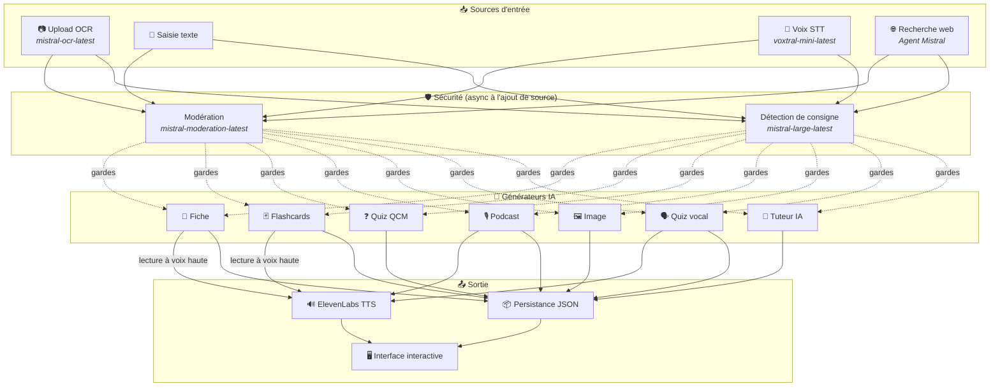
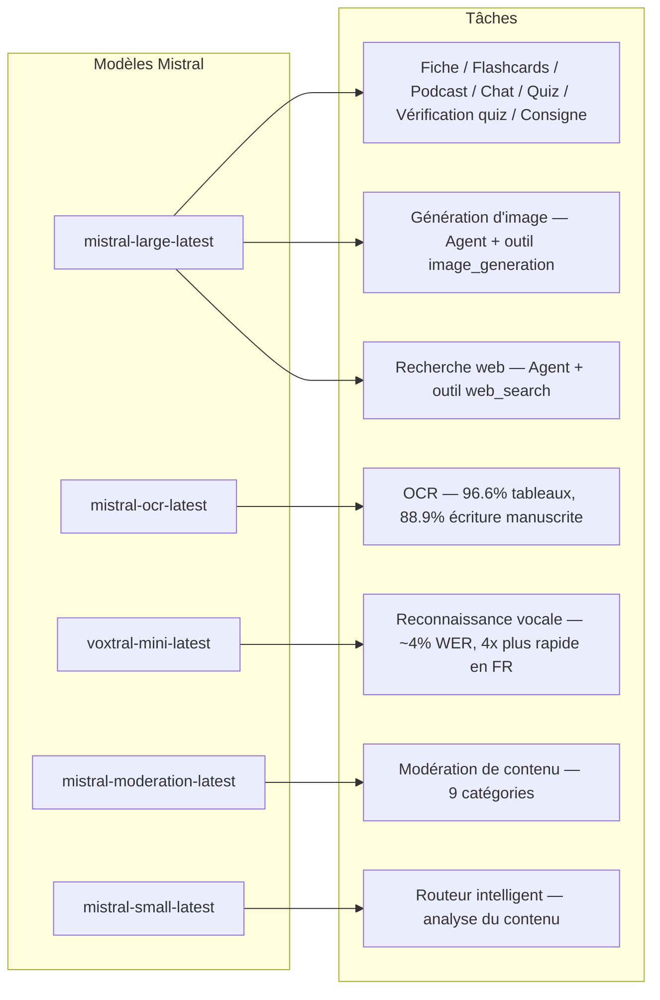
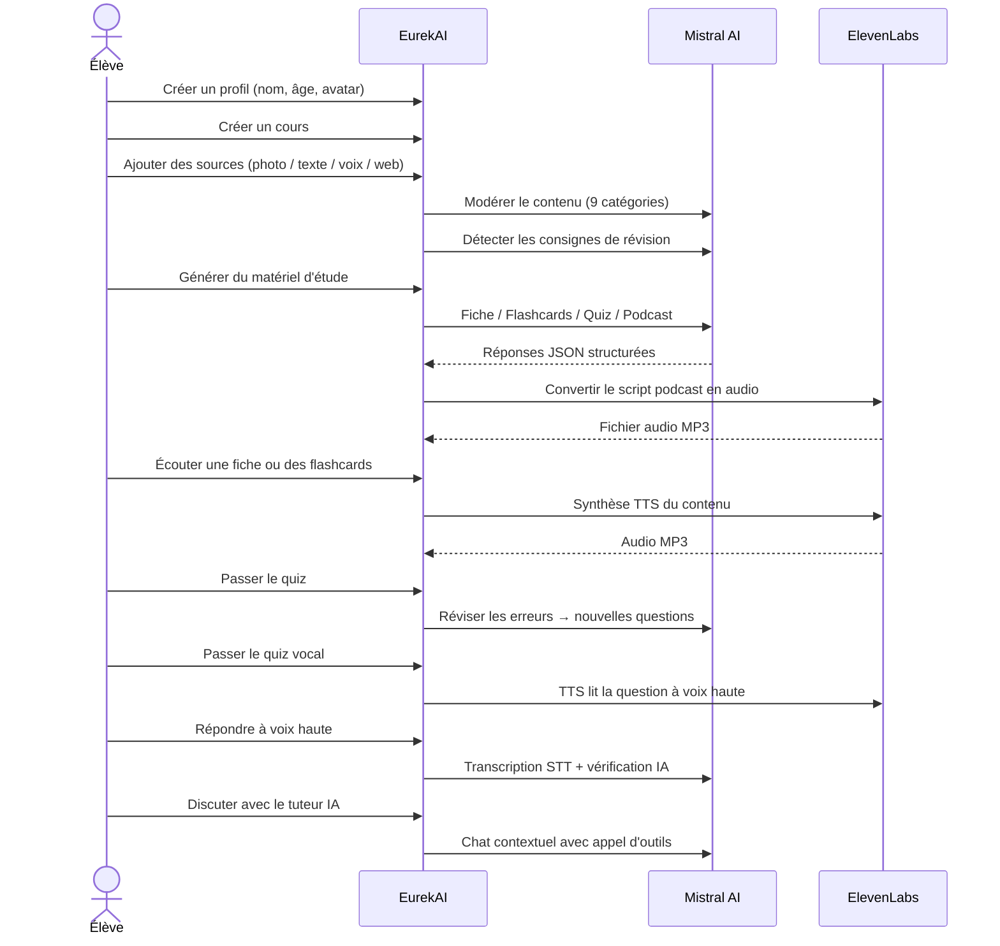

<p align="center">
  
</p>

<h1 align="center">EurekAI</h1>

<p align="center">
  <strong>Förvandla vilket innehåll som helst till en interaktiv lärandeupplevelse — drivet av AI.</strong>
</p>

<p align="center">
  <a href="https://mistral.ai"></a>
  <a href="https://www.typescriptlang.org"></a>
  <a href="https://mistral.ai"></a>
  <a href="https://elevenlabs.io"></a>
</p>

<p align="center">
  <a href="https://www.youtube.com/watch?v=_b1TQz2leoI">▶️ Se demon på YouTube</a> · <a href="README-en.md">🇬🇧 Läs på engelska</a>
</p>

---

## Berättelsen — Varför EurekAI?

**EurekAI** föddes under [Mistral AI Worldwide Hackathon](https://worldwidehackathon.mistral.ai/) (mars 2026). Jag behövde ett ämne — och idén kom från något väldigt konkret: jag förbereder regelbundet prov med min dotter, och jag tänkte att det borde vara möjligt att göra det mer lekfullt och interaktivt med hjälp av AI.

Målet: ta **vilken inmatning som helst** — ett foto av läroboken, en kopierad text, en röstinspelning, en webbsökning — och förvandla den till **repetitionsblad, flashcards, quiz, poddar, illustrationer och mycket mer**. Allt drivet av Mistral AI:s franska modeller, vilket gör det till en naturligt anpassad lösning för fransktalande elever.

Varje kodrad skrevs under hackathonet. Alla API:er och bibliotek med öppen källkod används i enlighet med hackathonets regler.

---

## Funktioner

| | Funktion | Beskrivning |
|---|---|---|
| 📷 | **OCR-uppladdning** | Fotografera din lärobok eller dina anteckningar — Mistral OCR extraherar innehållet |
| 📝 | **Texteingång** | Skriv eller klistra in valfri text direkt |
| 🎤 | **Röståtkomst** | Spela in dig själv — Voxtral STT transkriberar din röst |
| 🌐 | **Webbsökning** | Ställ en fråga — en Mistral-agent söker svar på webben |
| 📄 | **Repetitionsblad** | Strukturerade anteckningar med nyckelpunkter, vokabulär, citat, anekdoter |
| 🃏 | **Flashcards** | 5 Q/A-kort med källhänvisningar för aktiv memorering |
| ❓ | **Flervalsquiz** | 10–20 flervalsfrågor med adaptiv repetition av fel |
| 🎙️ | **Podcast** | Mini-podcast med 2 röster (Alex & Zoé) konverterad till ljud via ElevenLabs |
| 🖼️ | **Illustrationer** | Pedagogiska bilder genererade av en Mistral-agent |
| 🗣️ | **Röstquiz** | Frågor upplästa högt, muntligt svar, AI:n kontrollerar svaret |
| 💬 | **AI-lärare** | Kontextuell chatt med dina kursdokument, med verktygsanrop |
| 🧠 | **Smart router** | AI:n analyserar ditt innehåll och rekommenderar de bästa generatorerna |
| 🔒 | **Föräldrakontroll** | Åldersbaserad moderering, föräldra-PIN, chattbegränsningar |
| 🌍 | **Flerspråkigt** | Fullständig AI-innehålls- och gränssnittsupplevelse på franska och engelska |
| 🔊 | **Uppläsning** | Lyssna på repetitionsblad och flashcards upplästa via ElevenLabs TTS |

---

## Översikt över arkitekturen



---

## Modellanvändningskarta



---

## Användarflöde



---

## Fördjupning — Funktioner

### Fler-modal inmatning

EurekAI accepterar 4 typer av källor, alla modererade före bearbetning:

- **OCR-uppladdning** — JPG-, PNG- eller PDF-filer bearbetas av `mistral-ocr-latest`. Hanterar tryckt text, tabeller (96.6% noggrannhet) och handskrift (88.9% noggrannhet).
- **Fri text** — Skriv eller klistra in valfritt innehåll. Går igenom moderering innan lagring.
- **Röståtkomst** — Spela in ljud i webbläsaren. Transkriberas av `voxtral-mini-latest` med ~4% WER. Parametern `language="fr"` gör det 4x snabbare.
- **Webbsökning** — Ange en fråga. En tillfällig Mistral-agent med verktyget `web_search` hämtar och sammanfattar resultaten.

### Generering av AI-innehåll

Sex typer av genererat lärandematerial:

| Generator | Modell | Utdata |
|---|---|---|
| **Repetitionsblad** | `mistral-large-latest` | Titel, sammanfattning, 10–25 nyckelpunkter, vokabulär, citat, anekdot |
| **Flashcards** | `mistral-large-latest` | 5 Q/A-kort med källhänvisningar |
| **Flervalsquiz** | `mistral-large-latest` | 10–20 frågor, 4 val per fråga, förklaringar, adaptiv repetition |
| **Podcast** | `mistral-large-latest` + ElevenLabs | Manus för 2 röster (Alex & Zoé) → MP3-ljud |
| **Illustration** | Agent `mistral-large-latest` | Pedagogisk bild via verktyget `image_generation` |
| **Röstquiz** | `mistral-large-latest` + ElevenLabs + Voxtral | TTS-frågor → STT-svar → AI-verifiering |

### AI-lärare via chatt

En konversationslärare med full tillgång till kursdokumenten:

- Använder `mistral-large-latest` (128K tokens kontextfönster)
- **Verktygsanrop**: kan generera repetitionsblad, flashcards eller quiz i realtid under samtalet
- Historik på 50 meddelanden per kurs
- Innehållsmoderering för åldersanpassade profiler

### Intelligent automatisk router

Routern använder `mistral-small-latest` för att analysera källornas innehåll och rekommendera vilka generatorer som är mest relevanta — så att eleverna inte behöver välja manuellt.

### Adaptivt lärande

- **Quizstatistik**: spårning av försök och träffsäkerhet per fråga
- **Quizrepetition**: genererar 5–10 nya frågor som riktar sig mot svaga koncept
- **Instruktionsdetektering**: upptäcker repetitionsinstruktioner ("Jag kan min läxa om jag kan...") och prioriterar dem i alla generatorer

### Säkerhet & föräldrakontroll

- **4 åldersgrupper**: barn (6–10), tonåring (11–15), student (16+), vuxen
- **Innehållsmoderering**: 9 kategorier via `mistral-moderation-latest`, trösklar anpassade per åldersgrupp
- **Föräldra-PIN**: SHA-256-hash, krävs för profiler under 15 år
- **Chattbegränsningar**: AI-chatt endast tillgänglig för profiler från 15 år och uppåt

### System med flera profiler

- Flera profiler med namn, ålder, avatar, språkpreferenser
- Projekt kopplade till profiler via `profileId`
- Kaskadborttagning: att ta bort en profil tar bort alla dess projekt

### Internationalisering

- Fullständig gränssnittsupplevelse tillgänglig på franska och engelska
- AI-prompter stöder 2 språk idag (FR, EN) med arkitektur redo för 15 (es, de, it, pt, nl, ja, zh, ko, ar, hi, pl, ro, sv)
- Språk kan konfigureras per profil

---

## Tekniskt stack

| Lager | Teknologi | Roll |
|---|---|---|
| **Runtime** | Node.js + TypeScript 5.7 | Server och typsäkerhet |
| **Backend** | Express 4.21 | REST API |
| **Utvecklingsserver** | Vite 7.3 + tsx | HMR, Handlebars-partials, proxy |
| **Frontend** | HTML + TailwindCSS 4.2 + Alpine.js 3.15 | Reaktivt gränssnitt, TypeScript kompilerat av Vite |
| **Templating** | vite-plugin-handlebars | HTML-komposition via partials |
| **AI** | Mistral AI SDK 1.14 | Chatt, OCR, STT, agenter, moderering |
| **TTS** | ElevenLabs SDK 2.36 | Tal-syntes för poddar och röstquiz |
| **Ikoner** | Lucide 0.575 | SVG-ikonbibliotek |
| **Markdown** | Marked 17 | Markdown-rendering i chatten |
| **Filuppladdning** | Multer 1.4 | Hantering av multipart-formulär |
| **Ljud** | ffmpeg-static | Ljudbearbetning |
| **Tester** | Vitest 4 | Enhetstester |
| **Persistens** | JSON-filer | Lagring utan beroenden |

---

## Modellsreferens

| Modell | Användning | Varför |
|---|---|---|
| `mistral-large-latest` | Repetitionsblad, Flashcards, Podcast, Flervalsquiz, Chatt, Quizverifiering, Bildagent, Webb-sökningsagent, Instruktionsdetektering | Bäst flerspråkig + instruktionuppföljning |
| `mistral-ocr-latest` | Dokument-OCR | 96.6% noggrannhet för tabeller, 88.9% handskrift |
| `voxtral-mini-latest` | Taligenkänning | ~4% WER, `language="fr"` ger 4x+ hastighet |
| `mistral-moderation-latest` | Innehållsmoderering | 9 kategorier, barnsäkerhet |
| `mistral-small-latest` | Smart router | Snabb innehållsanalys för routningsbeslut |
| `eleven_v3` (ElevenLabs) | Tal-syntes | Naturliga franska röster för poddar och röstquiz |

---

## Snabbstart

```bash
# Cloner le dépôt
git clone https://github.com/your-username/eurekai.git
cd eurekai

# Installer les dépendances
npm install

# Configurer les clés API
cp .env.example .env
# Éditez .env avec vos clés :
#   MISTRAL_API_KEY=votre_clé_ici
#   ELEVENLABS_API_KEY=votre_clé_ici  (optionnel, pour les fonctions audio)

# Lancer le développement
npm run dev
# → Backend :  http://localhost:3000 (API)
# → Frontend : http://localhost:5173 (serveur Vite avec HMR)
```

> **Obs**: ElevenLabs är valfritt. Utan denna nyckel kommer podcast- och röstquizfunktionerna att generera manus men inte syntetisera ljud.

---

## Projektstruktur

```
server.ts                 — Point d'entrée Express, monte les routes + config
config.ts                 — Config runtime (modèles, voix, TTS), persistée dans output/config.json
store.ts                  — ProjectStore : CRUD projets/sources/générations, persistance JSON
profiles.ts               — ProfileStore : gestion des profils, hachage PIN
types.ts                  — Types TypeScript : Source, Generation (6 types), QuizStats, Profile
prompts.ts                — Tous les prompts IA centralisés (system + user templates, FR/EN)

generators/
  ocr.ts                  — Upload + OCR via Mistral (JPG, PNG, PDF)
  summary.ts              — Génération de fiche de révision (JSON structuré)
  flashcards.ts           — 5 flashcards Q/R
  quiz.ts                 — Quiz QCM (10-20 questions) + révision adaptative
  podcast.ts              — Script podcast 2 voix (Alex + Zoé)
  quiz-vocal.ts           — Quiz vocal : questions TTS + réponses STT + vérification IA
  image.ts                — Génération d'image via Agent Mistral (outil image_generation)
  chat.ts                 — Tuteur IA par chat avec appel d'outils
  router.ts               — Routeur automatique intelligent (contenu → générateurs recommandés)
  consigne.ts             — Détection de consignes de révision
  tts.ts                  — ElevenLabs TTS (eleven_v3, concaténation de segments)
  stt.ts                  — Voxtral STT (audio → texte)
  websearch.ts            — Agent Mistral avec outil web_search
  moderation.ts           — Modération de contenu (9 catégories)

routes/
  projects.ts             — CRUD projets
  sources.ts              — Upload OCR, texte libre, voix STT, recherche web, modération
  generate.ts             — Endpoints de génération (fiche/flashcards/quiz/podcast/image/vocal)
  generations.ts          — Tentatives de quiz, réponses vocales, lecture à voix haute, renommage, suppression
  chat.ts                 — Chat IA avec appel d'outils
  profiles.ts             — CRUD profils avec gestion du PIN

helpers/
  index.ts                — safeParseJson, unwrapJsonArray, extractAllText, timer
  audio.ts                — collectStream (ReadableStream → Buffer)

src/                      — Frontend (Vite + Handlebars)
  index.html              — Point d'entrée HTML principal
  main.ts                 — Entrée frontend (init Alpine.js + icônes Lucide)
  app/                    — Modules applicatifs Alpine.js
    state.ts              — Gestion d'état réactif
    navigation.ts         — Routage des vues + gardes par âge
    profiles.ts           — Logique du sélecteur de profils
    projects.ts           — CRUD des cours
    sources.ts            — Gestionnaires d'upload de sources
    generate.ts           — Déclencheurs de génération
    generations.ts        — Affichage + actions sur les générations
    chat.ts               — Interface de chat
    render.ts             — Helpers de rendu HTML
    i18n.ts               — Changement de langue
    ...
  components/
    quiz.ts               — Composant quiz interactif
    quiz-vocal.ts         — Composant quiz vocal
  i18n/
    fr.ts                 — Traductions françaises
    en.ts                 — Traductions anglaises
    index.ts              — Chargeur i18n
  partials/               — Partials HTML Handlebars (header, sidebar, dialogues, vues)
  styles/
    main.css              — Entrée TailwindCSS
    theme.css             — Variables de thème personnalisées

public/assets/            — Ressources statiques (logo, avatars)
output/                   — Données d'exécution (projets, config, fichiers audio)
```

---

## API-referens

### Konfig
| Metod | Endpoint | Beskrivning |
|---|---|---|
| `GET` | `/api/config` | Aktuell konfiguration |
| `PUT` | `/api/config` | Ändra konfiguration (modeller, röster, TTS) |
| `GET` | `/api/config/status` | API-status (Mistral, ElevenLabs) |

### Profiler
| Metod | Endpoint | Beskrivning |
|---|---|---|
| `GET` | `/api/profiles` | Lista alla profiler |
| `POST` | `/api/profiles` | Skapa en profil |
| `PUT` | `/api/profiles/:id` | Ändra en profil (PIN krävs för < 15 år) |
| `DELETE` | `/api/profiles/:id` | Ta bort en profil + kaskadprojekt |

### Projekt
| Metod | Endpoint | Beskrivning |
|---|---|---|
| `GET` | `/api/projects` | Lista projekt |
| `POST` | `/api/projects` | Skapa ett projekt `{name, profileId}` |
| `GET` | `/api/projects/:pid` | Projektinformation |
| `PUT` | `/api/projects/:pid` | Byt namn på `{name}` |
| `DELETE` | `/api/projects/:pid` | Ta bort projektet |

### Källor
| Metod | Endpoint | Beskrivning |
|---|---|---|
| `POST` | `/api/projects/:pid/sources/upload` | OCR-uppladdning (multipart-filer) |
| `POST` | `/api/projects/:pid/sources/text` | Fri text `{text}` |
| `POST` | `/api/projects/:pid/sources/voice` | Röst STT (multipart-ljud) |
| `POST` | `/api/projects/:pid/sources/websearch` | Webbsökning `{query}` |
| `DELETE` | `/api/projects/:pid/sources/:sid` | Ta bort en källa |
| `POST` | `/api/projects/:pid/moderate` | Moderera `{text}` |
| `POST` | `/api/projects/:pid/detect-consigne` | Detektera repetitionsinstruktioner |

### Generering
| Metod | Endpoint | Beskrivning |
|---|---|---|
| `POST` | `/api/projects/:pid/generate/summary` | Repetitionsblad `{sourceIds?}` |
| `POST` | `/api/projects/:pid/generate/flashcards` | Flashcards `{sourceIds?}` |
| `POST` | `/api/projects/:pid/generate/quiz` | Flervalsquiz `{sourceIds?}` |
| `POST` | `/api/projects/:pid/generate/podcast` | Podcast `{sourceIds?}` |
| `POST` | `/api/projects/:pid/generate/image` | Illustration `{sourceIds?}` |
| `POST` | `/api/projects/:pid/generate/quiz-vocal` | Röstquiz `{sourceIds?}` |
| `POST` | `/api/projects/:pid/generate/quiz-review` | Adaptiv repetition `{generationId, weakQuestions}` |
| `POST` | `/api/projects/:pid/generate/auto` | Automatisk generering via routern |

### CRUD Genereringar
| Metod | Endpoint | Beskrivning |
|---|---|---|
| `POST` | `/api/projects/:pid/generations/:gid/quiz-attempt` | Skicka in svar `{answers}` |
| `POST` | `/api/projects/:pid/generations/:gid/vocal-answer` | Verifiera ett muntligt svar (multipart-ljud + questionIndex) |
| `POST` | `/api/projects/:pid/generations/:gid/read-aloud` | Läsa upp TTS högt (repetitionsblad/flashcards) |
| `PUT` | `/api/projects/:pid/generations/:gid` | Byt namn på `{title}` |
| `DELETE` | `/api/projects/:pid/generations/:gid` | Ta bort genereringen |

### Chatt
| Metod | Endpoint | Beskrivning |
|---|---|---|
| `GET` | `/api/projects/:pid/chat` | Hämta chatthistorik |
| `POST` | `/api/projects/:pid/chat` | Skicka ett meddelande `{message}` |
| `DELETE` | `/api/projects/:pid/chat` | Rensa chatthistoriken |

---

## Arkitektoniska beslut

| Beslut | Motivering |
|---|---|
| **Alpine.js framför React/Vue** | Minimal footprint, lättviktig reaktivitet med TypeScript kompilerat av Vite. Perfekt för en hackathon där snabbhet räknas. |
| **Persistens i JSON-filer** | Noll beroenden, omedelbar start. Ingen databas att konfigurera — bara att köra igång. |
| **Vite + Handlebars** | Det bästa av två världar: snabb HMR för utveckling, HTML-partials för kodorganisation, Tailwind JIT. |
| **Centraliserade prompts** | Alla AI-prompter i `prompts.ts` — lätt att iterera, testa och anpassa per språk/åldersgrupp. |
| **System med flera generationer** | Varje generation är ett självständigt objekt med eget ID — möjliggör flera blad, quiz etc. per kurs. |
| **Åldersanpassade prompter** | 4 åldersgrupper med olika vokabulär, komplexitet och ton — samma innehåll lär ut olika beroende på eleven. |
| **Agentbaserade funktioner** | Bildgenerering och webbsökning använder tillfälliga Mistral-agenter — ren livscykel med automatisk städning. |

---

## Krediter & tack

- **[Mistral AI](https://mistral.ai)** — AI-modeller (Large, OCR, Voxtral, Moderation, Small) + Worldwide Hackathon
- **[ElevenLabs](https://elevenlabs.io)** — Motor för tal-syntes (`eleven_v3`)
- **[Alpine.js](https://alpinejs.dev)** — Lättviktigt reaktivt ramverk
- **[TailwindCSS](https://tailwindcss.com)** — Utility-first CSS-ramverk
- **[Vite](https://vitejs.dev)** — Verktyg för frontend-build
- **[Lucide](https://lucide.dev)** — Ikonbibliotek
- **[Marked](https://marked.js.org)** — Markdown-parser

Byggd med omsorg under Mistral AI Worldwide Hackathon, mars 2026.

---

## Författare

**Julien LS** — [contact@jls42.org](mailto:contact@jls42.org)

## Licens

[AGPL-3.0](LICENSE) — Copyright (C) 2026 Julien LS

**Detta dokument har översatts från fr-versionen till språket sv med hjälp av modellen gpt-5.4-mini. För mer information om översättningsprocessen, se https://gitlab.com/jls42/ai-powered-markdown-translator**

