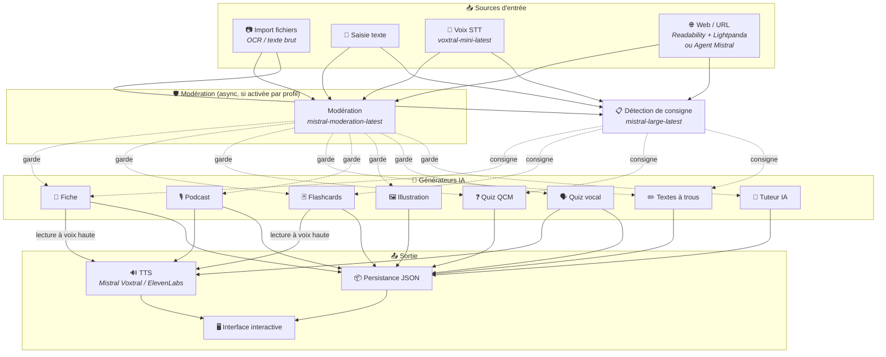
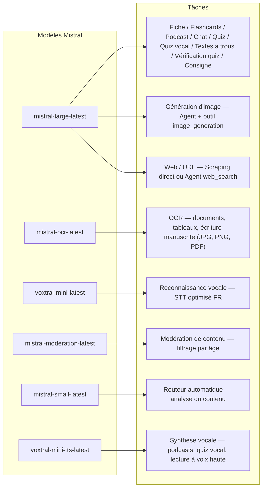
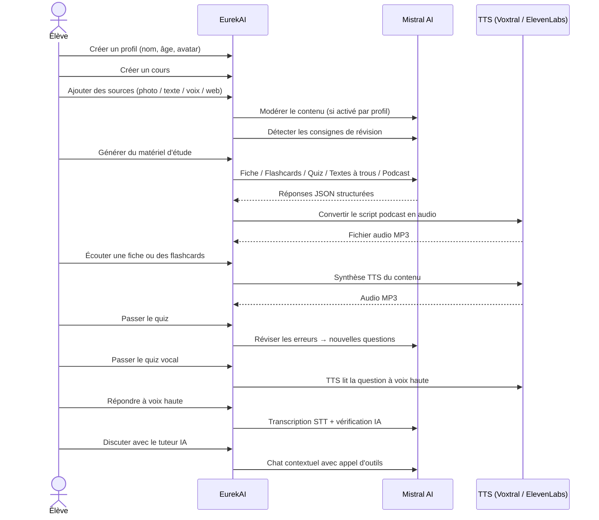

<p align="center">
  
</p>

<h1 align="center">EurekAI</h1>

<p align="center">
  <strong>将任何内容转变为互动式学习体验 — 由 <a href="https://mistral.ai">Mistral AI</a> 提供技术支持。</strong>
</p>

<p align="center">
  <a href="README-en.md">🇬🇧 英语</a> · <a href="README-es.md">🇪🇸 西班牙语</a> · <a href="README-pt.md">🇧🇷 葡萄牙语</a> · <a href="README-de.md">🇩🇪 德语</a> · <a href="README-it.md">🇮🇹 意大利语</a> · <a href="README-nl.md">🇳🇱 荷兰语</a> · <a href="README-ar.md">🇸🇦 阿拉伯语</a><br>
  <a href="README-hi.md">🇮🇳 印地语</a> · <a href="README-zh.md">🇨🇳 中文</a> · <a href="README-ja.md">🇯🇵 日语</a> · <a href="README-ko.md">🇰🇷 韩语</a> · <a href="README-pl.md">🇵🇱 波兰语</a> · <a href="README-ro.md">🇷🇴 罗马尼亚语</a> · <a href="README-sv.md">🇸🇪 瑞典语</a>
</p>

<p align="center">
  <a href="https://www.youtube.com/watch?v=_b1TQz2leoI"></a>
</p>

<h4 align="center">📊 代码质量</h4>

<p align="center">
  <a href="https://sonarcloud.io/summary/new_code?id=jls42_EurekAI"></a>
  <a href="https://sonarcloud.io/summary/new_code?id=jls42_EurekAI"></a>
  <a href="https://sonarcloud.io/summary/new_code?id=jls42_EurekAI"></a>
  <a href="https://sonarcloud.io/summary/new_code?id=jls42_EurekAI"></a>
</p>
<p align="center">
  <a href="https://sonarcloud.io/summary/new_code?id=jls42_EurekAI"></a>
  <a href="https://sonarcloud.io/summary/new_code?id=jls42_EurekAI"></a>
  <a href="https://sonarcloud.io/summary/new_code?id=jls42_EurekAI"></a>
  <a href="https://sonarcloud.io/summary/new_code?id=jls42_EurekAI"></a>
</p>

---

## 故事 — 为什么选择 EurekAI？

**EurekAI** 起源于 [Mistral AI 全球黑客松](https://luma.com/mistralhack-online)（[官方网站](https://worldwide-hackathon.mistral.ai/)）（2026 年 3 月）。我需要一个项目题材——灵感来自一个非常实际的场景：我经常和女儿一起准备小测验，我想是否可以用 AI 将这一过程变得更有趣、更互动。

目标：接收**任意输入**——课程照片、复制粘贴的文本、语音录音、网页搜索——并将其转换为**复习笔记、闪卡、测验、播客、填空题、插画**等多种学习素材。全部由 Mistral AI 的法国模型驱动，因此对讲法语的学生特别友好。

[初始原型](https://github.com/jls42/worldwide-hackathon.mistral.ai) 在黑客松的 48 小时内作为围绕 Mistral 服务的概念验证被实现——已可工作但功能有限。此后，EurekAI 发展成一个真正的项目：填空题、练习导航、网页抓取、可配置的家长审查、深入的代码审查等。项目的绝大部分代码由 AI 生成——主要是 [Claude Code](https://code.claude.com/)，并辅以少量来自 [Codex](https://openai.com/codex/) 和 [Gemini CLI](https://geminicli.com/) 的贡献。

---

## 功能

| | 功能 | 描述 |
|---|---|---|
| 📷 | **导入文件** | 导入课程资料——照片、PDF（通过 Mistral OCR）或文本文件（TXT、MD） |
| 📝 | **文本输入** | 直接输入或粘贴任意文本 |
| 🎤 | **语音输入** | 在浏览器中录音——Voxtral STT 转写你的语音 |
| 🌐 | **网页 / URL** | 粘贴 URL（通过 Readability + Lightpanda 直接抓取）或输入搜索词（Agent Mistral web_search） |
| 📄 | **复习笔记** | 结构化笔记，包含要点、词汇、引用、轶事 |
| 🃏 | **闪卡** | 带来源引用的问答卡片，用于主动记忆（数量可配置） |
| ❓ | **选择题测验** | 多项选择题，带错误的自适应复习（数量可配置） |
| ✏️ | **填空题** | 带提示和容错验证的完形填空练习 |
| 🎙️ | **播客** | 双声道迷你播客音频——默认 Mistral 声音或自定义声音（家长！） |
| 🖼️ | **插画** | 由 Agent Mistral 生成的教育图像 |
| 🗣️ | **语音测验** | 题目朗读（可自定义声音）、口头回答、AI 验证 |
| 💬 | **AI 辅导** | 基于课程文档的情境聊天，支持调用工具 |
| 🧠 | **自动路由器** | 基于 `mistral-small-latest` 的路由器分析内容并在 7 种生成器中推荐组合 |
| 🔒 | **家长控制** | 按档案可配置的审核（自定义类别）、家长 PIN、聊天限制 |
| 🌍 | **多语言** | 界面支持 9 种语言；通过提示可在 15 种语言中控制 AI 生成 |
| 🔊 | **朗读** | 通过 Mistral Voxtral TTS 或 ElevenLabs 听复习笔记与闪卡 |

---

## 架构概览



---

## 模型使用图



---

## 用户流程



---

## 深入解析 — 功能

### 多模态输入

EurekAI 接受 4 种来源类型，根据档案进行审核（默认对儿童和青少年启用）：

- **导入文件** — JPG、PNG 或 PDF 文件由 `mistral-ocr-latest` 处理（印刷文本、表格、手写），或直接导入文本文件（TXT、MD）。
- **自由文本** — 输入或粘贴任意内容。若启用审核，存储前会先审核。
- **语音输入** — 在浏览器中录制音频。由 `voxtral-mini-latest` 转写。参数 `language="fr"` 可优化识别效果。
- **网页 / URL** — 粘贴一个或多个 URL 以直接抓取内容（Readability + Lightpanda 用于 JS 页面），或输入关键词通过 Agent Mistral 进行网络搜索。单一输入框同时接受 URL 和关键词，两者会自动分离，每个结果生成独立来源。

### AI 内容生成

生成七类学习材料：

| 生成器 | 模型 | 输出 |
|---|---|---|
| **复习笔记** | `mistral-large-latest` | 标题、摘要、要点、词汇、引用、轶事 |
| **闪卡** | `mistral-large-latest` | 带来源引用的问答卡片（数量可配置） |
| **选择题测验** | `mistral-large-latest` | 多项选择题、解释、错误的自适应复习（数量可配置） |
| **填空题** | `mistral-large-latest` | 带提示的填空句子，容错验证（Levenshtein） |
| **播客** | `mistral-large-latest` + Voxtral TTS | 双声道脚本 → MP3 音频 |
| **插画** | Agent `mistral-large-latest` | 通过工具 `image_generation` 生成教育图片 |
| **语音测验** | `mistral-large-latest` + Voxtral TTS + STT | 题目 TTS → 回答 STT → AI 验证 |

### 聊天式 AI 辅导

基于课程文档的对话式辅导：

- 使用 `mistral-large-latest`
- **调用工具**：可在对话中生成复习笔记、闪卡、测验或填空题
- 每门课程保留 50 条消息的历史记录
- 若为该档案启用，将对内容进行审核

### 自动路由器

路由器使用 `mistral-small-latest` 分析来源内容，并在 7 种生成器中推荐最相关的生成器组合。界面实时显示进度：先分析阶段，然后是各个生成任务（可逐项取消）。

### 自适应学习

- **测验统计**：跟踪每题的尝试次数与正确率
- **测验复习**：生成 5–10 道新的题目，针对薄弱概念
- **指令检测**：检测复习指令（“如果我会...就表示我会这课”）并在兼容的文本生成器中优先处理（笔记、闪卡、测验、填空题）

### 安全与家长控制

- **4 个年龄组**：儿童（≤10 岁）、青少年（11–15 岁）、学生（16–25 岁）、成人（26 岁以上）
- **内容审核**：`mistral-moderation-latest`，提供 10 个可用类别，儿童/青少年默认屏蔽 5 类（`sexual`, `hate_and_discrimination`, `violence_and_threats`, `selfharm`, `jailbreaking`）。可在档案设置中自定义类别。
- **家长 PIN**：SHA-256 哈希，15 岁以下档案需提供。生产部署请使用带盐的慢哈希（Argon2id、bcrypt）。
- **聊天限制**：默认对 16 岁以下禁用 AI 聊天，家长可启用

### 多档案系统

- 多档案支持姓名、年龄、头像、语言偏好
- 档案关联的项目通过 `profileId`
- 级联删除：删除档案会删除其所有项目

### 多 TTS 提供商与自定义语音

- **Mistral Voxtral TTS**（默认）：`voxtral-mini-tts-latest`，无需额外密钥
- **ElevenLabs**（可选）：`eleven_v3`，更自然的声音，需提供 `ELEVENLABS_API_KEY`
- 在应用设置中可配置提供商
- **自定义语音**：家长可通过 Mistral Voices API（基于音频样本）创建自有声音，并将其分配给主讲/嘉宾角色——播客与语音测验将使用家长的声音，使孩子的体验更具沉浸感
- 两个可配置的声音角色：**主讲**（主要叙述者）和 **嘉宾**（播客的第二声音）
- 设置中可查看完整的 Mistral 语音目录，并按语言筛选

### 国际化

- 界面支持 9 种语言：法语、英语、西班牙语、葡萄牙语、意大利语、荷兰语、德语、印地语、阿拉伯语
- AI 提示支持 15 种语言（fr, en, es, de, it, pt, nl, ja, zh, ko, ar, hi, pl, ro, sv）
- 语言可按档案配置

---

## 技术栈

| 层 | 技术 | 作用 |
|---|---|---|
| **运行时** | Node.js + TypeScript 6.x | 服务器与类型安全 |
| **后端** | Express 5.x | REST API |
| **开发服务器** | Vite 8.x (Rolldown) + tsx | HMR、Handlebars partials、代理 |
| **前端** | HTML + TailwindCSS 4.x + Alpine.js 3.x | 响应式界面，TypeScript 由 Vite 编译 |
| **模板** | vite-plugin-handlebars | 通过 partials 组合 HTML |
| **AI** | Mistral AI SDK 2.x | 聊天、OCR、STT、TTS、Agents、审核 |
| **TTS（默认）** | Mistral Voxtral TTS | `voxtral-mini-tts-latest`，内置语音合成 |
| **TTS（可选）** | ElevenLabs SDK 2.x | `eleven_v3`，自然语音 |
| **图标** | Lucide 1.x | SVG 图标库 |
| **网页抓取** | Readability + linkedom | 提取网页主体内容（类似 Firefox Reader View 技术） |
| **无头浏览器** | Lightpanda | 超轻量 headless（Zig + V8），用于 JS/SPA 页面抓取的回退方案 |
| **Markdown** | Marked | 在聊天中渲染 Markdown |
| **文件上传** | Multer 2.x | 处理 multipart 表单 |
| **音频** | ffmpeg-static | 拼接音频片段 |
| **测试** | Vitest | 单元测试 — 覆盖率由 SonarCloud 测量 |
| **持久化** | JSON 文件 | 无外部依赖的存储 |

---

## 模型参考

| 模型 | 用途 | 为什么 |
|---|---|---|
| `mistral-large-latest` | 笔记、闪卡、播客、测验、填空题、聊天、语音测验验证、图像 Agent、网络搜索 Agent、指令检测 | 最佳多语种支持 + 指令跟随能力 |
| `mistral-ocr-latest` | 文档 OCR | 印刷文本、表格、手写 |
| `voxtral-mini-latest` | 语音识别（STT） | 多语种 STT，配合 `language="fr"` 优化 |
| `voxtral-mini-tts-latest` | 语音合成（TTS） | 播客、语音测验、朗读 |
| `mistral-moderation-latest` | 内容审核 | 对儿童/青少年默认屏蔽 5 类（+ 越狱检测） |
| `mistral-small-latest` | 自动路由器 | 快速分析内容以做出路由决策 |
| `eleven_v3` (ElevenLabs) | 语音合成（TTS 可选） | 自然声音，可选配置 |

---

## 快速开始

```bash
# Cloner le dépôt
git clone https://github.com/jls42/EurekAI.git
cd EurekAI

# Installer les dépendances
npm install

# Configurer les clés API
cp .env.example .env
# Éditez .env avec vos clés :
#   MISTRAL_API_KEY=votre_clé_ici           (requis)
#   ELEVENLABS_API_KEY=votre_clé_ici        (optionnel, TTS alternatif)
#   SONAR_TOKEN=...                          (optionnel, CI SonarCloud uniquement)

# Lancer le développement
npm run dev
# → Backend :  http://localhost:3000 (API)
# → Frontend : http://localhost:5173 (serveur Vite avec HMR)
```

> **注意**：Mistral Voxtral TTS 为默认提供商——除 `MISTRAL_API_KEY` 外无需额外密钥。ElevenLabs 为可配置的替代 TTS 提供商。

---

## 项目结构

```
server.ts                 — Point d'entrée Express, monte les routes + config
config.ts                 — Config runtime (modèles, voix, TTS provider), persistée dans output/config.json
store.ts                  — ProjectStore : CRUD projets/sources/générations, persistance JSON
profiles.ts               — ProfileStore : gestion des profils, hachage PIN
types.ts                  — Types TypeScript : Source, Generation (7 types), QuizStats, Profile
prompts.ts                — Tous les prompts IA centralisés (system + user templates, 15 langues)

generators/
  ocr.ts                  — OCR via Mistral (JPG, PNG, PDF)
  summary.ts              — Génération de fiche de révision (JSON structuré)
  flashcards.ts           — Flashcards Q/R (5-50, configurable)
  quiz.ts                 — Quiz QCM (5-50 questions, configurable) + révision adaptative
  fill-blank.ts           — Exercices à trous avec validation tolérante
  podcast.ts              — Script podcast 2 voix
  quiz-vocal.ts           — Quiz vocal : questions TTS + réponses STT + vérification IA
  image.ts                — Génération d'image via Agent Mistral (outil image_generation)
  chat.ts                 — Tuteur IA par chat avec appel d'outils
  router.ts               — Routeur automatique (contenu → générateurs recommandés)
  consigne.ts             — Détection de consignes de révision
  tts-provider.ts         — Dispatch TTS multi-provider (Mistral Voxtral / ElevenLabs)
  tts.ts                  — Génération audio podcast (concaténation de segments)
  stt.ts                  — Voxtral STT (audio → texte)
  websearch.ts            — Agent Mistral avec outil web_search (fallback)
  moderation.ts           — Modération de contenu (filtrage par âge)

routes/
  projects.ts             — CRUD projets
  profiles.ts             — CRUD profils avec gestion du PIN
  sources.ts              — Import fichiers (OCR + texte brut), texte libre, voix STT, scraping URL + recherche web, modération
  generate.ts             — Endpoints de génération (7 types + auto + route)
  generations.ts          — Tentatives de quiz/fill-blank, réponses vocales, lecture à voix haute
  chat.ts                 — Chat IA avec appel d'outils

helpers/
  index.ts                — getContent, stripJsonMarkdown, safeParseJson, unwrapJsonArray, extractAllText, timer
  audio.ts                — collectStream (ReadableStream → Buffer)
  fill-blank-validate.ts  — Validation tolérante des réponses (normalisation, Levenshtein)
  diversity.ts            — Diversité des générations (exclusion du contenu déjà produit, randomSeed)

src/                      — Frontend (Vite + Handlebars)
  index.html              — Point d'entrée HTML principal
  main.ts                 — Entrée frontend (init Alpine.js + icônes Lucide)
  app/                    — Modules applicatifs Alpine.js
    state.ts              — Gestion d'état réactif
    navigation.ts         — Routage des vues + gardes par âge
    profiles.ts           — Logique du sélecteur de profils
    projects.ts           — CRUD des cours
    sources.ts            — Gestionnaires d'upload de sources
    generate.ts           — Déclencheurs de génération (individuel, tout, auto 2 phases)
    generations.ts        — Affichage + actions sur les générations
    chat.ts               — Interface de chat
    config.ts             — Interface de configuration (modèles, voix, TTS provider)
    render.ts             — Helpers de rendu HTML
    i18n.ts               — Changement de langue
    ...
  components/
    quiz.ts               — Composant quiz interactif
    quiz-vocal.ts         — Composant quiz vocal
    fill-blank.ts         — Composant textes à trous
    flashcards.ts         — Composant flashcards avec retournement
    step-by-step.ts       — Mixin navigation pas-à-pas (quiz, fill-blank, flashcards)
  i18n/
    fr.ts, en.ts, es.ts, — Dictionnaires par langue (9 langues)
    pt.ts, it.ts, nl.ts,
    de.ts, hi.ts, ar.ts
    languages.ts          — Registre des langues UI disponibles
    index.ts              — Chargeur i18n
  partials/               — Partials HTML Handlebars (header, sidebar, dialogues, vues)
  styles/
    main.css              — Entrée TailwindCSS
    theme.css             — Variables de thème personnalisées

public/assets/            — Ressources statiques (logo, avatars)
output/                   — Données d'exécution (projets, config, fichiers audio)
```

---

## API 参考

### 配置
| 方法 | 端点 | 描述 |
|---|---|---|
| `GET` | `/api/config` | 当前配置 |
| `PUT` | `/api/config` | 修改配置（模型、声音、TTS 提供商） |
| `GET` | `/api/config/status` | API 状态（Mistral、ElevenLabs、TTS） |
| `POST` | `/api/config/reset` | 重置为默认配置 |
| `GET` | `/api/config/voices` | 列出 Mistral TTS 语音（可选 `?lang=fr`） |
| `GET` | `/api/moderation-categories` | 可用的审核类别 + 各年龄默认设置 |

### 档案
| 方法 | 端点 | 描述 |
|---|---|---|
| `GET` | `/api/profiles` | 列出所有档案 |
| `POST` | `/api/profiles` | 创建档案 |
| `PUT` | `/api/profiles/:id` | 修改档案（< 15 岁需 PIN） |
| `DELETE` | `/api/profiles/:id` | 删除档案 + 级联删除项目 `{pin?}` → `{ok, deletedProjects}` |

### 项目
| 方法 | 端点 | 描述 |
|---|---|---|
| `GET` | `/api/projects` | 列出项目（可选 `?profileId=`） |
| `POST` | `/api/projects` | 创建项目 `{name, profileId}` |
| `GET` | `/api/projects/:pid` | 项目详情 |
| `PUT` | `/api/projects/:pid` | 重命名 `{name}` |
| `DELETE` | `/api/projects/:pid` | 删除项目 |

### 来源
| 方法 | 端点 | 描述 |
|---|---|---|
| `POST` | `/api/projects/:pid/sources/upload` | 导入 multipart 文件（JPG/PNG/PDF 的 OCR，TXT/MD 的直接读取） |
| `POST` | `/api/projects/:pid/sources/text` | 自由文本 `{text}` |
| `POST` | `/api/projects/:pid/sources/voice` | 语音 STT（multipart 音频） |
| `POST` | `/api/projects/:pid/sources/websearch` | 抓取 URL 或网络搜索 `{query}` — 返回一个来源数组 |
| `DELETE` | `/api/projects/:pid/sources/:sid` | 删除来源 |
| `POST` | `/api/projects/:pid/moderate` | 审核 `{text}` |
| `POST` | `/api/projects/:pid/detect-consigne` | 检测复习指令 | ### 生成
| 方法 | Endpoint | 描述 |
|---|---|---|
| `POST` | `/api/projects/:pid/generate/summary` | 复习单 |
| `POST` | `/api/projects/:pid/generate/flashcards` | 抽认卡 |
| `POST` | `/api/projects/:pid/generate/quiz` | 多项选择测验 |
| `POST` | `/api/projects/:pid/generate/fill-blank` | 填空文本 |
| `POST` | `/api/projects/:pid/generate/podcast` | 播客 |
| `POST` | `/api/projects/:pid/generate/image` | 插图 |
| `POST` | `/api/projects/:pid/generate/quiz-vocal` | 语音测验 |
| `POST` | `/api/projects/:pid/generate/quiz-review` | 自适应复习 `{generationId, weakQuestions}` |
| `POST` | `/api/projects/:pid/generate/route` | 路由分析（要启动的生成器计划） |
| `POST` | `/api/projects/:pid/generate/auto` | 后端自动生成（路由 + 5 种：摘要、抽认卡、测验、填空、播客） |

所有生成路由都接受 `{sourceIds?, lang?, ageGroup?, count?, useConsigne?}`。`quiz-review` 还需要 `{generationId, weakQuestions}`。

### CRUD 生成
| 方法 | Endpoint | 描述 |
|---|---|---|
| `POST` | `/api/projects/:pid/generations/:gid/quiz-attempt` | 提交测验答案 `{answers}` |
| `POST` | `/api/projects/:pid/generations/:gid/fill-blank-attempt` | 提交填空答案 `{answers}` |
| `POST` | `/api/projects/:pid/generations/:gid/vocal-answer` | 验证口语答案（音频 + questionIndex） |
| `POST` | `/api/projects/:pid/generations/:gid/read-aloud` | TTS 朗读（复习单/抽认卡） |
| `PUT` | `/api/projects/:pid/generations/:gid` | 重命名 `{title}` |
| `DELETE` | `/api/projects/:pid/generations/:gid` | 删除生成 |

### 聊天
| 方法 | Endpoint | 描述 |
|---|---|---|
| `GET` | `/api/projects/:pid/chat` | 获取聊天历史 |
| `POST` | `/api/projects/:pid/chat` | 发送消息 `{message, lang, ageGroup}` |
| `DELETE` | `/api/projects/:pid/chat` | 清除聊天历史 |

---

## 架构决策

| 决策 | 理由 |
|---|---|
| **使用 Alpine.js 而非 React/Vue** | 极小的体积，结合由 Vite 编译的 TypeScript 提供轻量响应性。非常适合追求速度的黑客松。 |
| **以 JSON 文件持久化** | 零依赖、秒启动。无需配置数据库——开箱即可运行。 |
| **Vite + Handlebars** | 两者兼得：开发时快速 HMR，HTML partials 便于组织代码，Tailwind JIT。 |
| **提示集中管理** | 所有 IA 提示集中在 `prompts.ts` — 易于按语言/年龄组迭代、测试和调整。 |
| **多生成系统** | 每个生成是独立对象，拥有自己的 ID — 允许每门课程存在多张复习单、测验等。 |
| **按年龄适配的提示** | 4 个年龄组，词汇、复杂度和语气不同 — 相同内容根据学习者不同以不同方式呈现。 |
| **基于 Agents 的功能** | 图像生成和网页搜索使用临时 Mistral 代理 — 生命周期清晰并自动清理。 |
| **智能 URL 抓取** | 单一字段同时接受 URL 与关键词混合 — URL 通过 Readability 抓取（静态页面），回退至 Lightpanda（JS/SPA 页面），关键词触发 Mistral Agent web_search。每个结果产生一个独立来源。 |
| **多提供商 TTS** | 默认使用 Mistral Voxtral TTS（无需额外密钥），ElevenLabs 作为备选 — 可配置且无需重启。 |

---

## 致谢与鸣谢

- **[Mistral AI](https://mistral.ai)** — AI 模型（Large、OCR、Voxtral STT、Voxtral TTS、Moderation、Small）+ Worldwide Hackathon
- **[ElevenLabs](https://elevenlabs.io)** — 备选语音合成引擎 (`eleven_v3`)
- **[Alpine.js](https://alpinejs.dev)** — 轻量响应式框架
- **[TailwindCSS](https://tailwindcss.com)** — 实用型 CSS 框架
- **[Vite](https://vitejs.dev)** — 前端构建工具
- **[Lucide](https://lucide.dev)** — 图标库
- **[Marked](https://marked.js.org)** — Markdown 解析器
- **[Readability](https://github.com/mozilla/readability)** — 网页内容提取（Firefox Reader View 技术）
- **[Lightpanda](https://lightpanda.io)** — 用于抓取 JS/SPA 页面 的超轻量无头浏览器

始于 Mistral AI Worldwide Hackathon（2026 年 3 月），由 IA 完整开发，使用 [Claude Code](https://code.claude.com/)、[Codex](https://openai.com/codex/) 与 [Gemini CLI](https://geminicli.com/)。

---

## 作者

**Julien LS** — [contact@jls42.org](mailto:contact@jls42.org)

## 许可证

[AGPL-3.0](LICENSE) — 版权所有 (C) 2026 Julien LS

**本文件已使用模型 gpt-5-mini 将法语（fr）版本翻译为中文（zh）。有关翻译过程的更多信息，请参见 https://gitlab.com/jls42/ai-powered-markdown-translator**

