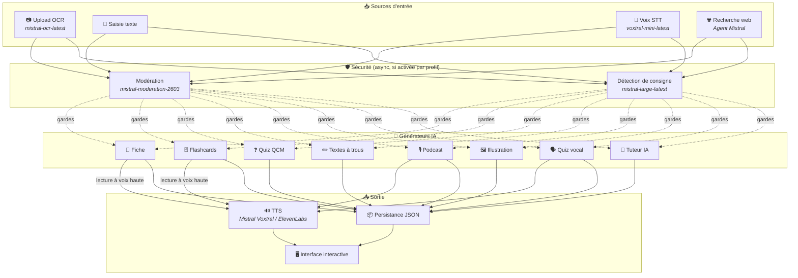
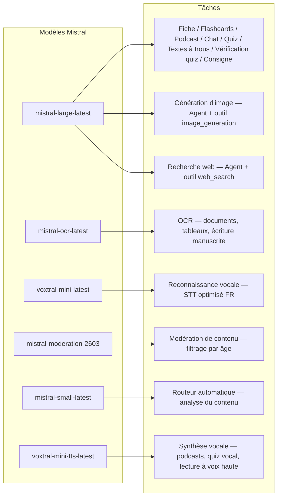
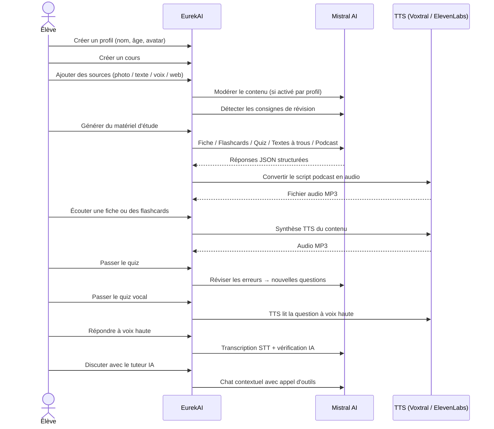

<p align="center">
  
</p>

<h1 align="center">EurekAI</h1>

<p align="center">
  <strong>将任何内容转化为交互式学习体验 — 由 <a href="https://mistral.ai">Mistral AI</a> 提供支持。</strong>
</p>

<p align="center">
  <a href="README-en.md">🇬🇧 英语</a> · <a href="README-es.md">🇪🇸 西班牙语</a> · <a href="README-pt.md">🇧🇷 葡萄牙语</a> · <a href="README-de.md">🇩🇪 德语</a> · <a href="README-it.md">🇮🇹 意大利语</a> · <a href="README-nl.md">🇳🇱 荷兰语</a> · <a href="README-ar.md">🇸🇦 阿拉伯语</a><br>
  <a href="README-hi.md">🇮🇳 印地语</a> · <a href="README-zh.md">🇨🇳 中文</a> · <a href="README-ja.md">🇯🇵 日语</a> · <a href="README-ko.md">🇰🇷 韩语</a> · <a href="README-pl.md">🇵🇱 波兰语</a> · <a href="README-ro.md">🇷🇴 罗马尼亚语</a> · <a href="README-sv.md">🇸🇪 瑞典语</a>
</p>

<p align="center">
  <a href="https://www.youtube.com/watch?v=_b1TQz2leoI"></a>
</p>

<h4 align="center">📊 代码质量</h4>

<p align="center">
  <a href="https://sonarcloud.io/summary/new_code?id=jls42_EurekAI"></a>
  <a href="https://sonarcloud.io/summary/new_code?id=jls42_EurekAI"></a>
  <a href="https://sonarcloud.io/summary/new_code?id=jls42_EurekAI"></a>
  <a href="https://sonarcloud.io/summary/new_code?id=jls42_EurekAI"></a>
</p>
<p align="center">
  <a href="https://sonarcloud.io/summary/new_code?id=jls42_EurekAI"></a>
  <a href="https://sonarcloud.io/summary/new_code?id=jls42_EurekAI"></a>
  <a href="https://sonarcloud.io/summary/new_code?id=jls42_EurekAI"></a>
  <a href="https://sonarcloud.io/summary/new_code?id=jls42_EurekAI"></a>
</p>

---

## 故事 — 为什么选择 EurekAI？

**EurekAI** 诞生于 [Mistral AI 全球黑客松](https://luma.com/mistralhack-online)（[官方网站](https://worldwide-hackathon.mistral.ai/)）（2026 年 3 月）。我需要一个项目主题——这个想法来自一个非常实际的场景：我经常和女儿一起准备考试，我想到应该可以利用 AI 将复习变得更有趣、更互动。

目标：接收任何输入——教科书的照片、复制粘贴的文本、语音录音、网络搜索——并将其转换为**复习笔记、抽认卡、测验、播客、完形填空、插图，等等**。所有内容由 Mistral AI 的法语模型驱动，因此自然适合讲法语的学生。

该项目在黑客松期间启动，随后在活动外继续开发和丰富。全部代码由 AI 生成——主要使用 [Claude Code](https://docs.anthropic.com/en/docs/claude-code)，并有少量通过 [Codex](https://openai.com/index/introducing-codex/) 的贡献。

---

## 功能

| | 功能 | 描述 |
|---|---|---|
| 📷 | **上传 OCR** | 拍摄你的教材或笔记 —— Mistral OCR 提取内容 |
| 📝 | **文本输入** | 直接输入或粘贴任意文本 |
| 🎤 | **语音输入** | 录音 —— Voxtral STT 将你的语音转写为文本 |
| 🌐 | **网络搜索** | 提出问题 —— 一个临时的 Mistral Agent 在网络上搜索答案 |
| 📄 | **复习笔记** | 结构化笔记，包含要点、词汇、引用、轶事 |
| 🃏 | **抽认卡** | 5-50 张问答卡，带有来源引用以促进主动记忆 |
| ❓ | **选择题测验** | 5-50 道多项选择题，带有错误的自适应复习 |
| ✏️ | **完形填空** | 带提示和容错校验的填空练习 |
| 🎙️ | **播客** | 两声部小型播客，通过 Mistral Voxtral TTS 转为音频 |
| 🖼️ | **插图** | 由 Mistral Agent 生成的教育图像 |
| 🗣️ | **语音测验** | 听题、口头回答、由 AI 进行答案核验 |
| 💬 | **AI 导师** | 基于课程文档的上下文聊天，可调用工具生成内容 |
| 🧠 | **自动路由器** | 基于 `mistral-small-latest` 的路由器分析内容并在 7 种可用生成器中提出组合建议 |
| 🔒 | **家长控制** | 按年龄的内容审核、家长 PIN、聊天限制 |
| 🌍 | **多语言** | 界面提供 9 种语言；通过提示可在 15 种语言中生成 AI 内容 |
| 🔊 | **语音朗读** | 通过 Mistral Voxtral TTS 或 ElevenLabs 听笔记和抽认卡 |

---

## 架构总览



---

## 模型使用地图



---

## 用户流程



---

## 深入功能

### 多模态输入

EurekAI 接受 4 类来源，根据用户配置进行审核（针对儿童和青少年默认启用）：

- **上传 OCR** — JPG、PNG 或 PDF 文件由 `mistral-ocr-latest` 处理。支持印刷文本、表格和手写文字。
- **自由文本** — 输入或粘贴任意内容。如启用审核，则在存储前进行审核。
- **语音输入** — 在浏览器中录制音频。由 `voxtral-mini-latest` 转写。参数 `language="fr"` 优化识别效果。
- **网络搜索** — 输入查询。一个带有工具 `web_search` 的临时 Mistral Agent 抓取并摘要搜索结果。

### AI 内容生成

七种学习材料生成类型：

| 生成器 | 模型 | 输出 |
|---|---|---|
| **复习笔记** | `mistral-large-latest` | 标题、摘要、10-25 个要点、词汇、引用、轶事 |
| **抽认卡** | `mistral-large-latest` | 5-50 张问答卡，带来源引用以促进主动记忆 |
| **选择题测验** | `mistral-large-latest` | 5-50 道题，每题 4 个选项，带解释，自适应复习 |
| **完形填空** | `mistral-large-latest` | 待填句子带提示，容错校验（Levenshtein） |
| **播客** | `mistral-large-latest` + Voxtral TTS | 两声部脚本 → MP3 音频 |
| **插图** | Agent `mistral-large-latest` | 通过工具 `image_generation` 生成的教育图像 |
| **语音测验** | `mistral-large-latest` + Voxtral TTS + STT | TTS 播题 → STT 录入回答 → AI 核验 |

### 聊天式 AI 导师

一个可访问所有课程文档的对话型导师：

- 使用 `mistral-large-latest`
- **工具调用**：在对话中可生成笔记、抽认卡、测验或完形填空
- 每门课程保留 50 条消息的历史
- 若为启用审核的配置，则对话内容进行审核

### 自动路由器

路由器使用 `mistral-small-latest` 来分析来源内容，并在 7 个可用生成器中推荐最相关的生成器。界面显示实时进度：先为分析阶段，然后是各项生成，支持取消单项生成。

### 自适应学习

- **测验统计**：跟踪每题的尝试次数和准确率
- **测验复习**：生成 5-10 道针对薄弱概念的新题
- **指令检测**：检测复习指令（“如果我会……就说明我会本课”），并在兼容的文本生成器（笔记、抽认卡、测验、完形填空）中优先处理

### 安全与家长控制

- **4 个年龄组**：儿童（≤10 岁）、青少年（11-15）、学生（16-25）、成人（26+）
- **内容审核**：`mistral-moderation-2603` 对儿童/青少年屏蔽 5 类（性、仇恨、暴力、自残、越狱），学生/成人则无此限制
- **家长 PIN**：使用 SHA-256 哈希，15 岁以下的配置需提供 PIN。生产部署建议使用带盐的慢哈希（Argon2id、bcrypt）。
- **聊天限制**：16 岁以下默认禁用 AI 聊天，需家长启用

### 多配置个人档案系统

- 多用户档案，含姓名、年龄、头像、语言偏好
- 项目与档案关联，通过 `profileId`
- 级联删除：删除档案会删除其所有项目

### 多提供商 TTS

- **Mistral Voxtral TTS**（默认）：`voxtral-mini-tts-latest`，无需额外密钥
- **ElevenLabs**（可选）：`eleven_v3`，更自然的语音，需 `ELEVENLABS_API_KEY`
- 提供商可在应用设置中配置

### 国际化

- 界面提供 9 种语言：fr、en、es、pt、it、nl、de、hi、ar
- AI 提示支持 15 种语言（fr、en、es、de、it、pt、nl、ja、zh、ko、ar、hi、pl、ro、sv）
- 每个档案可配置语言

---

## 技术栈

| 层 | 技术 | 作用 |
|---|---|---|
| **运行时** | Node.js + TypeScript 5.x | 服务器和类型安全 |
| **后端** | Express 4.x | REST API |
| **开发服务器** | Vite 7.x + tsx | HMR、Handlebars partials、代理 |
| **前端** | HTML + TailwindCSS 4.x + Alpine.js 3.x | 响应式界面，TypeScript 由 Vite 编译 |
| **模板** | vite-plugin-handlebars | 通过 partials 组合 HTML |
| **AI** | Mistral AI SDK 2.x | 聊天、OCR、STT、TTS、Agents、审核 |
| **TTS（默认）** | Mistral Voxtral TTS | `voxtral-mini-tts-latest`，内置语音合成 |
| **TTS（可选）** | ElevenLabs SDK 2.x | `eleven_v3`，更自然的声音 |
| **图标** | Lucide | SVG 图标库 |
| **Markdown** | Marked | 聊天中的 Markdown 渲染 |
| **文件上传** | Multer 1.4 LTS | multipart 表单处理 |
| **音频** | ffmpeg-static | 音频片段合并 |
| **测试** | Vitest | 单元测试 — 覆盖率由 SonarCloud 测量 |
| **持久化** | JSON 文件 | 无外部依赖的存储 |

---

## 模型参考

| 模型 | 用途 | 为何使用 |
|---|---|---|
| `mistral-large-latest` | 笔记、抽认卡、播客、测验、完形填空、聊天、语音测验核验、图像 Agent、网络搜索 Agent、指令检测 | 最佳的多语言能力 + 指令跟随 |
| `mistral-ocr-latest` | 文档 OCR | 印刷文本、表格、手写识别 |
| `voxtral-mini-latest` | 语音识别（STT） | 多语言 STT，结合 `language="fr"` 优化 |
| `voxtral-mini-tts-latest` | 语音合成（TTS） | 播客、语音测验、朗读 |
| `mistral-moderation-2603` | 内容审核 | 对儿童/青少年屏蔽 5 类（含越狱） |
| `mistral-small-latest` | 自动路由器 | 快速分析内容以做路由决策 |
| `eleven_v3`（ElevenLabs） | 语音合成（TTS 可选） | 自然声音，可作为可配置的替代方案 |

---

## 快速开始

```bash
# Cloner le dépôt
git clone https://github.com/jls42/EurekAI.git
cd EurekAI

# Installer les dépendances
npm install

# Configurer les clés API
cp .env.example .env
# Éditez .env avec vos clés :
#   MISTRAL_API_KEY=votre_clé_ici           (requis)
#   ELEVENLABS_API_KEY=votre_clé_ici        (optionnel, TTS alternatif)
#   SONAR_TOKEN=...                          (optionnel, CI SonarCloud uniquement)

# Lancer le développement
npm run dev
# → Backend :  http://localhost:3000 (API)
# → Frontend : http://localhost:5173 (serveur Vite avec HMR)
```

> **注意**：Mistral Voxtral TTS 为默认提供商——除 `MISTRAL_API_KEY` 外无需额外密钥。ElevenLabs 是可在设置中配置的替代 TTS 提供商。

---

## 项目结构

```
server.ts                 — Point d'entrée Express, monte les routes + config
config.ts                 — Config runtime (modèles, voix, TTS provider), persistée dans output/config.json
store.ts                  — ProjectStore : CRUD projets/sources/générations, persistance JSON
profiles.ts               — ProfileStore : gestion des profils, hachage PIN
types.ts                  — Types TypeScript : Source, Generation (7 types), QuizStats, Profile
prompts.ts                — Tous les prompts IA centralisés (system + user templates, 15 langues)

generators/
  ocr.ts                  — Upload + OCR via Mistral (JPG, PNG, PDF)
  summary.ts              — Génération de fiche de révision (JSON structuré)
  flashcards.ts           — Flashcards Q/R (5-50, configurable)
  quiz.ts                 — Quiz QCM (5-50 questions, configurable) + révision adaptative
  fill-blank.ts           — Exercices à trous avec validation tolérante
  podcast.ts              — Script podcast 2 voix
  quiz-vocal.ts           — Quiz vocal : questions TTS + réponses STT + vérification IA
  image.ts                — Génération d'image via Agent Mistral (outil image_generation)
  chat.ts                 — Tuteur IA par chat avec appel d'outils
  router.ts               — Routeur automatique (contenu → générateurs recommandés)
  consigne.ts             — Détection de consignes de révision
  tts-provider.ts         — Dispatch TTS multi-provider (Mistral Voxtral / ElevenLabs)
  tts.ts                  — Génération audio podcast (concaténation de segments)
  stt.ts                  — Voxtral STT (audio → texte)
  websearch.ts            — Agent Mistral avec outil web_search
  moderation.ts           — Modération de contenu (filtrage par âge)

routes/
  projects.ts             — CRUD projets
  profiles.ts             — CRUD profils avec gestion du PIN
  sources.ts              — Upload OCR, texte libre, voix STT, recherche web, modération
  generate.ts             — Endpoints de génération (7 types + auto + route)
  generations.ts          — Tentatives de quiz/fill-blank, réponses vocales, lecture à voix haute
  chat.ts                 — Chat IA avec appel d'outils

helpers/
  index.ts                — safeParseJson, unwrapJsonArray, extractAllText, timer
  audio.ts                — collectStream (ReadableStream → Buffer)
  fill-blank-validate.ts  — Validation tolérante des réponses (normalisation, Levenshtein)

src/                      — Frontend (Vite + Handlebars)
  index.html              — Point d'entrée HTML principal
  main.ts                 — Entrée frontend (init Alpine.js + icônes Lucide)
  app/                    — Modules applicatifs Alpine.js
    state.ts              — Gestion d'état réactif
    navigation.ts         — Routage des vues + gardes par âge
    profiles.ts           — Logique du sélecteur de profils
    projects.ts           — CRUD des cours
    sources.ts            — Gestionnaires d'upload de sources
    generate.ts           — Déclencheurs de génération (individuel, tout, auto 2 phases)
    generations.ts        — Affichage + actions sur les générations
    chat.ts               — Interface de chat
    config.ts             — Interface de configuration (modèles, voix, TTS provider)
    render.ts             — Helpers de rendu HTML
    i18n.ts               — Changement de langue
    ...
  components/
    quiz.ts               — Composant quiz interactif
    quiz-vocal.ts         — Composant quiz vocal
    fill-blank.ts         — Composant textes à trous
    flashcards.ts         — Composant flashcards avec retournement
    step-by-step.ts       — Mixin navigation pas-à-pas (quiz, fill-blank, flashcards)
  i18n/
    fr.ts, en.ts, es.ts, — Dictionnaires par langue (9 langues)
    pt.ts, it.ts, nl.ts,
    de.ts, hi.ts, ar.ts
    languages.ts          — Registre des langues UI disponibles
    index.ts              — Chargeur i18n
  partials/               — Partials HTML Handlebars (header, sidebar, dialogues, vues)
  styles/
    main.css              — Entrée TailwindCSS
    theme.css             — Variables de thème personnalisées

public/assets/            — Ressources statiques (logo, avatars)
output/                   — Données d'exécution (projets, config, fichiers audio)
```

---

## API 参考

### 配置
| 方法 | Endpoint | 描述 |
|---|---|---|
| `GET` | `/api/config` | 当前配置 |
| `PUT` | `/api/config` | 修改配置（模型、语音、TTS 提供商） |
| `GET` | `/api/config/status` | API 状态（Mistral、ElevenLabs、TTS） |
| `POST` | `/api/config/reset` | 重置默认配置 |
| `GET` | `/api/config/voices` | 列出 Mistral TTS 语音（可选 `?lang=fr`） |

### 档案
| 方法 | Endpoint | 描述 |
|---|---|---|
| `GET` | `/api/profiles` | 列出所有档案 |
| `POST` | `/api/profiles` | 创建档案 |
| `PUT` | `/api/profiles/:id` | 修改档案（< 15 岁需 PIN） |
| `DELETE` | `/api/profiles/:id` | 删除档案 + 级联删除项目 `{pin?}` → `{ok, deletedProjects}` |

### 项目
| 方法 | Endpoint | 描述 |
|---|---|---|
| `GET` | `/api/projects` | 列出项目（可选 `?profileId=`） |
| `POST` | `/api/projects` | 创建项目 `{name, profileId}` |
| `GET` | `/api/projects/:pid` | 项目详情 |
| `PUT` | `/api/projects/:pid` | 重命名 `{name}` |
| `DELETE` | `/api/projects/:pid` | 删除项目 |

### 来源
| 方法 | Endpoint | 描述 |
|---|---|---|
| `POST` | `/api/projects/:pid/sources/upload` | 上传 OCR（multipart 文件） |
| `POST` | `/api/projects/:pid/sources/text` | 自由文本 `{text}` |
| `POST` | `/api/projects/:pid/sources/voice` | 语音 STT（multipart 音频） |
| `POST` | `/api/projects/:pid/sources/websearch` | 网络搜索 `{query}` |
| `DELETE` | `/api/projects/:pid/sources/:sid` | 删除来源 |
| `POST` | `/api/projects/:pid/moderate` | 审核 `{text}` |
| `POST` | `/api/projects/:pid/detect-consigne` | 检测复习指令 |

### 生成
| 方法 | Endpoint | 描述 |
|---|---|---|
| `POST` | `/api/projects/:pid/generate/summary` | 生成复习笔记 |
| `POST` | `/api/projects/:pid/generate/flashcards` | 生成抽认卡 |
| `POST` | `/api/projects/:pid/generate/quiz` | 生成选择题测验 |
| `POST` | `/api/projects/:pid/generate/fill-blank` | 生成完形填空 |
| `POST` | `/api/projects/:pid/generate/podcast` | 生成播客 |
| `POST` | `/api/projects/:pid/generate/image` | 生成插图 |
| `POST` | `/api/projects/:pid/generate/quiz-vocal` | 生成语音测验 |
| `POST` | `/api/projects/:pid/generate/quiz-review` | 自适应复习 `{generationId, weakQuestions}` |
| `POST` | `/api/projects/:pid/generate/route` | 路由分析（要启动的生成器计划） |
| `POST` | `/api/projects/:pid/generate/auto` | 后端自动生成（路由 + 5 类：摘要、抽认卡、测验、完形填空、播客） |

所有生成路由均接受 `{sourceIds?, lang?, ageGroup?, count?, useConsigne?}`。`quiz-review` 还需要 `{generationId, weakQuestions}`。

### 生成 CRUD
| 方法 | Endpoint | 描述 |
|---|---|---|
| `POST` | `/api/projects/:pid/generations/:gid/quiz-attempt` | 提交测验答案 `{answers}` |
| `POST` | `/api/projects/:pid/generations/:gid/fill-blank-attempt` | 提交完形填空答案 `{answers}` |
| `POST` | `/api/projects/:pid/generations/:gid/vocal-answer` | 验证口语回答（音频 + questionIndex） |
| `POST` | `/api/projects/:pid/generations/:gid/read-aloud` | TTS 朗读（笔记/抽认卡） |
| `PUT` | `/api/projects/:pid/generations/:gid` | 重命名 `{title}` |
| `DELETE` | `/api/projects/:pid/generations/:gid` | 删除生成内容 |

### 聊天
| 方法 | Endpoint | 描述 |
|---|---|---|
| `GET` | `/api/projects/:pid/chat` | 获取聊天历史 |
| `POST` | `/api/projects/:pid/chat` | 发送消息 `{message, lang, ageGroup}` |
| `DELETE` | `/api/projects/:pid/chat` | 清空聊天历史 |

---

## 架构决策

| 决策 | 说明 |
|---|---|
| **使用 Alpine.js 而非 React/Vue** | 体积小、响应性轻量，TypeScript 由 Vite 编译。非常适合以速度为先的黑客松开发。 |
| **使用 JSON 文件持久化** | 零依赖、快速启动。无需配置数据库——即开即用。 |
| **Vite + Handlebars** | 两全其美：开发时的快速 HMR、用于代码组织的 HTML partials、Tailwind JIT。 |
| **Prompts centralisés** | 所有 AI 提示都在 `prompts.ts` — 易于按语言/年龄组迭代、测试和调整。 |
| **Système multi-générations** | 每个生成是一个具有自己 ID 的独立对象 — 允许每门课程有多张学习卡、测验等。 |
| **Prompts adaptés par âge** | 4 个年龄组，词汇、复杂度和语气不同 — 相同内容根据学习者不同方式教学。 |
| **Fonctionnalités basées sur les Agents** | 图像生成和网页搜索使用临时 Mistral Agents — 有明确生命周期并自动清理。 |
| **TTS multi-provider** | 默认使用 Mistral Voxtral TTS（不需额外密钥），可选 ElevenLabs — 可配置且无需重启。 |

---

## 致谢与鸣谢

- **[Mistral AI](https://mistral.ai)** — AI 模型（Large、OCR、Voxtral STT、Voxtral TTS、Moderation、Small）+ 全球黑客松
- **[ElevenLabs](https://elevenlabs.io)** — 备用语音合成引擎（`eleven_v3`）
- **[Alpine.js](https://alpinejs.dev)** — 轻量响应式框架
- **[TailwindCSS](https://tailwindcss.com)** — 实用型 CSS 框架
- **[Vite](https://vitejs.dev)** — 前端构建工具
- **[Lucide](https://lucide.dev)** — 图标库
- **[Marked](https://marked.js.org)** — Markdown 解析器

始于 Mistral AI 全球黑客松（2026 年 3 月），由 AI 完整开发，使用 Claude Code 和 Codex。

---

## 作者

**Julien LS** — [contact@jls42.org](mailto:contact@jls42.org)

## 许可证

[AGPL-3.0](LICENSE) — 版权所有 (C) 2026 Julien LS

**本文件使用模型 gpt-5-mini 由法语（fr）翻译为中文（zh）。有关翻译过程的更多信息，请参阅 https://gitlab.com/jls42/ai-powered-markdown-translator**

