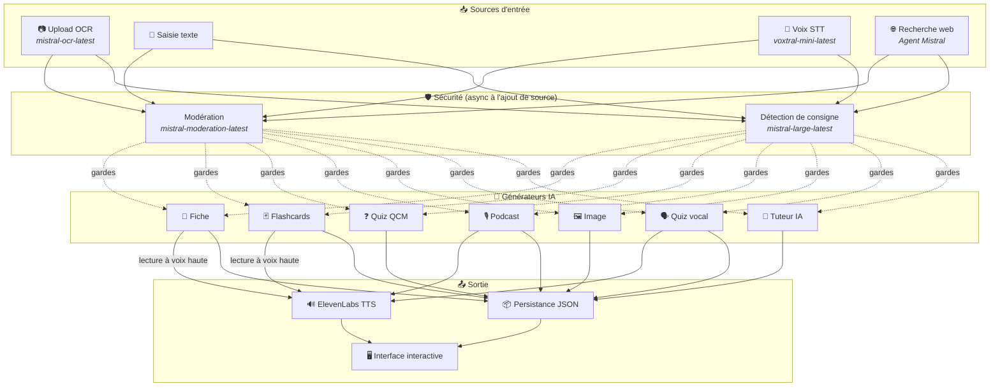
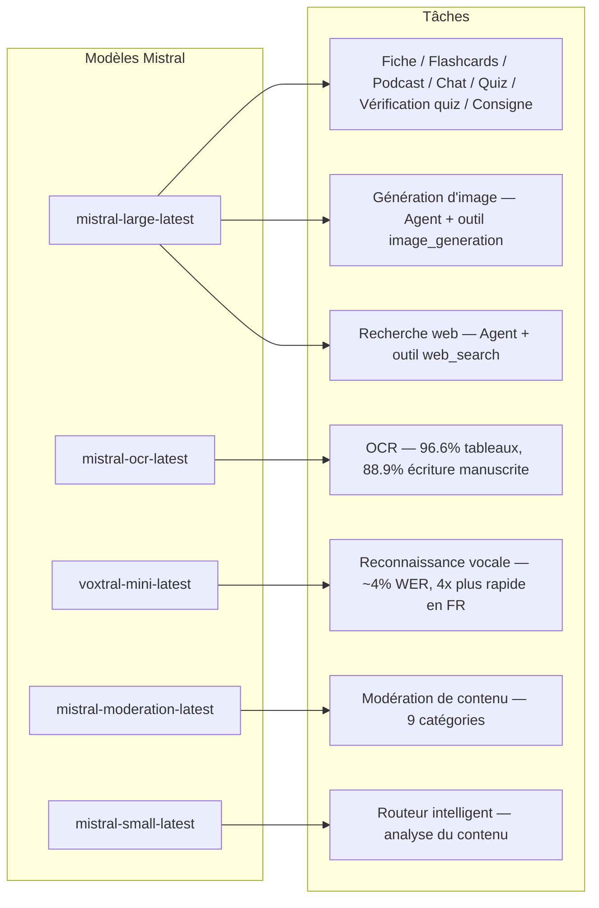
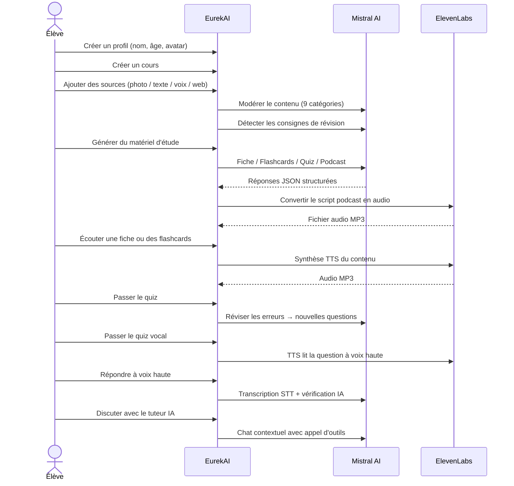

<p align="center">
  
</p>

<h1 align="center">EurekAI</h1>

<p align="center">
  <strong>将任何内容转化为互动式学习体验——由 AI 驱动。</strong>
</p>

<p align="center">
  <a href="https://mistral.ai"></a>
  <a href="https://www.typescriptlang.org"></a>
  <a href="https://mistral.ai"></a>
  <a href="https://elevenlabs.io"></a>
</p>

<p align="center">
  <a href="https://www.youtube.com/watch?v=_b1TQz2leoI">▶️ 在 YouTube 上观看演示</a> · <a href="README-en.md">🇬🇧 以英文阅读</a>
</p>

---

## 故事 — 为什么是 EurekAI？

**EurekAI** 诞生于 [Mistral AI Worldwide Hackathon](https://worldwidehackathon.mistral.ai/)（2026 年 3 月）。我需要一个选题——灵感来自一个非常现实的场景：我经常和女儿一起准备测验，我突然想到，也许可以借助 AI 让这件事变得更有趣、更互动。

目标是：把**任何输入**——教材照片、复制粘贴的文本、语音录音、网页搜索——转化为**复习笔记、闪卡、测验、播客、插图**等等。所有功能都由 Mistral AI 的法国模型驱动，因此天然适合说法语的学生。

每一行代码都在黑客松期间编写完成。所有 API 和开源库的使用都符合黑客松规则。

---

## 功能

| | 功能 | 描述 |
|---|---|---|
| 📷 | **OCR 上传** | 拍摄教材或笔记照片——由 Mistral OCR 提取内容 |
| 📝 | **文本输入** | 直接输入或粘贴任意文本 |
| 🎤 | **语音输入** | 在浏览器中录音——Voxtral STT 转写你的语音 |
| 🌐 | **网页搜索** | 提出问题——Mistral Agent 在网上查找答案 |
| 📄 | **复习笔记** | 结构化笔记，包含关键点、词汇、引文、轶事 |
| 🃏 | **闪卡** | 5 张问答卡，附带来源引用，用于主动记忆 |
| ❓ | **选择题测验** | 10-20 道多项选择题，带自适应错题复习 |
| 🎙️ | **播客** | 由 ElevenLabs 转为音频的双人迷你播客（Alex & Zoé） |
| 🖼️ | **插图** | 由 Mistral Agent 生成的教育图片 |
| 🗣️ | **语音测验** | 题目朗读、口头作答，AI 验证答案 |
| 💬 | **AI 导师** | 与课程文档进行上下文聊天，并支持工具调用 |
| 🧠 | **智能路由器** | AI 分析你的内容并推荐最佳生成器 |
| 🔒 | **家长控制** | 按年龄进行内容审核、家长 PIN、聊天限制 |
| 🌍 | **多语言** | 完整的法语和英语界面及 AI 内容 |
| 🔊 | **朗读** | 通过 ElevenLabs TTS 朗读笔记和闪卡 |

---

## 架构概览



---

## 模型使用图



---

## 用户流程



---

## 深入了解 — 功能

### 多模态输入

EurekAI 接受 4 种来源类型，所有内容在处理前都会经过审核：

- **OCR 上传** — 由 `mistral-ocr-latest` 处理的 JPG、PNG 或 PDF 文件。支持印刷体、表格（96.6% 准确率）和手写体（88.9% 准确率）。
- **自由文本** — 输入或粘贴任意内容。存储前先经过审核。
- **语音输入** — 在浏览器中录制音频。由 `voxtral-mini-latest` 转写，WER 约 4%。`language="fr"` 参数可使其快 4 倍。
- **网页搜索** — 输入查询。一个临时的 Mistral Agent 使用 `web_search` 工具获取并总结结果。

### AI 内容生成

生成六种学习材料：

| 生成器 | 模型 | 输出 |
|---|---|---|
| **复习笔记** | `mistral-large-latest` | 标题、摘要、10-25 个关键点、词汇、引文、轶事 |
| **闪卡** | `mistral-large-latest` | 5 张带来源引用的问答卡 |
| **选择题测验** | `mistral-large-latest` | 10-20 道题，每题 4 个选项、解析、自适应复习 |
| **播客** | `mistral-large-latest` + ElevenLabs | 双人脚本（Alex & Zoé）→ MP3 音频 |
| **插图** | `mistral-large-latest` 代理 | 通过 `image_generation` 工具生成教育图片 |
| **语音测验** | `mistral-large-latest` + ElevenLabs + Voxtral | TTS 题目 → STT 回答 → AI 验证 |

### 聊天式 AI 导师

可全面访问课程文档的对话式导师：

- 使用 `mistral-large-latest`（128K token 上下文窗口）
- **工具调用**：可在对话中实时生成笔记、闪卡或测验
- 每门课程保留 50 条消息历史
- 按年龄进行内容审核

### 智能自动路由器

路由器使用 `mistral-small-latest` 分析来源内容，并推荐最相关的生成器——这样学生无需手动选择。

### 自适应学习

- **测验统计**：跟踪每道题的作答次数和准确率
- **测验复习**：生成 5-10 道针对薄弱概念的新题
- **指令检测**：检测复习指令（"Je sais ma leçon si je sais..."），并在所有生成器中优先处理

### 安全与家长控制

- **4 个年龄组**：儿童（6-10）、青少年（11-15）、学生（16+）、成人
- **内容审核**：通过 `mistral-moderation-latest` 进行 9 类别审核，并按年龄组调整阈值
- **家长 PIN**：SHA-256 哈希，15 岁以下用户档案必需
- **聊天限制**：AI 聊天仅对 15 岁及以上用户档案开放

### 多用户档案系统

- 多个档案，包含姓名、年龄、头像、语言偏好
- 通过 `profileId` 将项目与档案关联
- 级联删除：删除档案会同时删除其所有项目

### 国际化

- 法语和英语均提供完整界面
- AI 提示目前支持 2 种语言（FR、EN），架构可扩展至 15 种（es, de, it, pt, nl, ja, zh, ko, ar, hi, pl, ro, sv）
- 可按档案配置语言

---

## 技术栈

| 层 | 技术 | 作用 |
|---|---|---|
| **运行时** | Node.js + TypeScript 5.7 | 服务器与类型安全 |
| **后端** | Express 4.21 | REST API |
| **开发服务器** | Vite 7.3 + tsx | HMR、Handlebars 片段、代理 |
| **前端** | HTML + TailwindCSS 4.2 + Alpine.js 3.15 | 响应式界面，TypeScript 由 Vite 编译 |
| **模板** | vite-plugin-handlebars | 通过 partials 组合 HTML |
| **AI** | Mistral AI SDK 1.14 | 聊天、OCR、STT、Agents、审核 |
| **TTS** | ElevenLabs SDK 2.36 | 播客和语音测验的语音合成 |
| **图标** | Lucide 0.575 | SVG 图标库 |
| **Markdown** | Marked 17 | 聊天中的 Markdown 渲染 |
| **文件上传** | Multer 1.4 | multipart 表单处理 |
| **音频** | ffmpeg-static | 音频处理 |
| **测试** | Vitest 4 | 单元测试 |
| **持久化** | JSON 文件 | 无依赖存储 |

---

## 模型参考

| 模型 | 用途 | 原因 |
|---|---|---|
| `mistral-large-latest` | 笔记、闪卡、播客、选择题测验、聊天、测验验证、图像代理、网页搜索代理、指令检测 | 最佳多语言能力 + 指令跟随 |
| `mistral-ocr-latest` | 文档 OCR | 表格 96.6% 准确率，手写体 88.9% 准确率 |
| `voxtral-mini-latest` | 语音识别 | WER 约 4%，`language="fr"` 可实现 4 倍以上速度 |
| `mistral-moderation-latest` | 内容审核 | 9 个类别，儿童安全 |
| `mistral-small-latest` | 智能路由器 | 快速分析内容以进行路由决策 |
| `eleven_v3`（ElevenLabs） | 语音合成 | 为播客和语音测验提供自然的法语声音 |

---

## 快速开始

```bash
# Cloner le dépôt
git clone https://github.com/your-username/eurekai.git
cd eurekai

# Installer les dépendances
npm install

# Configurer les clés API
cp .env.example .env
# Éditez .env avec vos clés :
#   MISTRAL_API_KEY=votre_clé_ici
#   ELEVENLABS_API_KEY=votre_clé_ici  (optionnel, pour les fonctions audio)

# Lancer le développement
npm run dev
# → Backend :  http://localhost:3000 (API)
# → Frontend : http://localhost:5173 (serveur Vite avec HMR)
```

> **注意**：ElevenLabs 为可选项。没有此密钥时，播客和语音测验功能仍会生成脚本，但不会合成音频。

---

## 项目结构

```
server.ts                 — Point d'entrée Express, monte les routes + config
config.ts                 — Config runtime (modèles, voix, TTS), persistée dans output/config.json
store.ts                  — ProjectStore : CRUD projets/sources/générations, persistance JSON
profiles.ts               — ProfileStore : gestion des profils, hachage PIN
types.ts                  — Types TypeScript : Source, Generation (6 types), QuizStats, Profile
prompts.ts                — Tous les prompts IA centralisés (system + user templates, FR/EN)

generators/
  ocr.ts                  — Upload + OCR via Mistral (JPG, PNG, PDF)
  summary.ts              — Génération de fiche de révision (JSON structuré)
  flashcards.ts           — 5 flashcards Q/R
  quiz.ts                 — Quiz QCM (10-20 questions) + révision adaptative
  podcast.ts              — Script podcast 2 voix (Alex + Zoé)
  quiz-vocal.ts           — Quiz vocal : questions TTS + réponses STT + vérification IA
  image.ts                — Génération d'image via Agent Mistral (outil image_generation)
  chat.ts                 — Tuteur IA par chat avec appel d'outils
  router.ts               — Routeur automatique intelligent (contenu → générateurs recommandés)
  consigne.ts             — Détection de consignes de révision
  tts.ts                  — ElevenLabs TTS (eleven_v3, concaténation de segments)
  stt.ts                  — Voxtral STT (audio → texte)
  websearch.ts            — Agent Mistral avec outil web_search
  moderation.ts           — Modération de contenu (9 catégories)

routes/
  projects.ts             — CRUD projets
  sources.ts              — Upload OCR, texte libre, voix STT, recherche web, modération
  generate.ts             — Endpoints de génération (fiche/flashcards/quiz/podcast/image/vocal)
  generations.ts          — Tentatives de quiz, réponses vocales, lecture à voix haute, renommage, suppression
  chat.ts                 — Chat IA avec appel d'outils
  profiles.ts             — CRUD profils avec gestion du PIN

helpers/
  index.ts                — safeParseJson, unwrapJsonArray, extractAllText, timer
  audio.ts                — collectStream (ReadableStream → Buffer)

src/                      — Frontend (Vite + Handlebars)
  index.html              — Point d'entrée HTML principal
  main.ts                 — Entrée frontend (init Alpine.js + icônes Lucide)
  app/                    — Modules applicatifs Alpine.js
    state.ts              — Gestion d'état réactif
    navigation.ts         — Routage des vues + gardes par âge
    profiles.ts           — Logique du sélecteur de profils
    projects.ts           — CRUD des cours
    sources.ts            — Gestionnaires d'upload de sources
    generate.ts           — Déclencheurs de génération
    generations.ts        — Affichage + actions sur les générations
    chat.ts               — Interface de chat
    render.ts             — Helpers de rendu HTML
    i18n.ts               — Changement de langue
    ...
  components/
    quiz.ts               — Composant quiz interactif
    quiz-vocal.ts         — Composant quiz vocal
  i18n/
    fr.ts                 — Traductions françaises
    en.ts                 — Traductions anglaises
    index.ts              — Chargeur i18n
  partials/               — Partials HTML Handlebars (header, sidebar, dialogues, vues)
  styles/
    main.css              — Entrée TailwindCSS
    theme.css             — Variables de thème personnalisées

public/assets/            — Ressources statiques (logo, avatars)
output/                   — Données d'exécution (projets, config, fichiers audio)
```

---

## API 参考

### 配置
| 方法 | 端点 | 描述 |
|---|---|---|
| `GET` | `/api/config` | 当前配置 |
| `PUT` | `/api/config` | 修改配置（模型、语音、TTS） |
| `GET` | `/api/config/status` | API 状态（Mistral、ElevenLabs） |

### 档案
| 方法 | 端点 | 描述 |
|---|---|---|
| `GET` | `/api/profiles` | 列出所有档案 |
| `POST` | `/api/profiles` | 创建档案 |
| `PUT` | `/api/profiles/:id` | 修改档案（< 15 岁需要 PIN） |
| `DELETE` | `/api/profiles/:id` | 删除档案 + 级联项目 |

### 项目
| 方法 | 端点 | 描述 |
|---|---|---|
| `GET` | `/api/projects` | 列出项目 |
| `POST` | `/api/projects` | 创建 `{name, profileId}` 项目 |
| `GET` | `/api/projects/:pid` | 项目详情 |
| `PUT` | `/api/projects/:pid` | 重命名 `{name}` |
| `DELETE` | `/api/projects/:pid` | 删除项目 |

### 来源
| 方法 | 端点 | 描述 |
|---|---|---|
| `POST` | `/api/projects/:pid/sources/upload` | OCR 上传（multipart 文件） |
| `POST` | `/api/projects/:pid/sources/text` | 自由文本 `{text}` |
| `POST` | `/api/projects/:pid/sources/voice` | STT 语音（multipart 音频） |
| `POST` | `/api/projects/:pid/sources/websearch` | 网页搜索 `{query}` |
| `DELETE` | `/api/projects/:pid/sources/:sid` | 删除来源 |
| `POST` | `/api/projects/:pid/moderate` | 审核 `{text}` |
| `POST` | `/api/projects/:pid/detect-consigne` | 检测复习指令 |

### 生成
| 方法 | 端点 | 描述 |
|---|---|---|
| `POST` | `/api/projects/:pid/generate/summary` | 复习笔记 `{sourceIds?}` |
| `POST` | `/api/projects/:pid/generate/flashcards` | 闪卡 `{sourceIds?}` |
| `POST` | `/api/projects/:pid/generate/quiz` | 选择题测验 `{sourceIds?}` |
| `POST` | `/api/projects/:pid/generate/podcast` | 播客 `{sourceIds?}` |
| `POST` | `/api/projects/:pid/generate/image` | 插图 `{sourceIds?}` |
| `POST` | `/api/projects/:pid/generate/quiz-vocal` | 语音测验 `{sourceIds?}` |
| `POST` | `/api/projects/:pid/generate/quiz-review` | 自适应复习 `{generationId, weakQuestions}` |
| `POST` | `/api/projects/:pid/generate/auto` | 通过路由器自动生成 |

### 生成 CRUD
| 方法 | 端点 | 描述 |
|---|---|---|
| `POST` | `/api/projects/:pid/generations/:gid/quiz-attempt` | 提交答案 `{answers}` |
| `POST` | `/api/projects/:pid/generations/:gid/vocal-answer` | 验证口头回答（multipart 音频 + questionIndex） |
| `POST` | `/api/projects/:pid/generations/:gid/read-aloud` | 朗读 TTS（笔记/闪卡） |
| `PUT` | `/api/projects/:pid/generations/:gid` | 重命名 `{title}` |
| `DELETE` | `/api/projects/:pid/generations/:gid` | 删除生成内容 |

### 聊天
| 方法 | 端点 | 描述 |
|---|---|---|
| `GET` | `/api/projects/:pid/chat` | 获取聊天历史 |
| `POST` | `/api/projects/:pid/chat` | 发送消息 `{message}` |
| `DELETE` | `/api/projects/:pid/chat` | 清空聊天历史 |

---

## 架构决策

| 决策 | 理由 |
|---|---|
| **Alpine.js 而非 React/Vue** | 极小体积，借助 Vite 编译的 TypeScript 实现轻量响应式。非常适合速度至上的黑客松。 |
| **JSON 文件持久化** | 零依赖，即刻启动。无需配置数据库——启动就能用。 |
| **Vite + Handlebars** | 两全其美：开发时 HMR 快速，HTML partials 便于组织代码，Tailwind JIT。 |
| **集中式提示词** | 所有 AI 提示都放在 `prompts.ts` 中——便于迭代、测试并按语言/年龄组调整。 |
| **多生成器系统** | 每个生成结果都是带独立 ID 的对象——允许每门课程拥有多个笔记、测验等。 |
| **按年龄调整提示词** | 4 个年龄组对应不同词汇、复杂度和语气——同一内容会根据学习者而以不同方式教学。 |
| **基于 Agent 的功能** | 图像生成和网页搜索使用临时的 Mistral Agents——清晰的生命周期与自动清理。 |

---

## 致谢与鸣谢

- **[Mistral AI](https://mistral.ai)** — AI 模型（Large、OCR、Voxtral、Moderation、Small）+ Worldwide Hackathon
- **[ElevenLabs](https://elevenlabs.io)** — 语音合成引擎（`eleven_v3`）
- **[Alpine.js](https://alpinejs.dev)** — 轻量响应式框架
- **[TailwindCSS](https://tailwindcss.com)** — 实用工具 CSS 框架
- **[Vite](https://vitejs.dev)** — 前端构建工具
- **[Lucide](https://lucide.dev)** — 图标库
- **[Marked](https://marked.js.org)** — Markdown 解析器

由 Mistral AI Worldwide Hackathon 期间精心打造，2026 年 3 月。

---

## 作者

**Julien LS** — [contact@jls42.org](mailto:contact@jls42.org)

## 许可证

[AGPL-3.0](LICENSE) — Copyright (C) 2026 Julien LS

**此文档已使用 gpt-5.4-mini 模型从 fr 版本翻译为 zh 语言。有关翻译过程的更多信息，请参阅 https://gitlab.com/jls42/ai-powered-markdown-translator**

