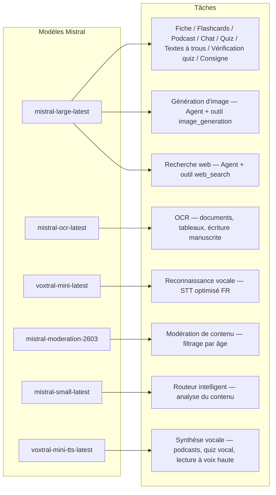
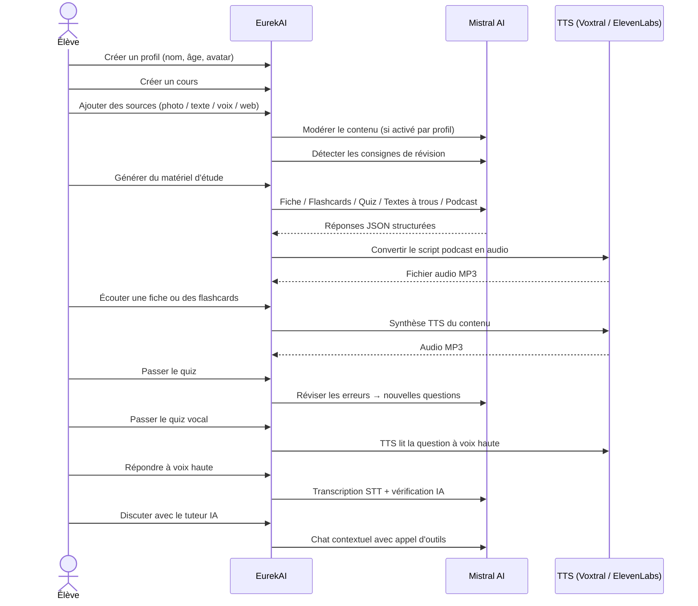

<p align="center">
  
</p>

<h1 align="center">EurekAI</h1>

<p align="center">
  <strong>将任何内容转化为交互式学习体验 —— 由人工智能驱动。</strong>
</p>

<p align="center">
  <a href="https://mistral.ai"></a>
  <a href="https://www.typescriptlang.org"></a>
  <a href="https://mistral.ai"></a>
  <a href="https://elevenlabs.io"></a>
</p>

<p align="center">
  <a href="https://www.youtube.com/watch?v=_b1TQz2leoI">▶️ 在 YouTube 上观看演示</a> · <a href="README-en.md">🇬🇧 阅读英文版</a>
</p>

<p align="center">
  <a href="https://sonarcloud.io/summary/new_code?id=jls42_EurekAI"></a>
  <a href="https://sonarcloud.io/summary/new_code?id=jls42_EurekAI"></a>
  <a href="https://sonarcloud.io/summary/new_code?id=jls42_EurekAI"></a>
  <a href="https://sonarcloud.io/summary/new_code?id=jls42_EurekAI"></a>
</p>
<p align="center">
  <a href="https://sonarcloud.io/summary/new_code?id=jls42_EurekAI"></a>
  <a href="https://sonarcloud.io/summary/new_code?id=jls42_EurekAI"></a>
  <a href="https://sonarcloud.io/summary/new_code?id=jls42_EurekAI"></a>
  <a href="https://sonarcloud.io/summary/new_code?id=jls42_EurekAI"></a>
</p>

---

## 故事 — 为什么是 EurekAI？

**EurekAI** 诞生于 [Mistral AI Worldwide Hackathon](https://worldwidehackathon.mistral.ai/)（2026 年 3 月）。我需要一个项目主题——这个想法来源于一个非常具体的场景：我经常和女儿一起准备测验，我想有没有可能借助 AI 把复习变得更有趣、更互动。

目标：接受各种“任意输入”——手册的照片、复制粘贴的文本、语音录音、网页搜索——并将其转换为**复习要点、抽认卡、测验、播客、填空题、插图，以及更多**。所有功能都由 Mistral AI 的模型驱动，因此对法语学生来说是天然适配的解决方案。

每一行代码都是在黑客松期间编写的。所有 API 和开源库均按照黑客松规则使用。

---

## 功能

| | 功能 | 描述 |
|---|---|---|
| 📷 | **Upload OCR** | 拍照上传教科书或笔记 — Mistral OCR 提取内容 |
| 📝 | **Saisie texte** | 直接输入或粘贴任意文本 |
| 🎤 | **Entrée vocale** | 录音 — Voxtral STT 转写你的语音 |
| 🌐 | **Recherche web** | 提问 — 一个 Mistral Agent 在网上搜索答案 |
| 📄 | **Fiches de révision** | 结构化笔记：要点、词汇、引言、趣闻 |
| 🃏 | **Flashcards** | 5-50 张问答卡，带来源参考以便主动记忆 |
| ❓ | **Quiz QCM** | 5-50 道多项选择题，带错误的自适应复习 |
| ✏️ | **Textes à trous** | 填空练习，带提示与容错校验 |
| 🎙️ | **Podcast** | 双声迷你播客，通过 Mistral Voxtral TTS 转为音频 |
| 🖼️ | **Illustrations** | 由 Mistral Agent 生成的教学图片 |
| 🗣️ | **Quiz vocal** | 题目由语音朗读，口头回答，AI 进行答题判定 |
| 💬 | **Tuteur IA** | 基于课程文档的上下文聊天，可调用工具生成内容 |
| 🧠 | **Routeur intelligent** | AI 分析你的内容并在 7 个生成器中推荐最合适的 |
| 🔒 | **Contrôle parental** | 年龄分级审核、家长 PIN、聊天限制 |
| 🌍 | **Multilingue** | 界面与 AI 内容支持法语与英语 |
| 🔊 | **Lecture à voix haute** | 通过 Mistral Voxtral TTS 或 ElevenLabs 听复习要点与抽认卡 |

---

## 架构概览


---

## 模型使用地图



---

## 用户流程



---

## 深入探讨 — 功能

### 多模态输入

EurekAI 接受 4 种类型的来源，按用户档案进行审核（儿童和青少年默认启用）：

- **Upload OCR** — JPG、PNG 或 PDF 文件，由 `mistral-ocr-latest` 处理。支持印刷文本、表格和手写文字。
- **Texte libre** — 直接输入或粘贴任意内容。如启用审核，会在存储前进行审核。
- **Entrée vocale** — 在浏览器中录制音频。由 `voxtral-mini-latest` 转写。`language="fr"` 参数可优化识别效果。
- **Recherche web** — 输入查询。一个临时的 Mistral Agent 使用工具 `web_search` 获取并总结结果。

### AI 内容生成

七种类型的学习材料生成：

| Générateur | Modèle | Sortie |
|---|---|---|
| **Fiche de révision** | `mistral-large-latest` | 标题、摘要、10-25 要点、词汇、引用、趣闻 |
| **Flashcards** | `mistral-large-latest` | 5-50 张问答卡，带来源引用以便主动记忆 |
| **Quiz QCM** | `mistral-large-latest` | 5-50 道题，每题 4 个选项，含解释与自适应复习 |
| **Textes à trous** | `mistral-large-latest` | 填空句子，带提示，容错校验（Levenshtein） |
| **Podcast** | `mistral-large-latest` + Voxtral TTS | 双声脚本 → MP3 音频 |
| **Illustration** | Agent `mistral-large-latest` | 通过工具 `image_generation` 生成教学图片 |
| **Quiz vocal** | `mistral-large-latest` + Voxtral TTS + STT | 题目 TTS → 回答 STT → AI 验证 |

### 聊天式 AI 家教

一个可访问完整课程文档的对话型家教：

- 使用 `mistral-large-latest`
- **调用工具**：聊天过程中可生成复习要点、抽认卡、测验或填空题
- 每门课程保留 50 条消息的历史
- 如启用审核，会对内容进行过滤

### 智能自动路由

路由器使用 `mistral-small-latest` 分析来源内容，并在 7 个可用生成器中推荐最相关的那些——让学生无需手动选择。界面实时显示进度：先是分析阶段，随后逐个生成，并可取消单项生成。

### 自适应学习

- **测验统计**：跟踪每题的尝试次数与准确率
- **测验复习**：生成 5-10 道针对薄弱概念的新题
- **检测复习指令**：识别复习指令（例如 "Je sais ma leçon si je sais..."），并在所有生成器中优先处理这些内容

### 安全与家长控制

- **4 个年龄组**：儿童（≤10 岁）、青少年（11-15）、学生（16-25）、成人（26+）
- **内容审核**：`mistral-moderation-2603`，对儿童/青少年屏蔽 5 类内容（性、仇恨、暴力、自残、jailbreaking），学生/成人不作限制
- **家长 PIN**：SHA-256 哈希，15 岁以下档案需要
- **聊天限制**：默认对 16 岁以下禁用 AI 聊天，家长可开启

### 多档案系统

- 支持多个档案，包含姓名、年龄、头像、语言偏好
- 档案相关项目通过 `profileId` 关联
- 级联删除：删除档案会同时删除其所有项目

### 多 TTS 提供商

- **Mistral Voxtral TTS**（默认）：`voxtral-mini-tts-latest`，无需额外密钥
- **ElevenLabs**（可选）：`eleven_v3`，更自然的声音，需提供 `ELEVENLABS_API_KEY`
- 提供商可在应用设置中配置

### 国际化

- 界面完整支持法语与英语
- AI prompts 当前支持两种语言（FR, EN），架构支持扩展至 15 种（es, de, it, pt, nl, ja, zh, ko, ar, hi, pl, ro, sv）
- 每个档案可配置语言

---

## 技术栈

| 层 | 技术 | 作用 |
|---|---|---|
| **Runtime** | Node.js + TypeScript 5.7 | 服务器与类型安全 |
| **Backend** | Express 4.21 | REST API |
| **开发服务器** | Vite 7.3 + tsx | HMR、Handlebars partials、代理 |
| **Frontend** | HTML + TailwindCSS 4.2 + Alpine.js 3.15 | 响应式界面，TypeScript 由 Vite 编译 |
| **模板** | vite-plugin-handlebars | 通过 partials 组合 HTML |
| **IA** | Mistral AI SDK 2.1 | 聊天、OCR、STT、TTS、Agents、审核 |
| **TTS（默认）** | Mistral Voxtral TTS | `voxtral-mini-tts-latest`，内置语音合成 |
| **TTS（可选）** | ElevenLabs SDK 2.36 | `eleven_v3`，更自然的声音 |
| **图标** | Lucide 0.575 | SVG 图标库 |
| **Markdown** | Marked 17 | 聊天中的 Markdown 渲染 |
| **文件上传** | Multer 1.4 | 处理 multipart 表单 |
| **音频** | ffmpeg-static | 音频片段拼接 |
| **测试** | Vitest 4 | 单元测试 — 覆盖率由 SonarCloud 测量 |
| **持久化** | JSON 文件 | 无外部依赖的存储 |

---

## 模型参考

| 模型 | 用途 | 为什么 |
|---|---|---|
| `mistral-large-latest` | 复习要点、抽认卡、播客、测验、填空、聊天、口测验证、图片 Agent、网页搜索 Agent、复习指令检测 | 最佳多语言能力 + 指令追踪 |
| `mistral-ocr-latest` | 文档 OCR | 印刷文本、表格、手写文字 |
| `voxtral-mini-latest` | 语音识别（STT） | 多语言 STT，配合 `language="fr"` 优化 |
| `voxtral-mini-tts-latest` | 语音合成（TTS） | 播客、口测、朗读 |
| `mistral-moderation-2603` | 内容审核 | 对儿童/青少年屏蔽 5 类内容 (+ jailbreaking) |
| `mistral-small-latest` | 智能路由 | 快速分析内容以决定路由策略 |
| `eleven_v3` (ElevenLabs) | 语音合成（TTS 可选） | 更自然的声音，可作为可配置替代方案 |

---

## 快速开始

```bash
# Cloner le dépôt
git clone https://github.com/jls42/EurekAI.git
cd EurekAI

# Installer les dépendances
npm install

# Configurer les clés API
cp .env.example .env
# Éditez .env avec vos clés :
#   MISTRAL_API_KEY=votre_clé_ici           (requis)
#   ELEVENLABS_API_KEY=votre_clé_ici        (optionnel, TTS alternatif)

# Lancer le développement
npm run dev
# → Backend :  http://localhost:3000 (API)
# → Frontend : http://localhost:5173 (serveur Vite avec HMR)
```

> **注意**：Mistral Voxtral TTS 为默认提供商 —— 除了 `MISTRAL_API_KEY` 外无需额外密钥。ElevenLabs 为可配置的替代 TTS 提供商，可在设置中启用。

---

## 项目结构

```
server.ts                 — Point d'entrée Express, monte les routes + config
config.ts                 — Config runtime (modèles, voix, TTS provider), persistée dans output/config.json
store.ts                  — ProjectStore : CRUD projets/sources/générations, persistance JSON
profiles.ts               — ProfileStore : gestion des profils, hachage PIN
types.ts                  — Types TypeScript : Source, Generation (7 types), QuizStats, Profile
prompts.ts                — Tous les prompts IA centralisés (system + user templates, FR/EN)

generators/
  ocr.ts                  — Upload + OCR via Mistral (JPG, PNG, PDF)
  summary.ts              — Génération de fiche de révision (JSON structuré)
  flashcards.ts           — Flashcards Q/R (5-50, configurable)
  quiz.ts                 — Quiz QCM (5-50 questions, configurable) + révision adaptative
  fill-blank.ts           — Exercices à trous avec validation tolérante
  podcast.ts              — Script podcast 2 voix
  quiz-vocal.ts           — Quiz vocal : questions TTS + réponses STT + vérification IA
  image.ts                — Génération d'image via Agent Mistral (outil image_generation)
  chat.ts                 — Tuteur IA par chat avec appel d'outils
  router.ts               — Routeur automatique intelligent (contenu → générateurs recommandés)
  consigne.ts             — Détection de consignes de révision
  tts-provider.ts         — Dispatch TTS multi-provider (Mistral Voxtral / ElevenLabs)
  tts.ts                  — Génération audio podcast (concaténation de segments)
  stt.ts                  — Voxtral STT (audio → texte)
  websearch.ts            — Agent Mistral avec outil web_search
  moderation.ts           — Modération de contenu (filtrage par âge)

routes/
  projects.ts             — CRUD projets
  profiles.ts             — CRUD profils avec gestion du PIN
  sources.ts              — Upload OCR, texte libre, voix STT, recherche web, modération
  generate.ts             — Endpoints de génération (7 types + auto + route)
  generations.ts          — Tentatives de quiz/fill-blank, réponses vocales, lecture à voix haute
  chat.ts                 — Chat IA avec appel d'outils

helpers/
  index.ts                — safeParseJson, unwrapJsonArray, extractAllText, timer
  audio.ts                — collectStream (ReadableStream → Buffer)
  fill-blank-validate.ts  — Validation tolérante des réponses (normalisation, Levenshtein)

src/                      — Frontend (Vite + Handlebars)
  index.html              — Point d'entrée HTML principal
  main.ts                 — Entrée frontend (init Alpine.js + icônes Lucide)
  app/                    — Modules applicatifs Alpine.js
    state.ts              — Gestion d'état réactif
    navigation.ts         — Routage des vues + gardes par âge
    profiles.ts           — Logique du sélecteur de profils
    projects.ts           — CRUD des cours
    sources.ts            — Gestionnaires d'upload de sources
    generate.ts           — Déclencheurs de génération (individuel, tout, auto 2 phases)
    generations.ts        — Affichage + actions sur les générations
    chat.ts               — Interface de chat
    config.ts             — Interface de configuration (modèles, voix, TTS provider)
    render.ts             — Helpers de rendu HTML
    i18n.ts               — Changement de langue
    ...
  components/
    quiz.ts               — Composant quiz interactif
    quiz-vocal.ts         — Composant quiz vocal
    fill-blank.ts         — Composant textes à trous
    flashcards.ts         — Composant flashcards avec retournement
    step-by-step.ts       — Mixin navigation pas-à-pas (quiz, fill-blank, flashcards)
  i18n/
    fr.ts                 — Traductions françaises
    en.ts                 — Traductions anglaises
    index.ts              — Chargeur i18n
  partials/               — Partials HTML Handlebars (header, sidebar, dialogues, vues)
  styles/
    main.css              — Entrée TailwindCSS
    theme.css             — Variables de thème personnalisées

public/assets/            — Ressources statiques (logo, avatars)
output/                   — Données d'exécution (projets, config, fichiers audio)
```

---

## API 参考

### 配置
| 方法 | Endpoint | 描述 |
|---|---|---|
| `GET` | `/api/config` | 当前配置 |
| `PUT` | `/api/config` | 修改配置（模型、声音、TTS 提供商） |
| `GET` | `/api/config/status` | APIs 状态（Mistral、ElevenLabs、TTS） |
| `POST` | `/api/config/reset` | 重置为默认配置 |
| `GET` | `/api/config/voices` | 列出 Mistral TTS 的语音（可选 `?lang=fr`） |

### 档案
| 方法 | Endpoint | 描述 |
|---|---|---|
| `GET` | `/api/profiles` | 列出所有档案 |
| `POST` | `/api/profiles` | 创建档案 |
| `PUT` | `/api/profiles/:id` | 修改档案（< 15 岁需 PIN） |
| `DELETE` | `/api/profiles/:id` | 删除档案 + 级联删除项目 |

### 项目
| 方法 | Endpoint | 描述 |
|---|---|---|
| `GET` | `/api/projects` | 列出项目 |
| `POST` | `/api/projects` | 创建项目 `{name, profileId}` |
| `GET` | `/api/projects/:pid` | 项目详情 |
| `PUT` | `/api/projects/:pid` | 重命名 `{name}` |
| `DELETE` | `/api/projects/:pid` | 删除项目 |

### 来源
| 方法 | Endpoint | 描述 |
|---|---|---|
| `POST` | `/api/projects/:pid/sources/upload` | Upload OCR（multipart 文件） |
| `POST` | `/api/projects/:pid/sources/text` | 自由文本 `{text}` |
| `POST` | `/api/projects/:pid/sources/voice` | 语音 STT（multipart 音频） |
| `POST` | `/api/projects/:pid/sources/websearch` | 网页搜索 `{query}` |
| `DELETE` | `/api/projects/:pid/sources/:sid` | 删除来源 |
| `POST` | `/api/projects/:pid/moderate` | 审核 `{text}` |
| `POST` | `/api/projects/:pid/detect-consigne` | 检测复习指令 |

### 生成
| 方法 | Endpoint | 描述 |
|---|---|---|
| `POST` | `/api/projects/:pid/generate/summary` | 复习要点 |
| `POST` | `/api/projects/:pid/generate/flashcards` | 抽认卡 |
| `POST` | `/api/projects/:pid/generate/quiz` | 多项选择题 |
| `POST` | `/api/projects/:pid/generate/fill-blank` | 填空题 |
| `POST` | `/api/projects/:pid/generate/podcast` | 播客 |
| `POST` | `/api/projects/:pid/generate/image` | 插图 |
| `POST` | `/api/projects/:pid/generate/quiz-vocal` | 口语测验 |
| `POST` | `/api/projects/:pid/generate/quiz-review` | 自适应复习 `{generationId, weakQuestions}` |
| `POST` | `/api/projects/:pid/generate/route` | 路由分析（计划要启动的生成器） |
| `POST` | `/api/projects/:pid/generate/auto` | 后端自动生成（路由 + 5 种类型：summary, flashcards, quiz, fill-blank, podcast） |

所有生成路由均接受 `{sourceIds?, lang?, ageGroup?, count?, useConsigne?}`。

### CRUD 生成
| 方法 | Endpoint | 描述 |
|---|---|---|
| `POST` | `/api/projects/:pid/generations/:gid/quiz-attempt` | 提交测验答案 `{answers}` |
| `POST` | `/api/projects/:pid/generations/:gid/fill-blank-attempt` | 提交填空答案 `{answers}` |
| `POST` | `/api/projects/:pid/generations/:gid/vocal-answer` | 验证口头回答（音频 + questionIndex） |
| `POST` | `/api/projects/:pid/generations/:gid/read-aloud` | TTS 朗读（复习要点/抽认卡） |
| `PUT` | `/api/projects/:pid/generations/:gid` | 重命名 `{title}` |
| `DELETE` | `/api/projects/:pid/generations/:gid` | 删除生成结果 |

### 聊天
| 方法 | Endpoint | 描述 |
|---|---|---|
| `GET` | `/api/projects/:pid/chat` | 获取聊天历史 |
| `POST` | `/api/projects/:pid/chat` | 发送消息 `{message, lang, ageGroup}` |
| `DELETE` | `/api/projects/:pid/chat` | 清空聊天历史 |

---

## 架构决策

| 决策 | 理由 |
|---|---|
| **使用 Alpine.js 而非 React/Vue** | 体积小、响应性轻量，配合 Vite 编译 TypeScript。对于以速度为主的黑客松非常合适。 |
| **以 JSON 文件持久化** | 零依赖、启动即用。无需配置数据库——开箱即用。 |
| **Vite + Handlebars** | 两者兼得：开发时快速 HMR，HTML partials 有利于代码组织，Tailwind JIT。 |
| **提示集中管理** | 所有 AI prompts 集中在 `prompts.ts` —— 便于按语言/年龄组迭代、测试与调整。 |
| **多代系统** | 每一代都是一个独立对象，拥有自己的 ID — 允许每门课程有多份讲义、测验等。 |
| **按年龄定制的提示** | 分为 4 个年龄组，词汇、复杂度与语气各不相同 — 相同内容根据学习者以不同方式呈现。 |
| **基于 Agents 的功能** | 图片生成和网页搜索使用临时的 Mistral Agents — 拥有独立生命周期并会自动清理。 |
| **多供应商 TTS** | 默认使用 Mistral Voxtral TTS（无需额外密钥），可选 ElevenLabs — 可在不重启的情况下配置。 |

---

## 致谢与鸣谢

- **[Mistral AI](https://mistral.ai)** — AI 模型（Large、OCR、Voxtral STT、Voxtral TTS、Moderation、Small）+ 全球黑客马拉松
- **[ElevenLabs](https://elevenlabs.io)** — 替代的语音合成引擎 (`eleven_v3`)
- **[Alpine.js](https://alpinejs.dev)** — 轻量级响应式框架
- **[TailwindCSS](https://tailwindcss.com)** — 实用型 CSS 框架
- **[Vite](https://vitejs.dev)** — 前端构建工具
- **[Lucide](https://lucide.dev)** — 图标库
- **[Marked](https://marked.js.org)** — Markdown 解析器

在 2026 年 3 月的 Mistral AI 全球黑客马拉松期间精心构建。

---

## 作者

**Julien LS** — [contact@jls42.org](mailto:contact@jls42.org)

## 许可

[AGPL-3.0](LICENSE) — 版权 (C) 2026 Julien LS

**本文件已使用模型 gpt-5-mini 将 fr 版本翻译为 zh 语言。有关翻译过程的更多信息，请参阅 https://gitlab.com/jls42/ai-powered-markdown-translator**

