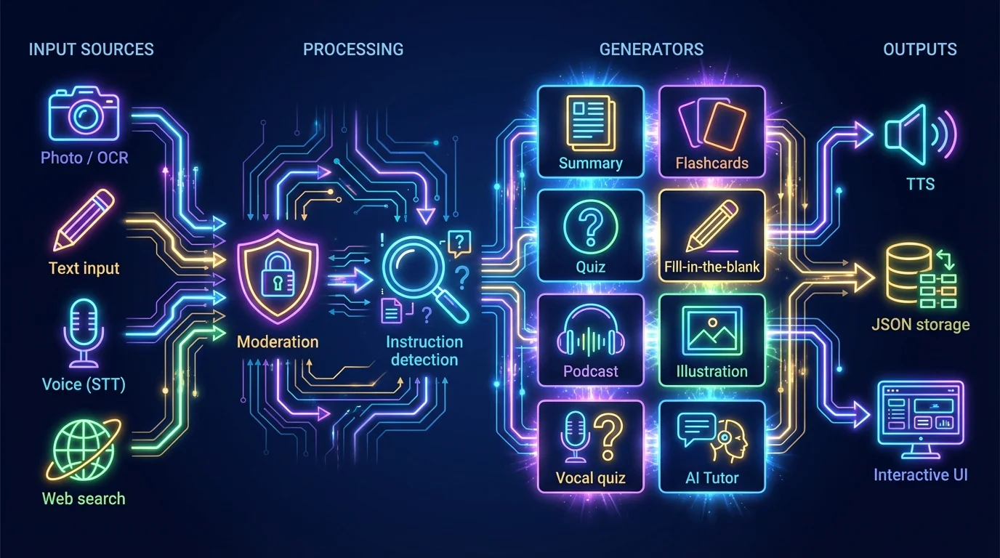
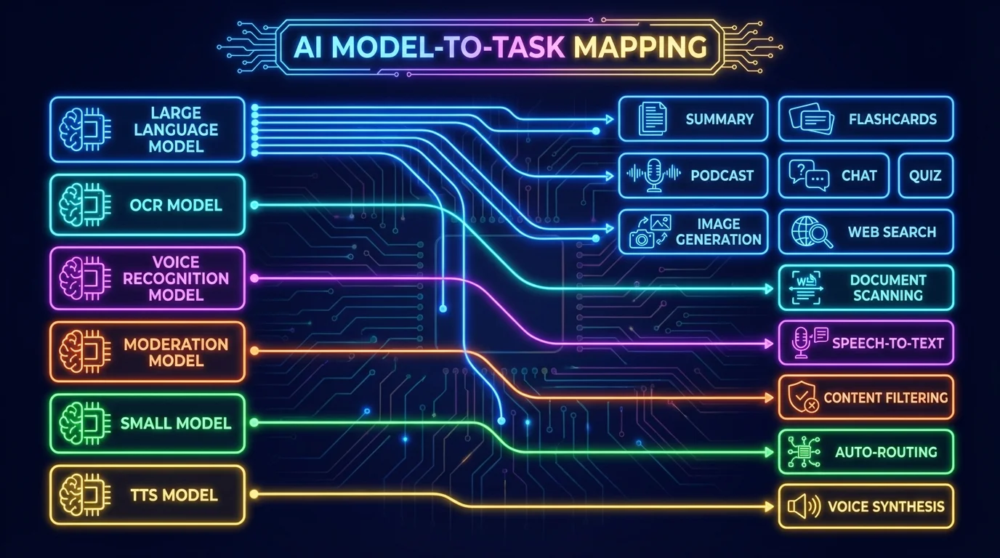
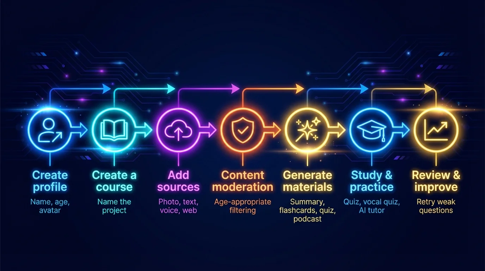

<p align="center">
  
</p>

<h1 align="center">EurekAI</h1>

<p align="center">
  <strong>Transforme n'importe quel contenu en expérience d'apprentissage interactive — propulsé par <a href="https://mistral.ai">Mistral AI</a>.</strong>
</p>

<p align="center">
  <a href="README-en.md">🇬🇧 English</a> · <a href="README-es.md">🇪🇸 Español</a> · <a href="README-pt.md">🇧🇷 Português</a> · <a href="README-de.md">🇩🇪 Deutsch</a> · <a href="README-it.md">🇮🇹 Italiano</a> · <a href="README-nl.md">🇳🇱 Nederlands</a> · <a href="README-ar.md">🇸🇦 العربية</a><br>
  <a href="README-hi.md">🇮🇳 हिन्दी</a> · <a href="README-zh.md">🇨🇳 中文</a> · <a href="README-ja.md">🇯🇵 日本語</a> · <a href="README-ko.md">🇰🇷 한국어</a> · <a href="README-pl.md">🇵🇱 Polski</a> · <a href="README-ro.md">🇷🇴 Română</a> · <a href="README-sv.md">🇸🇪 Svenska</a>
</p>

<p align="center">
  <a href="https://www.youtube.com/watch?v=_b1TQz2leoI"></a>
</p>

<h4 align="center">📊 Qualité du code</h4>

<p align="center">
  <a href="https://sonarcloud.io/summary/new_code?id=jls42_EurekAI"></a>
  <a href="https://sonarcloud.io/summary/new_code?id=jls42_EurekAI"></a>
  <a href="https://sonarcloud.io/summary/new_code?id=jls42_EurekAI"></a>
  <a href="https://sonarcloud.io/summary/new_code?id=jls42_EurekAI"></a>
</p>
<p align="center">
  <a href="https://sonarcloud.io/summary/new_code?id=jls42_EurekAI"></a>
  <a href="https://sonarcloud.io/summary/new_code?id=jls42_EurekAI"></a>
  <a href="https://sonarcloud.io/summary/new_code?id=jls42_EurekAI"></a>
  <a href="https://sonarcloud.io/summary/new_code?id=jls42_EurekAI"></a>
</p>
<p align="center">
  <a href="https://app.codacy.com/gh/jls42/EurekAI/dashboard?utm_source=gh&utm_medium=referral&utm_content=&utm_campaign=Badge_grade"></a>
  <a href="https://www.codefactor.io/repository/github/jls42/eurekai"></a>
</p>

---

## L'histoire — Pourquoi EurekAI ?

**EurekAI** est né pendant le [Mistral AI Worldwide Hackathon](https://luma.com/mistralhack-online) ([site officiel](https://worldwide-hackathon.mistral.ai/)) (mars 2026). Il me fallait un sujet — et l'idée est venue de quelque chose de très concret : je prépare régulièrement les contrôles avec ma fille, et je me suis dit qu'il devait être possible de rendre ça plus ludique et interactif grâce à l'IA.

L'objectif : prendre **n'importe quelle entrée** — une photo de la leçon, un texte copié-collé, un enregistrement vocal, une recherche web — et la transformer en **fiches de révision, flashcards, quiz, podcasts, textes à trous, illustrations, et plus encore**. Le tout propulsé par les modèles français de Mistral AI, ce qui en fait une solution naturellement adaptée aux élèves francophones.

Le [prototype initial](https://github.com/jls42/worldwide-hackathon.mistral.ai) a été conçu en 48h pendant le hackathon comme preuve de concept autour des services Mistral — déjà fonctionnel, mais limité. Depuis, EurekAI est devenu un vrai projet : textes à trous, navigation dans les exercices, scraping web, modération parentale configurable, revue de code approfondie, et bien plus. L'intégralité du code est générée par IA — principalement [Claude Code](https://code.claude.com/), avec quelques contributions via [Codex](https://openai.com/codex/) et [Gemini CLI](https://geminicli.com/).

---

## Fonctionnalités

| | Fonctionnalité | Description |
|---|---|---|
| 📷 | **Import de fichiers** | Importez vos leçons — photo, PDF (via Mistral OCR avec score de confiance par page, tiers `high`/`medium`/`low`) ou fichier texte (TXT, MD). Sessions d'upload avec retry par fichier et progress individuel |
| 📝 | **Saisie texte** | Tapez ou collez n'importe quel texte directement |
| 🎤 | **Entrée vocale** | Enregistrez-vous — Voxtral STT transcrit votre voix |
| 🌐 | **Web / URL** | Collez une URL (scraping direct via Readability + Lightpanda) ou tapez une recherche (Agent Mistral web_search) |
| 📄 | **Fiches de révision** | Notes structurées avec points clés, vocabulaire, citations, anecdotes |
| 🃏 | **Flashcards** | Cartes Q/R interactives, lecture audio dialoguée |
| ❓ | **Quiz QCM** | Questions à choix multiples avec révision adaptative des erreurs (nombre configurable) |
| ✏️ | **Textes à trous** | Exercices à compléter avec indices et validation tolérante |
| 🎙️ | **Podcast** | Mini-podcast 2 voix en audio — voix Mistral par défaut ou voix personnalisées (parents !) |
| 🖼️ | **Illustrations** | Images éducatives générées par un Agent Mistral |
| 🗣️ | **Quiz vocal** | Questions lues à voix haute (voix custom possible), réponse orale, vérification IA |
| 💬 | **Tuteur IA** | Chat contextuel avec vos documents de cours, avec appel d'outils |
| 🧠 | **Routeur automatique** | Un routeur basé sur `mistral-small-latest` analyse le contenu et propose une combinaison de générateurs parmi les 7 types disponibles |
| 🔒 | **Contrôle parental** | Modération configurable par profil (catégories personnalisables), PIN parental, restrictions du chat |
| 🌍 | **Multilingue** | Interface disponible en 9 langues ; génération IA pilotable dans 15 langues via les prompts |
| 🔊 | **Lecture à voix haute** | Écoutez les fiches et flashcards (dialogue question/réponse) via Mistral Voxtral TTS ou ElevenLabs |
| 💶 | **Suivi des coûts API** | Estimation transparente du coût € de chaque génération et source (tokens / caractères / pages / secondes audio). Badge par carte + total par projet, visible dans le dashboard |
| 🎨 | **Thème par profil** | Chaque profil choisit son thème `dark` ou `light` — persiste au changement de profil |

---

## Vue d'ensemble de l'architecture

<p align="center">
  
</p>

---

## Carte d'utilisation des modèles

<p align="center">
  
</p>

---

## Parcours utilisateur

<p align="center">
  
</p>

---

## Plongée en profondeur — Fonctionnalités

### Entrée multi-modale

EurekAI accepte 4 types de sources, modérées selon le profil (activé par défaut pour enfant et ado) :

- **Import de fichiers** — Fichiers JPG, PNG ou PDF traités par `mistral-ocr-latest` (texte imprimé, tableaux, écriture manuscrite), ou fichiers texte (TXT, MD) importés directement. Les uploads multi-fichiers utilisent un système de **sessions d'upload** : progress individuel par fichier, retry du fichier en échec sans re-soumettre les autres, dismiss de la session quand terminée. L'OCR expose un **score de confiance** par page (`overall` + `perPage[]`), affiché dans l'UI sous forme de badge tier `high` / `medium` / `low` (seuils ~0.9 / ~0.7) — avertit sans bloquer si le scan est de mauvaise qualité.
- **Texte libre** — Tapez ou collez n'importe quel contenu. Modéré avant stockage si la modération est active.
- **Entrée vocale** — Enregistrez de l'audio dans le navigateur. Transcrit par `voxtral-mini-latest`. Le paramètre `language="fr"` optimise la reconnaissance.
- **Web / URL** — Collez une ou plusieurs URLs pour scraper le contenu directement (Readability + Lightpanda pour les pages JS), ou tapez des mots-clés pour une recherche web via Agent Mistral. Le champ unique accepte les deux — URLs et mots-clés sont séparés automatiquement, chaque résultat crée une source indépendante.

### Génération de contenu IA

Sept types de matériel d'apprentissage généré :

| Générateur | Modèle | Sortie |
|---|---|---|
| **Fiche de révision** | `mistral-large-latest` | Titre, résumé, points clés, vocabulaire, citations, anecdote |
| **Flashcards** | `mistral-large-latest` | Cartes Q/R avec références aux sources (nombre configurable) |
| **Quiz QCM** | `mistral-large-latest` | Questions à choix multiples, explications, révision adaptative (nombre configurable) |
| **Textes à trous** | `mistral-large-latest` | Phrases à compléter avec indices, validation tolérante (Levenshtein) |
| **Podcast** | `mistral-large-latest` + Voxtral TTS | Script 2 voix → audio MP3 |
| **Illustration** | Agent `mistral-large-latest` | Image éducative via l'outil `image_generation` |
| **Quiz vocal** | `mistral-large-latest` + Voxtral TTS + STT | Questions TTS → réponse STT → vérification IA |

### Tuteur IA par chat

Un tuteur conversationnel avec accès complet aux documents de cours :

- Utilise `mistral-large-latest`
- **Appel d'outils** : peut générer des fiches, flashcards, quiz ou textes à trous pendant la conversation
- Historique de 50 messages par cours
- Modération du contenu si activée pour le profil

### Routeur automatique

Le routeur utilise `mistral-small-latest` pour analyser le contenu des sources et proposer les générateurs les plus pertinents parmi les 7 disponibles. L'interface affiche la progression en temps réel : d'abord une phase d'analyse, puis les générations individuelles avec annulation possible.

### Apprentissage adaptatif

- **Statistiques de quiz** : suivi des tentatives et de la précision par question
- **Révision de quiz** : génère 5-10 nouvelles questions ciblant les concepts faibles
- **Détection de consigne** : détecte les instructions de révision ("Je sais ma leçon si je sais...") et les priorise dans les générateurs textuels compatibles (fiche, flashcards, quiz, textes à trous)

### Sécurité & contrôle parental

- **4 groupes d'âge** : enfant (≤10 ans), ado (11-15), étudiant (16-25), adulte (26+)
- **Modération du contenu** : `mistral-moderation-latest` avec 10 catégories disponibles, 5 bloquées par défaut pour enfant/ado (`sexual`, `hate_and_discrimination`, `violence_and_threats`, `selfharm`, `jailbreaking`). Catégories personnalisables par profil dans les paramètres.
- **PIN parental** : hash SHA-256, requis pour les profils de moins de 15 ans. Pour un déploiement production, prévoir un hash lent avec sel (Argon2id, bcrypt).
- **Restrictions du chat** : chat IA désactivé par défaut pour les moins de 16 ans, activable par les parents

### Système multi-profils

- Profils multiples avec nom, âge, avatar, préférences de langue
- **Voix par profil** (`Profile.mistralVoices?: { host, guest }`) — chaque enfant peut avoir sa paire de voix podcast/quiz vocal
- **Thème par profil** (`Profile.theme: 'dark' | 'light'`) — bascule automatique au changement de profil, persistée côté backend
- Projets liés aux profils via `profileId`
- Suppression en cascade : supprimer un profil supprime tous ses projets

### Suivi des coûts API

Chaque appel Mistral (chat, OCR, STT, TTS, modération, agents) est instrumenté pour fournir une estimation € **transparente** à l'utilisateur — pas de surprise sur la facturation.

- **Source de vérité** : `helpers/pricing.ts` — `MODEL_PRICING` par prefix de modèle (ex: `mistral-large` → input 0.5 €/M tokens, output 1.5 €/M tokens), `PRICING_SOURCES` avec URLs doc Mistral pour re-scraping périodique
- **Unités supportées** : `tokens`, `characters` (TTS), `pages` (OCR), `audio-seconds` (STT) — conversion pilotée par `helpers/cost-calc.ts`
- **Chaîne d'instrumentation** : `helpers/tracked-client.ts` (wrap client Mistral) → `helpers/usage-context.ts` (AsyncLocalStorage) → `helpers/cost-calc.ts` → `helpers/cost-persist.ts` → `helpers/cost-middleware.ts` (injection dans la réponse HTTP)
- **UI** : badge coût par génération (`src/partials/cost-badge-gen.html`), par source (`cost-badge-src.html`), total cumulé dans le dashboard (`Project.totalCost`)
- **Endpoints** : les réponses `/generate/*` et `/sources/*` incluent `costDelta: { estimatedEuros, perModel }`. `GET /projects/:pid` retourne `totalCost` + `costLog[]` historique. `GET /api/config/status` expose `costEstimateAvailable`

### TTS multi-provider & voix personnalisées

- **Mistral Voxtral TTS** (défaut) : `voxtral-mini-tts-latest`, pas de clé supplémentaire nécessaire
- **ElevenLabs** (alternatif) : `eleven_v3`, voix naturelles, nécessite `ELEVENLABS_API_KEY`
- Provider configurable dans les paramètres de l'application
- **Voix personnalisées** : les parents peuvent créer leurs propres voix via l'API Mistral Voices (à partir d'un échantillon audio) et les assigner aux rôles hôte/invité — les podcasts et quiz vocaux sont alors lus avec la voix d'un parent, rendant l'expérience encore plus immersive pour l'enfant
- Deux rôles vocaux configurables : **hôte** (narrateur principal) et **invité** (deuxième voix du podcast)
- Catalogue complet des voix Mistral disponible dans les paramètres, filtrable par langue

### Internationalisation

- Interface disponible en 9 langues : fr, en, es, pt, it, nl, de, hi, ar
- Prompts IA supportent 15 langues (fr, en, es, de, it, pt, nl, ja, zh, ko, ar, hi, pl, ro, sv)
- Langue configurable par profil

---

## Stack technique

| Couche | Technologie | Rôle |
|---|---|---|
| **Runtime** | Node.js + TypeScript 6.x | Serveur et sûreté des types |
| **Backend** | Express 5.x | API REST |
| **Serveur de dev** | Vite 8.x (Rolldown) + tsx | HMR, partials Handlebars, proxy |
| **Frontend** | HTML + TailwindCSS 4.x + Alpine.js 3.x | Interface réactive, TypeScript compilé par Vite |
| **Templating** | vite-plugin-handlebars | Composition HTML par partials |
| **IA** | Mistral AI SDK 2.x | Chat, OCR, STT, TTS, Agents, Modération |
| **TTS (défaut)** | Mistral Voxtral TTS | `voxtral-mini-tts-latest`, synthèse vocale intégrée |
| **TTS (alternatif)** | ElevenLabs SDK 2.x | `eleven_v3`, voix naturelles |
| **Icônes** | Lucide 1.x | Bibliothèque d'icônes SVG |
| **Scraping web** | Readability + linkedom | Extraction du contenu principal des pages web (techno Firefox Reader View) |
| **Headless browser** | Lightpanda | Navigateur headless ultra-léger (Zig + V8) pour les pages JS/SPA — fallback scraping |
| **Markdown** | Marked | Rendu markdown dans le chat |
| **Upload fichiers** | Multer 2.x | Gestion des formulaires multipart |
| **Audio** | ffmpeg-static | Concaténation de segments audio |
| **Tests** | Vitest | Tests unitaires — couverture mesurée par SonarCloud |
| **Persistance** | Fichiers JSON | Stockage sans dépendance |

---

## Référence des modèles

| Modèle | Utilisation | Pourquoi |
|---|---|---|
| `mistral-large-latest` | Fiche, Flashcards, Podcast, Quiz, Textes à trous, Chat, Vérification quiz vocal, Agent Image, Agent Web Search, Détection consigne | Meilleur multilingual + suivi d'instructions |
| `mistral-ocr-latest` | OCR de documents | Texte imprimé, tableaux, écriture manuscrite |
| `voxtral-mini-latest` | Reconnaissance vocale (STT) | STT multilingue, optimisé avec `language="fr"` |
| `voxtral-mini-tts-latest` | Synthèse vocale (TTS) | Podcasts, quiz vocal, lecture à voix haute |
| `mistral-moderation-latest` | Modération de contenu | 5 catégories bloquées pour enfant/ado (+ jailbreaking) |
| `mistral-small-latest` | Routeur automatique | Analyse rapide du contenu pour décisions de routage |
| `eleven_v3` (ElevenLabs) | Synthèse vocale (TTS alternatif) | Voix naturelles, alternative configurable |

---

## Démarrage rapide

```bash
# Cloner le dépôt
git clone https://github.com/jls42/EurekAI.git
cd EurekAI

# Installer les dépendances
npm install

# Configurer les clés API
cp .env.example .env
# Éditez .env avec vos clés :
#   MISTRAL_API_KEY=<your_api_key>           (requis)
#   ELEVENLABS_API_KEY=<your_api_key>        (optionnel, TTS alternatif)
#   SONAR_TOKEN=...                          (optionnel, CI SonarCloud uniquement)

# Lancer le développement
npm run dev
# → Backend :  http://localhost:3000 (API)
# → Frontend : http://localhost:5173 (serveur Vite avec HMR)
```

> **Note** : Mistral Voxtral TTS est le provider par défaut — aucune clé supplémentaire nécessaire au-delà de `MISTRAL_API_KEY`. ElevenLabs est un provider TTS alternatif configurable dans les paramètres.

---

## Déploiement avec conteneur

L'image est publiée sur **GitHub Container Registry** :

```bash
# Télécharger l'image
podman pull ghcr.io/jls42/eurekai:latest

# Lancer EurekAI
mkdir -p ./data
podman run -d --name eurekai \
  -e MISTRAL_API_KEY=<your_api_key> \
  -e ELEVENLABS_API_KEY=<your_api_key> \
  -v ./data:/app/output:U \
  -p 3000:3000 \
  ghcr.io/jls42/eurekai:latest
# → http://localhost:3000
```

> **`:U`** est un flag Podman rootless qui ajuste automatiquement les permissions du volume.
> **`ELEVENLABS_API_KEY`** est optionnel (TTS alternatif).

```bash
# Build local
podman build -t eurekai -f Containerfile .

# Publier sur ghcr.io (mainteneurs)
./scripts/publish-ghcr.sh
```

---

## Structure du projet

```
server.ts                 — Point d'entrée Express, monte les routes + config
config.ts                 — Config runtime (modèles, voix, TTS provider), persistée dans output/config.json
store.ts                  — ProjectStore : CRUD projets/sources/générations, persistance JSON
profiles.ts               — ProfileStore : gestion des profils, hachage PIN
types.ts                  — Types TypeScript : Source, Generation (7 types), QuizStats, Profile
prompts.ts                — Tous les prompts IA centralisés (system + user templates, 15 langues)

generators/
  auto-agents.ts          — Source unique de vérité : AUTO_AGENTS_SET (7 agents) + MAX_AUTO_PLAN_LENGTH
  ocr.ts                  — OCR via Mistral (JPG, PNG, PDF) + extractConfidence (score par page)
  summary.ts              — Génération de fiche de révision (JSON structuré)
  flashcards.ts           — Flashcards Q/R (5-50, configurable)
  quiz.ts                 — Quiz QCM (5-50 questions, configurable) + révision adaptative
  fill-blank.ts           — Exercices à trous avec validation tolérante
  podcast.ts              — Script podcast 2 voix
  quiz-vocal.ts           — Quiz vocal : questions TTS + réponses STT + vérification IA
  image.ts                — Génération d'image via Agent Mistral (outil image_generation)
  chat.ts                 — Tuteur IA par chat avec appel d'outils
  router.ts               — Routeur automatique (contenu → générateurs recommandés)
  consigne.ts             — Détection de consignes de révision
  tts-provider.ts         — Dispatch TTS multi-provider (Mistral Voxtral / ElevenLabs)
  tts.ts                  — Génération audio multi-voix (podcast + flashcards, concaténation de segments)
  stt.ts                  — Voxtral STT (audio → texte)
  websearch.ts            — Agent Mistral avec outil web_search (fallback)
  moderation.ts           — Modération de contenu (filtrage par âge)

routes/
  projects.ts             — CRUD projets
  profiles.ts             — CRUD profils avec gestion du PIN
  sources.ts              — Import fichiers (OCR + texte brut), texte libre, voix STT, scraping URL + recherche web, modération
  generate.ts             — Endpoints de génération (7 types + auto + route)
  generations.ts          — Tentatives de quiz/fill-blank, réponses vocales, lecture à voix haute
  chat.ts                 — Chat IA avec appel d'outils

helpers/
  # IO & parsing
  index.ts                — getContent, stripJsonMarkdown, safeParseJson, unwrapJsonArray, extractAllText, timer
  audio.ts                — collectStream (ReadableStream → Buffer)
  audio-files.ts          — Persistance et lecture des fichiers audio générés (podcast, flashcards)
  logger.ts               — Logger structuré (niveaux, contexte JSON)

  # Génération & UX
  auto-title.ts           — autoTitle(type, data, lang) : préfixe auto pour carte liste (Fiche, Note, Quiz, etc.)
  choice-labels.ts        — Labels localisés des choix (quiz, quiz-vocal) — 9 langues
  diversity.ts            — Diversité des générations (exclusion du contenu déjà produit, randomSeed)
  fill-blank-validate.ts  — Validation tolérante des réponses (normalisation, Levenshtein)

  # Codes d'erreur stables
  error-codes.ts              — Re-export mince de l'API publique
  error-code-resolution.ts    — Orchestration extractErrorCode(e, agent) → FailedStepCode
  error-code-rules.ts         — Règles de mapping par agent/step
  error-matchers.ts           — Matchers par pattern d'erreur HTTP/LLM (délimités pour Lizard)

  # Cost tracking API (suivi coûts €)
  pricing.ts              — MODEL_PRICING + PRICING_SOURCES (tarifs Mistral par prefix de modèle)
  cost-calc.ts            — Conversion ApiUsage → coût € (tokens / characters / pages / audio-seconds)
  cost-persist.ts         — Écriture dans Project.costLog + totalCost
  cost-middleware.ts      — Injection de costDelta dans la réponse HTTP
  tracked-client.ts       — Wrap du client Mistral (capture ApiUsage automatiquement)
  usage-context.ts        — AsyncLocalStorage pour propager l'usage dans les pipelines async

  # Voix & profils
  voice-selection.ts      — selectVoices : rotation déterministe par profil + langue (host/guest)
  voice-types.ts          — Types Voice, VoiceRole, VoiceMap

src/                      — Frontend (Vite + Handlebars)
  index.html              — Point d'entrée HTML principal
  main.ts                 — Entrée frontend (init Alpine.js + icônes Lucide)
  app/                    — Modules applicatifs Alpine.js
    state.ts              — Gestion d'état réactif
    navigation.ts         — Routage des vues + gardes par âge
    profiles.ts           — Logique du sélecteur de profils
    projects.ts           — CRUD des cours
    sources.ts            — Gestionnaires d'upload de sources
    generate.ts           — Déclencheurs de génération (individuel, tout, auto 2 phases)
    generations.ts        — Affichage + actions sur les générations
    chat.ts               — Interface de chat
    config.ts             — Interface de configuration (modèles, voix, TTS provider)
    render.ts             — Helpers de rendu HTML
    i18n.ts               — Changement de langue
    ...
  components/
    quiz.ts               — Composant quiz interactif
    quiz-vocal.ts         — Composant quiz vocal
    fill-blank.ts         — Composant textes à trous
    flashcards.ts         — Composant flashcards avec retournement
    step-by-step.ts       — Mixin navigation pas-à-pas (quiz, fill-blank, flashcards)
  i18n/
    fr.ts, en.ts, es.ts, — Dictionnaires par langue (9 langues)
    pt.ts, it.ts, nl.ts,
    de.ts, hi.ts, ar.ts
    languages.ts          — Registre des langues UI disponibles
    index.ts              — Chargeur i18n
  partials/               — Partials HTML Handlebars (header, sidebar, dialogues, vues)
  styles/
    main.css              — Entrée TailwindCSS
    theme.css             — Variables de thème personnalisées

public/assets/            — Ressources statiques (logo, avatars)
output/                   — Données d'exécution (projets, config, fichiers audio)
```

---

## Référence API

### Config
| Méthode | Endpoint | Description |
|---|---|---|
| `GET` | `/api/config` | Configuration courante |
| `PUT` | `/api/config` | Modifier la config (modèles, voix, TTS provider) |
| `GET` | `/api/config/status` | Statut des APIs : `mistralAvailable`, `elevenlabsAvailable`, `ttsAvailable` (provider actif), `costEstimateAvailable` |
| `POST` | `/api/config/reset` | Réinitialiser la config par défaut |
| `GET` | `/api/config/voices` | Lister les voix Mistral TTS (optionnel `?lang=fr`) |
| `GET` | `/api/moderation-categories` | Catégories de modération disponibles + défauts par âge |

### Profils
| Méthode | Endpoint | Description |
|---|---|---|
| `GET` | `/api/profiles` | Lister tous les profils |
| `POST` | `/api/profiles` | Créer un profil |
| `PUT` | `/api/profiles/:id` | Modifier un profil (PIN requis pour < 15 ans) |
| `DELETE` | `/api/profiles/:id` | Supprimer un profil + cascade projets `{pin?}` → `{ok, deletedProjects}` |

### Projets
| Méthode | Endpoint | Description |
|---|---|---|
| `GET` | `/api/projects` | Lister les projets (`?profileId=` optionnel) |
| `POST` | `/api/projects` | Créer un projet `{name, profileId}` |
| `GET` | `/api/projects/:pid` | Détails du projet |
| `PUT` | `/api/projects/:pid` | Renommer `{name}` |
| `DELETE` | `/api/projects/:pid` | Supprimer le projet |

### Sources
| Méthode | Endpoint | Description |
|---|---|---|
| `POST` | `/api/projects/:pid/sources/upload` | Import fichiers multipart (OCR pour JPG/PNG/PDF, lecture directe pour TXT/MD) |
| `POST` | `/api/projects/:pid/sources/text` | Texte libre `{text}` |
| `POST` | `/api/projects/:pid/sources/voice` | Voix STT (audio multipart) |
| `POST` | `/api/projects/:pid/sources/websearch` | Scraping URL ou recherche web `{query}` — retourne un tableau de sources |
| `DELETE` | `/api/projects/:pid/sources/:sid` | Supprimer une source |
| `POST` | `/api/projects/:pid/moderate` | Modérer `{text}` |
| `POST` | `/api/projects/:pid/detect-consigne` | Détecter les consignes de révision |

### Génération
| Méthode | Endpoint | Description |
|---|---|---|
| `POST` | `/api/projects/:pid/generate/summary` | Fiche de révision |
| `POST` | `/api/projects/:pid/generate/flashcards` | Flashcards |
| `POST` | `/api/projects/:pid/generate/quiz` | Quiz QCM |
| `POST` | `/api/projects/:pid/generate/fill-blank` | Textes à trous |
| `POST` | `/api/projects/:pid/generate/podcast` | Podcast |
| `POST` | `/api/projects/:pid/generate/image` | Illustration |
| `POST` | `/api/projects/:pid/generate/quiz-vocal` | Quiz vocal |
| `POST` | `/api/projects/:pid/generate/quiz-review` | Révision adaptative `{generationId, weakQuestions}` |
| `POST` | `/api/projects/:pid/generate/route` | Analyse de routage (plan des générateurs à lancer) |
| `POST` | `/api/projects/:pid/generate/auto` | Génération auto backend (routage + 7 types : summary, flashcards, quiz, fill-blank, podcast, quiz-vocal, image). Exécution en parallèle — suppose un tier Mistral avec rate-limit ≥ 7 requêtes simultanées ; sinon plusieurs 429 peuvent remonter dans `failedSteps`. |

Toutes les routes de génération acceptent `{sourceIds?, lang?, ageGroup?, count?, useConsigne?}`. `quiz-review` exige en plus `{generationId, weakQuestions}`.

### CRUD Générations
| Méthode | Endpoint | Description |
|---|---|---|
| `POST` | `/api/projects/:pid/generations/:gid/quiz-attempt` | Soumettre les réponses quiz `{answers}` |
| `POST` | `/api/projects/:pid/generations/:gid/fill-blank-attempt` | Soumettre les réponses textes à trous `{answers}` |
| `POST` | `/api/projects/:pid/generations/:gid/vocal-answer` | Vérifier une réponse orale (audio + questionIndex) |
| `POST` | `/api/projects/:pid/generations/:gid/read-aloud` | Lecture TTS à voix haute (fiches/flashcards) |
| `PUT` | `/api/projects/:pid/generations/:gid` | Renommer `{title}` |
| `DELETE` | `/api/projects/:pid/generations/:gid` | Supprimer la génération |

### Chat
| Méthode | Endpoint | Description |
|---|---|---|
| `GET` | `/api/projects/:pid/chat` | Récupérer l'historique du chat |
| `POST` | `/api/projects/:pid/chat` | Envoyer un message `{message, lang, ageGroup}` |
| `DELETE` | `/api/projects/:pid/chat` | Effacer l'historique du chat |

---

## Décisions architecturales

| Décision | Justification |
|---|---|
| **Alpine.js plutôt que React/Vue** | Empreinte minimale, réactivité légère avec TypeScript compilé par Vite. Parfait pour un hackathon où la vitesse compte. |
| **Persistance en fichiers JSON** | Zéro dépendance, démarrage instantané. Aucune base de données à configurer — on démarre et c'est parti. |
| **Vite + Handlebars** | Le meilleur des deux mondes : HMR rapide pour le développement, partials HTML pour l'organisation du code, Tailwind JIT. |
| **Prompts centralisés** | Tous les prompts IA dans `prompts.ts` — facile à itérer, tester et adapter par langue/groupe d'âge. |
| **Système multi-générations** | Chaque génération est un objet indépendant avec son propre ID — permet plusieurs fiches, quiz, etc. par cours. |
| **Prompts adaptés par âge** | 4 groupes d'âge avec vocabulaire, complexité et ton différents — le même contenu enseigne différemment selon l'apprenant. |
| **Fonctionnalités basées sur les Agents** | La génération d'images et la recherche web utilisent des Agents Mistral temporaires — cycle de vie propre avec nettoyage automatique. |
| **Scraping intelligent d'URL** | Un champ unique accepte URLs et mots-clés mélangés — les URLs sont scrapées via Readability (pages statiques) avec fallback Lightpanda (pages JS/SPA), les mots-clés déclenchent un Agent Mistral web_search. Chaque résultat crée une source indépendante. |
| **TTS multi-provider** | Mistral Voxtral TTS par défaut (pas de clé supplémentaire), ElevenLabs en alternatif — configurable sans redémarrage. |

---

## Crédits & remerciements

- **[Mistral AI](https://mistral.ai)** — Modèles IA (Large, OCR, Voxtral STT, Voxtral TTS, Moderation, Small) + Worldwide Hackathon
- **[ElevenLabs](https://elevenlabs.io)** — Moteur de synthèse vocale alternatif (`eleven_v3`)
- **[Alpine.js](https://alpinejs.dev)** — Framework réactif léger
- **[TailwindCSS](https://tailwindcss.com)** — Framework CSS utilitaire
- **[Vite](https://vitejs.dev)** — Outil de build frontend
- **[Lucide](https://lucide.dev)** — Bibliothèque d'icônes
- **[Marked](https://marked.js.org)** — Parseur Markdown
- **[Readability](https://github.com/mozilla/readability)** — Extraction de contenu web (techno Firefox Reader View)
- **[Lightpanda](https://lightpanda.io)** — Navigateur headless ultra-léger pour le scraping de pages JS/SPA

Initié pendant le Mistral AI Worldwide Hackathon (mars 2026), développé intégralement par IA avec [Claude Code](https://code.claude.com/), [Codex](https://openai.com/codex/) et [Gemini CLI](https://geminicli.com/).

---

## Auteur

**Julien LS** — [contact@jls42.org](mailto:contact@jls42.org)

## Licence

[AGPL-3.0](LICENSE) — Copyright (C) 2026 Julien LS
