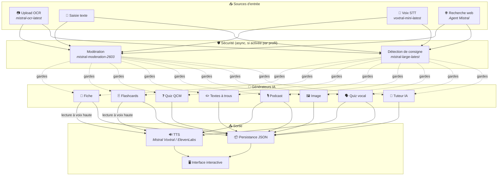
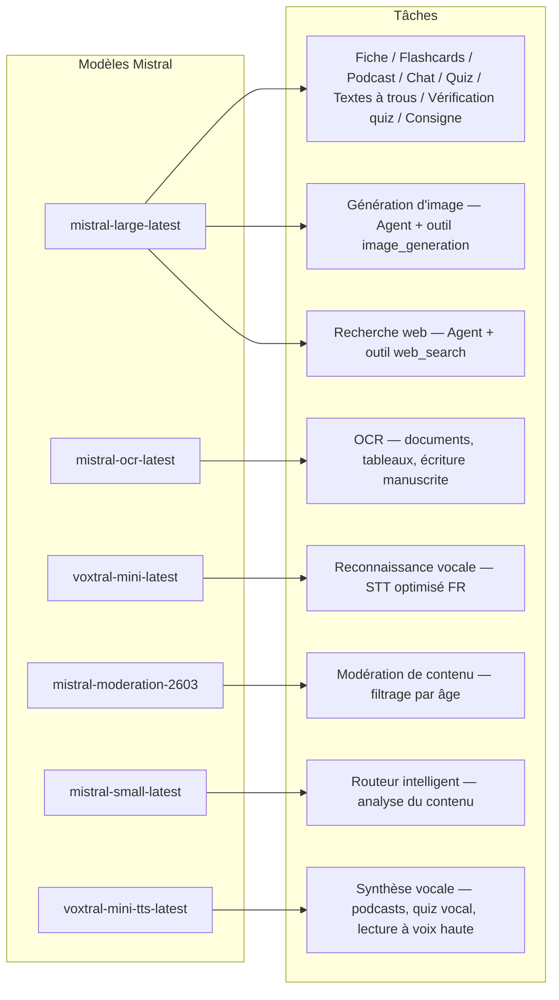
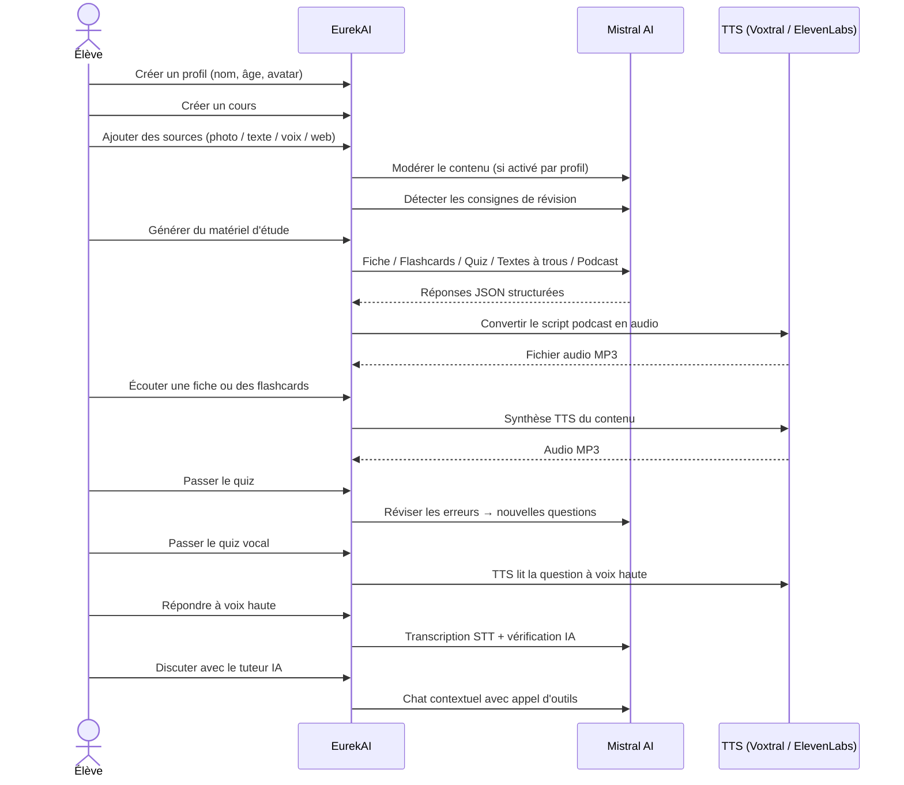

<p align="center">
  
</p>

<h1 align="center">EurekAI</h1>

<p align="center">
  <strong>Transforme n'importe quel contenu en expérience d'apprentissage interactive — propulsé par l'IA.</strong>
</p>

<p align="center">
  <a href="https://mistral.ai"></a>
  <a href="https://www.typescriptlang.org"></a>
  <a href="https://mistral.ai"></a>
  <a href="https://elevenlabs.io"></a>
</p>

<p align="center">
  <a href="https://www.youtube.com/watch?v=_b1TQz2leoI">▶️ Voir la démo sur YouTube</a> · <a href="README-en.md">🇬🇧 Read in English</a>
</p>

<p align="center">
  <a href="https://sonarcloud.io/summary/new_code?id=jls42_EurekAI"></a>
  <a href="https://sonarcloud.io/summary/new_code?id=jls42_EurekAI"></a>
  <a href="https://sonarcloud.io/summary/new_code?id=jls42_EurekAI"></a>
  <a href="https://sonarcloud.io/summary/new_code?id=jls42_EurekAI"></a>
</p>
<p align="center">
  <a href="https://sonarcloud.io/summary/new_code?id=jls42_EurekAI"></a>
  <a href="https://sonarcloud.io/summary/new_code?id=jls42_EurekAI"></a>
  <a href="https://sonarcloud.io/summary/new_code?id=jls42_EurekAI"></a>
  <a href="https://sonarcloud.io/summary/new_code?id=jls42_EurekAI"></a>
</p>

---

## L'histoire — Pourquoi EurekAI ?

**EurekAI** est né pendant le [Mistral AI Worldwide Hackathon](https://worldwide-hackathon.mistral.ai/) (mars 2026). Il me fallait un sujet — et l'idée est venue de quelque chose de très concret : je prépare régulièrement les contrôles avec ma fille, et je me suis dit qu'il devait être possible de rendre ça plus ludique et interactif grâce à l'IA.

L'objectif : prendre **n'importe quelle entrée** — une photo du manuel, un texte copié-collé, un enregistrement vocal, une recherche web — et la transformer en **fiches de révision, flashcards, quiz, podcasts, textes à trous, illustrations, et plus encore**. Le tout propulsé par les modèles français de Mistral AI, ce qui en fait une solution naturellement adaptée aux élèves francophones.

Chaque ligne de code a été écrite pendant le hackathon. Toutes les APIs et bibliothèques open-source sont utilisées conformément aux règles du hackathon.

---

## Fonctionnalités

| | Fonctionnalité | Description |
|---|---|---|
| 📷 | **Upload OCR** | Prenez en photo votre manuel ou vos notes — Mistral OCR en extrait le contenu |
| 📝 | **Saisie texte** | Tapez ou collez n'importe quel texte directement |
| 🎤 | **Entrée vocale** | Enregistrez-vous — Voxtral STT transcrit votre voix |
| 🌐 | **Recherche web** | Posez une question — un Agent Mistral cherche les réponses sur le web |
| 📄 | **Fiches de révision** | Notes structurées avec points clés, vocabulaire, citations, anecdotes |
| 🃏 | **Flashcards** | 5-50 cartes Q/R avec références aux sources pour la mémorisation active |
| ❓ | **Quiz QCM** | 5-50 questions à choix multiples avec révision adaptative des erreurs |
| ✏️ | **Textes à trous** | Exercices à compléter avec indices et validation tolérante |
| 🎙️ | **Podcast** | Mini-podcast 2 voix converti en audio via Mistral Voxtral TTS |
| 🖼️ | **Illustrations** | Images éducatives générées par un Agent Mistral |
| 🗣️ | **Quiz vocal** | Questions lues à haute voix, réponse orale, l'IA vérifie la réponse |
| 💬 | **Tuteur IA** | Chat contextuel avec vos documents de cours, avec appel d'outils |
| 🧠 | **Routeur intelligent** | L'IA analyse votre contenu et recommande les générateurs les plus pertinents parmi les 7 disponibles |
| 🔒 | **Contrôle parental** | Modération par âge, PIN parental, restrictions du chat |
| 🌍 | **Multilingue** | Interface et contenu IA complets en français et anglais |
| 🔊 | **Lecture à voix haute** | Écoutez les fiches et flashcards via Mistral Voxtral TTS ou ElevenLabs |

---

## Vue d'ensemble de l'architecture



---

## Carte d'utilisation des modèles



---

## Parcours utilisateur



---

## Plongée en profondeur — Fonctionnalités

### Entrée multi-modale

EurekAI accepte 4 types de sources, modérées selon le profil (activé par défaut pour enfant et ado) :

- **Upload OCR** — Fichiers JPG, PNG ou PDF traités par `mistral-ocr-latest`. Gère le texte imprimé, les tableaux et l'écriture manuscrite.
- **Texte libre** — Tapez ou collez n'importe quel contenu. Modéré avant stockage si la modération est active.
- **Entrée vocale** — Enregistrez de l'audio dans le navigateur. Transcrit par `voxtral-mini-latest`. Le paramètre `language="fr"` optimise la reconnaissance.
- **Recherche web** — Entrez une requête. Un Agent Mistral temporaire avec l'outil `web_search` récupère et résume les résultats.

### Génération de contenu IA

Sept types de matériel d'apprentissage généré :

| Générateur | Modèle | Sortie |
|---|---|---|
| **Fiche de révision** | `mistral-large-latest` | Titre, résumé, 10-25 points clés, vocabulaire, citations, anecdote |
| **Flashcards** | `mistral-large-latest` | 5-50 cartes Q/R avec références aux sources pour la mémorisation active |
| **Quiz QCM** | `mistral-large-latest` | 5-50 questions, 4 choix chacune, explications, révision adaptative |
| **Textes à trous** | `mistral-large-latest` | Phrases à compléter avec indices, validation tolérante (Levenshtein) |
| **Podcast** | `mistral-large-latest` + Voxtral TTS | Script 2 voix → audio MP3 |
| **Illustration** | Agent `mistral-large-latest` | Image éducative via l'outil `image_generation` |
| **Quiz vocal** | `mistral-large-latest` + Voxtral TTS + STT | Questions TTS → réponse STT → vérification IA |

### Tuteur IA par chat

Un tuteur conversationnel avec accès complet aux documents de cours :

- Utilise `mistral-large-latest`
- **Appel d'outils** : peut générer des fiches, flashcards, quiz ou textes à trous pendant la conversation
- Historique de 50 messages par cours
- Modération du contenu si activée pour le profil

### Routeur automatique intelligent

Le routeur utilise `mistral-small-latest` pour analyser le contenu des sources et recommander quels générateurs sont les plus pertinents parmi les 7 disponibles — pour que les élèves n'aient pas à choisir manuellement. L'interface affiche la progression en temps réel : d'abord une phase d'analyse, puis les générations individuelles avec annulation possible.

### Apprentissage adaptatif

- **Statistiques de quiz** : suivi des tentatives et de la précision par question
- **Révision de quiz** : génère 5-10 nouvelles questions ciblant les concepts faibles
- **Détection de consigne** : détecte les instructions de révision ("Je sais ma leçon si je sais...") et les priorise dans tous les générateurs

### Sécurité & contrôle parental

- **4 groupes d'âge** : enfant (≤10 ans), ado (11-15), étudiant (16-25), adulte (26+)
- **Modération du contenu** : `mistral-moderation-2603` avec 5 catégories bloquées pour enfant/ado (sexual, hate, violence, selfharm, jailbreaking), aucune restriction pour étudiant/adulte
- **PIN parental** : hash SHA-256, requis pour les profils de moins de 15 ans
- **Restrictions du chat** : chat IA désactivé par défaut pour les moins de 16 ans, activable par les parents

### Système multi-profils

- Profils multiples avec nom, âge, avatar, préférences de langue
- Projets liés aux profils via `profileId`
- Suppression en cascade : supprimer un profil supprime tous ses projets

### TTS multi-provider

- **Mistral Voxtral TTS** (défaut) : `voxtral-mini-tts-latest`, pas de clé supplémentaire nécessaire
- **ElevenLabs** (alternatif) : `eleven_v3`, voix naturelles, nécessite `ELEVENLABS_API_KEY`
- Provider configurable dans les paramètres de l'application

### Internationalisation

- Interface complète disponible en français et en anglais
- Prompts IA supportent 2 langues aujourd'hui (FR, EN) avec architecture prête pour 15 (es, de, it, pt, nl, ja, zh, ko, ar, hi, pl, ro, sv)
- Langue configurable par profil

---

## Stack technique

| Couche | Technologie | Rôle |
|---|---|---|
| **Runtime** | Node.js + TypeScript 5.7 | Serveur et sûreté des types |
| **Backend** | Express 4.21 | API REST |
| **Serveur de dev** | Vite 7.3 + tsx | HMR, partials Handlebars, proxy |
| **Frontend** | HTML + TailwindCSS 4.2 + Alpine.js 3.15 | Interface réactive, TypeScript compilé par Vite |
| **Templating** | vite-plugin-handlebars | Composition HTML par partials |
| **IA** | Mistral AI SDK 2.1 | Chat, OCR, STT, TTS, Agents, Modération |
| **TTS (défaut)** | Mistral Voxtral TTS | `voxtral-mini-tts-latest`, synthèse vocale intégrée |
| **TTS (alternatif)** | ElevenLabs SDK 2.36 | `eleven_v3`, voix naturelles |
| **Icônes** | Lucide 0.575 | Bibliothèque d'icônes SVG |
| **Markdown** | Marked 17 | Rendu markdown dans le chat |
| **Upload fichiers** | Multer 1.4 | Gestion des formulaires multipart |
| **Audio** | ffmpeg-static | Concaténation de segments audio |
| **Tests** | Vitest 4 | Tests unitaires — couverture mesurée par SonarCloud |
| **Persistance** | Fichiers JSON | Stockage sans dépendance |

---

## Référence des modèles

| Modèle | Utilisation | Pourquoi |
|---|---|---|
| `mistral-large-latest` | Fiche, Flashcards, Podcast, Quiz, Textes à trous, Chat, Vérification quiz vocal, Agent Image, Agent Web Search, Détection consigne | Meilleur multilingual + suivi d'instructions |
| `mistral-ocr-latest` | OCR de documents | Texte imprimé, tableaux, écriture manuscrite |
| `voxtral-mini-latest` | Reconnaissance vocale (STT) | STT multilingue, optimisé avec `language="fr"` |
| `voxtral-mini-tts-latest` | Synthèse vocale (TTS) | Podcasts, quiz vocal, lecture à voix haute |
| `mistral-moderation-2603` | Modération de contenu | 5 catégories bloquées pour enfant/ado (+ jailbreaking) |
| `mistral-small-latest` | Routeur intelligent | Analyse rapide du contenu pour décisions de routage |
| `eleven_v3` (ElevenLabs) | Synthèse vocale (TTS alternatif) | Voix naturelles, alternative configurable |

---

## Démarrage rapide

```bash
# Cloner le dépôt
git clone https://github.com/jls42/EurekAI.git
cd EurekAI

# Installer les dépendances
npm install

# Configurer les clés API
cp .env.example .env
# Éditez .env avec vos clés :
#   MISTRAL_API_KEY=votre_clé_ici           (requis)
#   ELEVENLABS_API_KEY=votre_clé_ici        (optionnel, TTS alternatif)

# Lancer le développement
npm run dev
# → Backend :  http://localhost:3000 (API)
# → Frontend : http://localhost:5173 (serveur Vite avec HMR)
```

> **Note** : Mistral Voxtral TTS est le provider par défaut — aucune clé supplémentaire nécessaire au-delà de `MISTRAL_API_KEY`. ElevenLabs est un provider TTS alternatif configurable dans les paramètres.

---

## Structure du projet

```
server.ts                 — Point d'entrée Express, monte les routes + config
config.ts                 — Config runtime (modèles, voix, TTS provider), persistée dans output/config.json
store.ts                  — ProjectStore : CRUD projets/sources/générations, persistance JSON
profiles.ts               — ProfileStore : gestion des profils, hachage PIN
types.ts                  — Types TypeScript : Source, Generation (7 types), QuizStats, Profile
prompts.ts                — Tous les prompts IA centralisés (system + user templates, FR/EN)

generators/
  ocr.ts                  — Upload + OCR via Mistral (JPG, PNG, PDF)
  summary.ts              — Génération de fiche de révision (JSON structuré)
  flashcards.ts           — Flashcards Q/R (5-50, configurable)
  quiz.ts                 — Quiz QCM (5-50 questions, configurable) + révision adaptative
  fill-blank.ts           — Exercices à trous avec validation tolérante
  podcast.ts              — Script podcast 2 voix
  quiz-vocal.ts           — Quiz vocal : questions TTS + réponses STT + vérification IA
  image.ts                — Génération d'image via Agent Mistral (outil image_generation)
  chat.ts                 — Tuteur IA par chat avec appel d'outils
  router.ts               — Routeur automatique intelligent (contenu → générateurs recommandés)
  consigne.ts             — Détection de consignes de révision
  tts-provider.ts         — Dispatch TTS multi-provider (Mistral Voxtral / ElevenLabs)
  tts.ts                  — Génération audio podcast (concaténation de segments)
  stt.ts                  — Voxtral STT (audio → texte)
  websearch.ts            — Agent Mistral avec outil web_search
  moderation.ts           — Modération de contenu (filtrage par âge)

routes/
  projects.ts             — CRUD projets
  profiles.ts             — CRUD profils avec gestion du PIN
  sources.ts              — Upload OCR, texte libre, voix STT, recherche web, modération
  generate.ts             — Endpoints de génération (7 types + auto + route)
  generations.ts          — Tentatives de quiz/fill-blank, réponses vocales, lecture à voix haute
  chat.ts                 — Chat IA avec appel d'outils

helpers/
  index.ts                — safeParseJson, unwrapJsonArray, extractAllText, timer
  audio.ts                — collectStream (ReadableStream → Buffer)
  fill-blank-validate.ts  — Validation tolérante des réponses (normalisation, Levenshtein)

src/                      — Frontend (Vite + Handlebars)
  index.html              — Point d'entrée HTML principal
  main.ts                 — Entrée frontend (init Alpine.js + icônes Lucide)
  app/                    — Modules applicatifs Alpine.js
    state.ts              — Gestion d'état réactif
    navigation.ts         — Routage des vues + gardes par âge
    profiles.ts           — Logique du sélecteur de profils
    projects.ts           — CRUD des cours
    sources.ts            — Gestionnaires d'upload de sources
    generate.ts           — Déclencheurs de génération (individuel, tout, auto 2 phases)
    generations.ts        — Affichage + actions sur les générations
    chat.ts               — Interface de chat
    config.ts             — Interface de configuration (modèles, voix, TTS provider)
    render.ts             — Helpers de rendu HTML
    i18n.ts               — Changement de langue
    ...
  components/
    quiz.ts               — Composant quiz interactif
    quiz-vocal.ts         — Composant quiz vocal
    fill-blank.ts         — Composant textes à trous
    flashcards.ts         — Composant flashcards avec retournement
    step-by-step.ts       — Mixin navigation pas-à-pas (quiz, fill-blank, flashcards)
  i18n/
    fr.ts                 — Traductions françaises
    en.ts                 — Traductions anglaises
    index.ts              — Chargeur i18n
  partials/               — Partials HTML Handlebars (header, sidebar, dialogues, vues)
  styles/
    main.css              — Entrée TailwindCSS
    theme.css             — Variables de thème personnalisées

public/assets/            — Ressources statiques (logo, avatars)
output/                   — Données d'exécution (projets, config, fichiers audio)
```

---

## Référence API

### Config
| Méthode | Endpoint | Description |
|---|---|---|
| `GET` | `/api/config` | Configuration courante |
| `PUT` | `/api/config` | Modifier la config (modèles, voix, TTS provider) |
| `GET` | `/api/config/status` | Statut des APIs (Mistral, ElevenLabs, TTS) |
| `POST` | `/api/config/reset` | Réinitialiser la config par défaut |
| `GET` | `/api/config/voices` | Lister les voix Mistral TTS (optionnel `?lang=fr`) |

### Profils
| Méthode | Endpoint | Description |
|---|---|---|
| `GET` | `/api/profiles` | Lister tous les profils |
| `POST` | `/api/profiles` | Créer un profil |
| `PUT` | `/api/profiles/:id` | Modifier un profil (PIN requis pour < 15 ans) |
| `DELETE` | `/api/profiles/:id` | Supprimer un profil + cascade projets |

### Projets
| Méthode | Endpoint | Description |
|---|---|---|
| `GET` | `/api/projects` | Lister les projets |
| `POST` | `/api/projects` | Créer un projet `{name, profileId}` |
| `GET` | `/api/projects/:pid` | Détails du projet |
| `PUT` | `/api/projects/:pid` | Renommer `{name}` |
| `DELETE` | `/api/projects/:pid` | Supprimer le projet |

### Sources
| Méthode | Endpoint | Description |
|---|---|---|
| `POST` | `/api/projects/:pid/sources/upload` | Upload OCR (fichiers multipart) |
| `POST` | `/api/projects/:pid/sources/text` | Texte libre `{text}` |
| `POST` | `/api/projects/:pid/sources/voice` | Voix STT (audio multipart) |
| `POST` | `/api/projects/:pid/sources/websearch` | Recherche web `{query}` |
| `DELETE` | `/api/projects/:pid/sources/:sid` | Supprimer une source |
| `POST` | `/api/projects/:pid/moderate` | Modérer `{text}` |
| `POST` | `/api/projects/:pid/detect-consigne` | Détecter les consignes de révision |

### Génération
| Méthode | Endpoint | Description |
|---|---|---|
| `POST` | `/api/projects/:pid/generate/summary` | Fiche de révision |
| `POST` | `/api/projects/:pid/generate/flashcards` | Flashcards |
| `POST` | `/api/projects/:pid/generate/quiz` | Quiz QCM |
| `POST` | `/api/projects/:pid/generate/fill-blank` | Textes à trous |
| `POST` | `/api/projects/:pid/generate/podcast` | Podcast |
| `POST` | `/api/projects/:pid/generate/image` | Illustration |
| `POST` | `/api/projects/:pid/generate/quiz-vocal` | Quiz vocal |
| `POST` | `/api/projects/:pid/generate/quiz-review` | Révision adaptative `{generationId, weakQuestions}` |
| `POST` | `/api/projects/:pid/generate/route` | Analyse de routage (plan des générateurs à lancer) |
| `POST` | `/api/projects/:pid/generate/auto` | Génération auto backend (routage + 5 types : summary, flashcards, quiz, fill-blank, podcast) |

Toutes les routes de génération acceptent `{sourceIds?, lang?, ageGroup?, count?, useConsigne?}`.

### CRUD Générations
| Méthode | Endpoint | Description |
|---|---|---|
| `POST` | `/api/projects/:pid/generations/:gid/quiz-attempt` | Soumettre les réponses quiz `{answers}` |
| `POST` | `/api/projects/:pid/generations/:gid/fill-blank-attempt` | Soumettre les réponses textes à trous `{answers}` |
| `POST` | `/api/projects/:pid/generations/:gid/vocal-answer` | Vérifier une réponse orale (audio + questionIndex) |
| `POST` | `/api/projects/:pid/generations/:gid/read-aloud` | Lecture TTS à voix haute (fiches/flashcards) |
| `PUT` | `/api/projects/:pid/generations/:gid` | Renommer `{title}` |
| `DELETE` | `/api/projects/:pid/generations/:gid` | Supprimer la génération |

### Chat
| Méthode | Endpoint | Description |
|---|---|---|
| `GET` | `/api/projects/:pid/chat` | Récupérer l'historique du chat |
| `POST` | `/api/projects/:pid/chat` | Envoyer un message `{message, lang, ageGroup}` |
| `DELETE` | `/api/projects/:pid/chat` | Effacer l'historique du chat |

---

## Décisions architecturales

| Décision | Justification |
|---|---|
| **Alpine.js plutôt que React/Vue** | Empreinte minimale, réactivité légère avec TypeScript compilé par Vite. Parfait pour un hackathon où la vitesse compte. |
| **Persistance en fichiers JSON** | Zéro dépendance, démarrage instantané. Aucune base de données à configurer — on démarre et c'est parti. |
| **Vite + Handlebars** | Le meilleur des deux mondes : HMR rapide pour le développement, partials HTML pour l'organisation du code, Tailwind JIT. |
| **Prompts centralisés** | Tous les prompts IA dans `prompts.ts` — facile à itérer, tester et adapter par langue/groupe d'âge. |
| **Système multi-générations** | Chaque génération est un objet indépendant avec son propre ID — permet plusieurs fiches, quiz, etc. par cours. |
| **Prompts adaptés par âge** | 4 groupes d'âge avec vocabulaire, complexité et ton différents — le même contenu enseigne différemment selon l'apprenant. |
| **Fonctionnalités basées sur les Agents** | La génération d'images et la recherche web utilisent des Agents Mistral temporaires — cycle de vie propre avec nettoyage automatique. |
| **TTS multi-provider** | Mistral Voxtral TTS par défaut (pas de clé supplémentaire), ElevenLabs en alternatif — configurable sans redémarrage. |

---

## Crédits & remerciements

- **[Mistral AI](https://mistral.ai)** — Modèles IA (Large, OCR, Voxtral STT, Voxtral TTS, Moderation, Small) + Worldwide Hackathon
- **[ElevenLabs](https://elevenlabs.io)** — Moteur de synthèse vocale alternatif (`eleven_v3`)
- **[Alpine.js](https://alpinejs.dev)** — Framework réactif léger
- **[TailwindCSS](https://tailwindcss.com)** — Framework CSS utilitaire
- **[Vite](https://vitejs.dev)** — Outil de build frontend
- **[Lucide](https://lucide.dev)** — Bibliothèque d'icônes
- **[Marked](https://marked.js.org)** — Parseur Markdown

Construit avec soin pendant le Mistral AI Worldwide Hackathon, mars 2026.

---

## Auteur

**Julien LS** — [contact@jls42.org](mailto:contact@jls42.org)

## Licence

[AGPL-3.0](LICENSE) — Copyright (C) 2026 Julien LS
